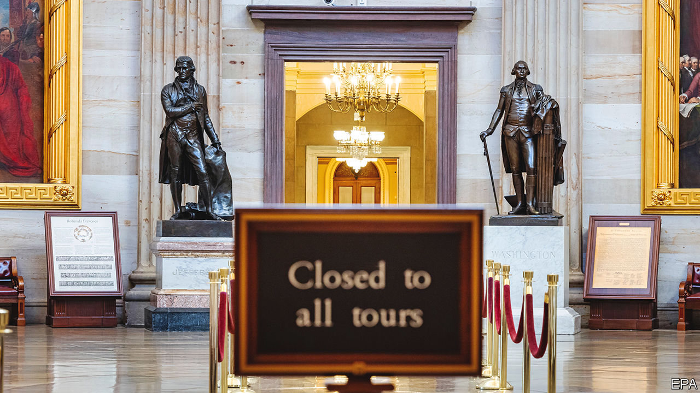

###### Nihilists in Washington

# America’s government will probably shut down, again, on October 1st 

##### This episode is a bit different from previous ones 

 

> Sep 28th 2023 

With another government shutdown looming, it is easy to assume that this particular governance failure is happening more often. Yet far fewer shutdowns have taken place in the past two decades than in the 1980s and 1990s. While funding gaps remain relatively rare, they now tend to last longer and the politics behind them are increasingly bizarre. The next shutdown could be . 

About two-thirds of federal spending is mandatory and dedicated to entitlement programmes, but discretionary spending requires annual authorisation. In theory, the process is simple. The president proposes a budget, Congress negotiates and legislation is signed into law ahead of the new fiscal year, which begins on October 1st. In practice, Congress has met this deadline only three times in the past half-century. Lawmakers often buy time with temporary resolutions to keep current funding levels. Since the 1980s, funding gaps have led to government shutdowns.

Ronald Reagan sparred with a Democrat-controlled House of Representatives and oversaw several shutdowns. Republicans led by House Speaker Newt Gingrich took on Bill Clinton twice. Today much of Washington expects a shutdown stemming not from partisan division but because of disagreements within the House Republican conference. 

With a Democrat in the White House, Republicans have regained interest in reducing federal spending, a consensus that disappeared during the Trump presidency. Yet House Speaker Kevin McCarthy has struggled to get his conference to agree on how to reopen spending negotiations after a debt-ceiling deal set spending levels earlier this year. “This is a high-wire act over the Grand Canyon during a thunderstorm,” Mr Gingrich says, adding that his larger majority let him manoeuvre more freely during bitter political fights. By comparison, Mr McCarthy is beholden to congressmen like Florida’s Matt Gaetz who, Mr Gingrich says, “would probably vote against anything that McCarthy was for just because he hates McCarthy”.

The current speaker bowed to the hardliners’ wishes and spent days leading up to the deadline trying to pass separate appropriations bills and so-called policy riders. These would drastically cut spending across the government and advance unrelated policies such as immigration enforcement. They stand no chance of passing the Senate or being signed into law by Joe Biden, making a shutdown inevitable.

The alternative is to pass the Senate’s bipartisan legislation to avert a shutdown. But were Mr McCarthy to side with a reasonable, bipartisan majority in the House, that would prompt a “motion to vacate”, or vote on Mr McCarthy’s speakership. Donald Trump is not helping much. His contribution to the debate was: “UNLESS YOU GET EVERYTHING, SHUT IT DOWN!”

Meanwhile, some members of the hardline House Freedom Caucus have shifted their ire from Mr McCarthy to each other. “I honestly don’t know what to say to my fellow Republicans other than ‘You’re gonna eat a shit sandwich, and you probably deserve to eat it’,” Chip Roy, a Freedom Caucus member who earlier tried to negotiate a compromise funding package rejected by his erstwhile allies, told Fox News. Mr McCarthy’s best hope at keeping the speakership may be these emerging divisions.

If and when the shutdown begins, the White House will have some discretion over what remains open, but many services will . Whereas pensioners will still receive benefits, soldiers and sailors will not receive pay-cheques without legislative action. Some federal programmes have contingency funds that can cover payments into the new fiscal year, but no one knows how long this shutdown would last. 

How does this seemingly intractable conflict end? Paul Winfree, a former congressional staffer now at the Economic Policy Innovation Centre, a think-tank, notes that after several weeks congressional staffers will not be getting paid. “At some point in this, the pain is felt at a very local level,” he explains. “They’ve got to pay rent. They’ve got to buy groceries.”■


