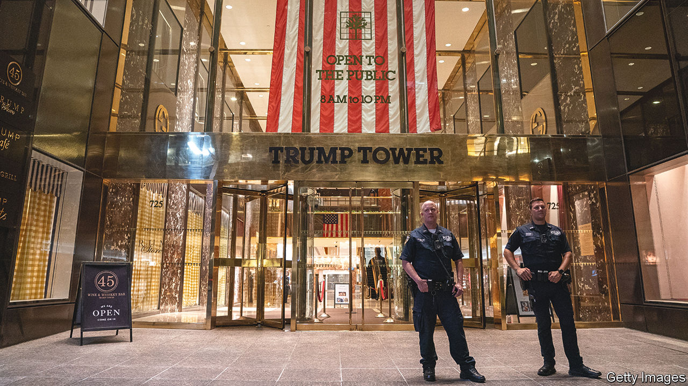

###### Summary smackdown

# Donald Trump is found liable for fraud in his real-estate dealings 

##### Eventually, that could cost him his business 

 

> Sep 27th 2023 

The purpose of a trial is to find facts and assign fault. But for civil lawsuits in which the evidence is unassailable, parties can ask a judge to skip the fact-finding and cut to the punishment. So it was in  brought by New York’s attorney-general, Letitia James, against Donald Trump in state court. On September 26th the presiding judge agreed with prosecutors that for years Mr Trump had misled lenders about the value of his  in Florida, New York and Scotland to secure better terms on his loans. Inaccuracies of the kind unearthed by prosecutors and backed up with “indisputable” evidence, wrote Arthur Engoron in a withering judgment, “can only be considered fraud”. This was, he ruled, not a matter of “rounding errors or reasonable experts disagreeing”.

Mr Trump denies all allegations and will appeal against the ruling; his lawyer called it “outrageous” and “completely disconnected from the facts”. The process of appeal will probably drag out over years. But if the judgment is ultimately upheld, parts of Mr Trump’s  may be dismantled. Judge Engoron ordered the cancellation of corporate licences that enable the Trump Organisation to operate in New York. Mr Trump’s properties would come under the control of a receiver and “could be put up for forfeiture by the state”, says Catherine Christian, a lawyer at Liston Abramson and former prosecutor in the Manhattan district-attorney’s office.

The judge has yet to describe how that process would actually play out. Mr Trump’s lawyer, for his part, seethed about attempts to “nationalise one of the most successful corporate empires in the United States”. Not for nothing is the punishment that has been ordered by Judge Engoron known, in legal circles, as a corporate death penalty.

Judge Engoron cited six assets whose values Mr Trump inflated on financial disclosures. Between 2012 and 2016 he claimed that his triplex apartment at Trump Tower in Manhattan was three times bigger than it was, resulting in an overvaluation of $114m-207m. His lawyers had argued that his square-footage calculations were subjective. But “good-faith measurements”, wrote Judge Engoron, do not vary by 200%. 

Mr Trump also ignored outside appraisals, according to the ruling. He reported the value of rent-stabilised apartments at the price they would fetch if their rents were not capped; and he reported that of his Florida estate as if it had no development restrictions (which it had, lowering its worth). Judge Engoron said that Mr Trump existed in a “fantasy world, not the real world”.

The judge is not done with the case. He determined that several of the alleged offences—that business records were falsified, for example—warrant a trial. Ms James, the state attorney-general, wants to fine Mr Trump $250m and bar him from serving as a director of a corporation in New York. Her burden of proof is lower than if it were a criminal trial (he , in federal and state courts, over separate allegations). ■


