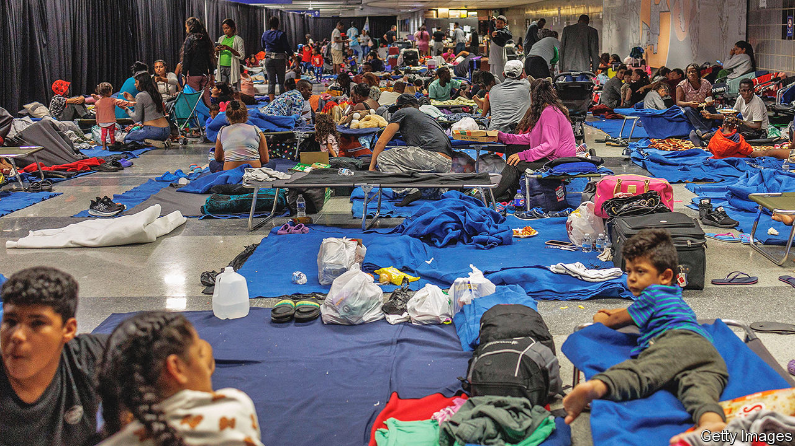
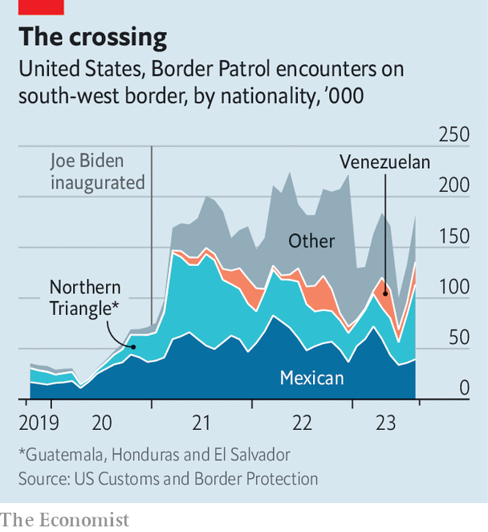

###### Sanctuary in the city

# The flow of migrants into Chicago is a crisis and an opportunity 

##### Will the new arrivals eventually settle in the Windy City? 

 

> Sep 28th 2023 

The entranceway of Chicago’s 19th district police station, just a couple of blocks east of Wrigley Field, the city’s pre-eminent baseball stadium, is no place to live. Yet enter it, and it is clear that people are managing it. Suitcases and bags of clothes are pushed up against the windows; mattresses and sleeping mats cover most of the available space. Small children run around, while adults watch soap operas on their phones. Amid it all, two police officers standing behind the desk try to listen to a woman who has come in to report some criminal behaviour. For the past few months, as many as 90 people have slept in this police station each night. When your correspondent visited, almost all there were Venezuelan migrants who had arrived in Chicago on buses as little as a day or two before.

In the past few months, police stations have become the most visible evidence of how the wave of asylum seekers arriving in Chicago are stretching the city. Since August last year, when the first busload sent by the state of Texas arrived in the Windy City, over 15,000 people have turned up. By September 22nd, roughly 10,500 people were in city accommodation, up from 7,600 less than a month before. Of those, around 1,500 were living on the floors of police stations, with another 500 or so on floors at O’Hare airport (the rest are mostly in shelters or hotels). Only New York City is hosting more. The flood of new arrivals is the first major crisis that Brandon Johnson, the city’s leftist mayor who took office in May, has to deal with. It is already showing what happens when progressive ideals crash into fiscal realities.

 


Chicago’s misfortune began over a year ago when Greg Abbott, the governor of Texas, began taking newly arrived migrants in border towns and loading them onto buses to be transported to “sanctuary cities”, almost all in Democrat-run states in the north far from the border. Since April last year, the state has shipped around 40,000 migrants out, including 8,700 to Chicago. The idea, Mr Abbott told the Manhattan Institute, a right-leaning think tank in New York, on September 27th, has been to give liberal places that claim to like undocumented immigrants “a tiny fraction of what’s happening every single day in the state of Texas.” That it has certainly done. Cristina Pacione-Zayas, Mr Johnson’s deputy chief-of-staff, says that the flow constitutes an “attack.”

The big problem is money. By the end of this year, Chicago expects to have spent $255m accommodating the new arrivals. Next year, the city is projecting a deficit of $538m, over a third of which is down to the money it is now budgeting to take care of the migrants. Ms Pacione-Zayas says that the city has no idea when migrants are likely to arrive—the only advance notice that her office gets is usually from contacts at the bus companies. But the flow seems to be accelerating. “This is a federal responsibility”, she says, adding that the problem “comes from failed us foreign policy.” But since the city will not let people live on the streets, it has little choice but to find ways to house them. 

In theory, the police stations are meant to be just temporary holding places where people crash for at most a few days. In practice however, according to Erika Villegas, a real-estate agent turned activist who organises hundreds of volunteers, many are staying far longer—some people have slept on police station floors for months. “In every police station there are officers welcoming and helping out”, she says. But most stations lack anywhere to wash, or to cook food, or means to access other services, leaving migrants dependent on help from volunteers. Worse, in July, the Civilian Office of Police Accountability, a city watchdog, opened an investigation into allegations that a number of police officers had sex with women under their care.

To get people out of police stations, on September 12th, Mr Johnson signed a $29m deal with a firm to provide a “winterised base camp”, to take in new arrivals. The idea is that instead of being put into lobbies, migrants will be housed in tents, a little like army barracks. But that is already drawing criticism. The city has not named a site yet, perhaps because it knows locals might oppose it. Nor is it clear exactly how keeping people in tents, including families with children, will hold up in Chicago’s brutal winter. It is “nowhere near what we understand to be ideal”, admits Ms Pacione-Zayas from the mayor’s office. 

One hope is that migrants will be able to get jobs and move out of the shelters more quickly. On September 20th, Alejandro Mayorkas, the secretary of homeland security, announced that Venezuelans who arrived in America before July 31st would qualify for temporary protected status, which allows them to apply for work permits. Julia Gelatt, of the Migration Policy Institute, a Washington DC-based think tank, says that it will take time before many can work. At the moment work permits can take months to be issued even to those who qualify. But the administration is under immense political pressure to speed things up, she says.

For all of the costs, if they can work, the new arrivals could yet prove helpful. Their children are already refilling emptying schools, notes Ms Villegas, the volunteer. Her grandfather came to Chicago from Mexico half a century ago. Then, it was easier: “Mexicans would come here because their brother, their neighbour, their cousin was already here,” she says. That is not true of those bused from Texas. But eventually they will settle. At the police station, a newly arrived couple say they knew almost nothing about Chicago. But asked whether they will stay if they can, the answer is an emphatic yes. ■


