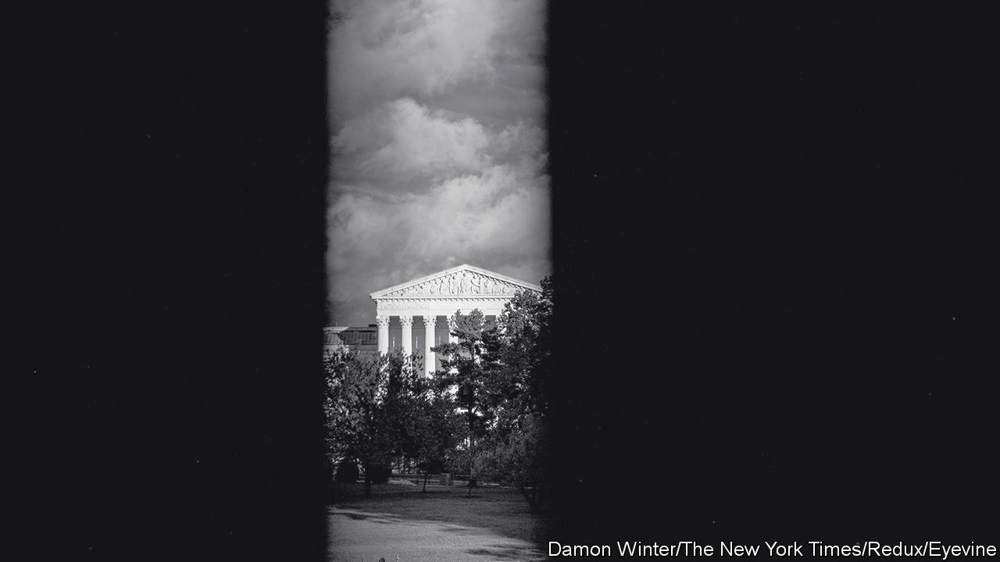

###### Who has agency?

# The new Supreme Court term takes aim at the administrative state 

##### Conflicts over guns, gender bias and abortion are coming up, too 

 

> Sep 28th 2023 

AMID A STORM of ethics concerns and an approval rating stuck at historic lows for a second consecutive year, the Supreme Court returns to action on October 2nd. Battles over gun rights, gender-based employment discrimination and social-media use by public officials loom, as do lingering questions about voting rights, abortion pills and affirmative action. A constitutional challenge to Donald Trump’s candidacy based on his role in the riot at the Capitol on January 6th 2021 could reach the high court as the presidential campaign heats up. But the stars of the term may be a deceptively bland trio of cases that could transform the way the federal government does its work. 

A wonky-but-weighty hearing will greet the justices on their second day back in robes. In the snappily named , the court will review a decision of the fifth circuit court of appeals, America’s most conservative circuit court, undercutting the consumer-watchdog agency established in the wake of the financial crisis of 2007-08. The fifth circuit ruled that the CFPB has an unconstitutional funding structure. Article I, section 9 of the constitution mandates that “[n]o money shall be drawn from the Treasury, but in consequence of appropriations made by law”. Since the CFPB has a permanent funding stream allocated annually not by Congress but by the Federal Reserve, the plaintiffs argue that its financing is illegitimate. 

If the justices find that this arrangement violates the constitution, everything the agency has done over its 12 years—from cracking down on predatory lenders to breaking up fraudulent debt-collection schemes—could be deemed unlawful, too. The fallout from such a ruling would be “deeply destabilising”, the federal government warns. A friend-of-the-court brief from the housing finance industry predicts “catastrophic economic consequences” should challengers to the CFPB prevail, including “severe instability” in the mortgage market from uncertainty about the status of the agency’s lending rules. 

Similarly significant effects could flow from, another fifth-circuit decision coming to the Supreme Court later in the autumn. The case was brought by George Jarkesy after his company, Patriot28, appeared before an administrative-law judge (ALJ) in 2014 for alleged securities fraud involving two hedge funds. After the ALJ found him liable, assessing $300,000 in civil penalties and disgorging $685,000 of illicit profits, Mr Jarkesy sued the SEC, contending that its enforcement procedures are unconstitutional. A fifth-circuit panel found that Mr Jarkesy had a seventh-amendment right to a jury trial, that Congress has handed the SEC too much power and that ALJs are too hard to remove. If the Supreme Court agrees, the SEC will become less nimble in its ability to protect investors. Other agencies using ALJs to enforce regulations, including the Equal Employment Opportunity Commission and Environmental Protection Agency (EPA), could get caught in  wake.

A third case threatening the independence of administrative agencies——may pull the plug on a precedent that has been on life support for years. When  came down in 1984, conservatives faithfully applied the deference it afforded to administrative agencies’ own interpretations of ambiguous laws. As long as agencies like the EPA or the Occupational Safety and Health Administration issued “reasonable” regulations in the face of statutory ambiguity,  held, judges should butt out and let the bureaucrats do their work.

But over the decades justices on the right have soured on  long leash for agencies and their progressive regulations. In 2015, in a case involving enforcement of the Clean Air Act, Justice Clarence Thomas wrote that  had enabled the EPA to enact “policy goals”—usurping Congress’s job. Last year, Justice Neil Gorsuch characterised  as “judicial abdication” and argued that although courts now seldom invoke it, the ruling “deserves a tombstone no one can miss”.

With three opportunities to rein in federal agencies—thereby reallocating power to the judiciary—the justices also face a tough case testing the reach of a revolutionary gun-rights decision, issued in 2022. According to that ruling, the only limits on firearms allowed by the second amendment today are those with historical analogues that were in place when the amendment was ratified in 1791 or extended to the states through the 14th amendment in 1868.  asks whether a federal ban on guns for domestic abusers under restraining orders passes constitutional muster despite, as the fifth circuit found, “no tradition” of such prohibitions in the 18th or 19th centuries. 

Racial gerrymandering returns to the Supreme Court on October 11th, when the justices look into a claim that South Carolina shuttled black voters in and out of districts when drawing its congressional map after the 2020 census. On October 31st the justices will hear two cases asking whether the first amendment bars public officials—a city manager in Michigan and two school-board members in San Diego—from blocking constituents on their social-media accounts. Later in the autumn, they will ask whether Title VII of the Civil Rights Act was violated when a female police officer was transferred to a less interesting position because her supervisor allegedly wanted a man for her job. 

The justices have aftershocks to confront from several recent decisions related to race. They showed no patience for Alabama’s defiance of , a decision from June requiring the state to comply with the Voting Rights Act by drawing a second congressional district where black voters have an opportunity to elect a candidate of their choice. , the decision from June ending race-based affirmative action in university admissions, has put wind in the sails of a lawsuit against a race-blind policy designed to enhance diversity at an elite high school in Virginia. In August opponents of the policy asked the Supreme Court to hear their case. And a new challenge to the consideration of race at West Point, a military academy, could eventually end up in the justices’ laps.

The hottest-button issue in American politics—abortion—is also likely to end up back at the high court. In the coming months, they may have the final say on a district court’s decision severely limiting access to mifepristone, a widely used drug to end early pregnancies. ■


