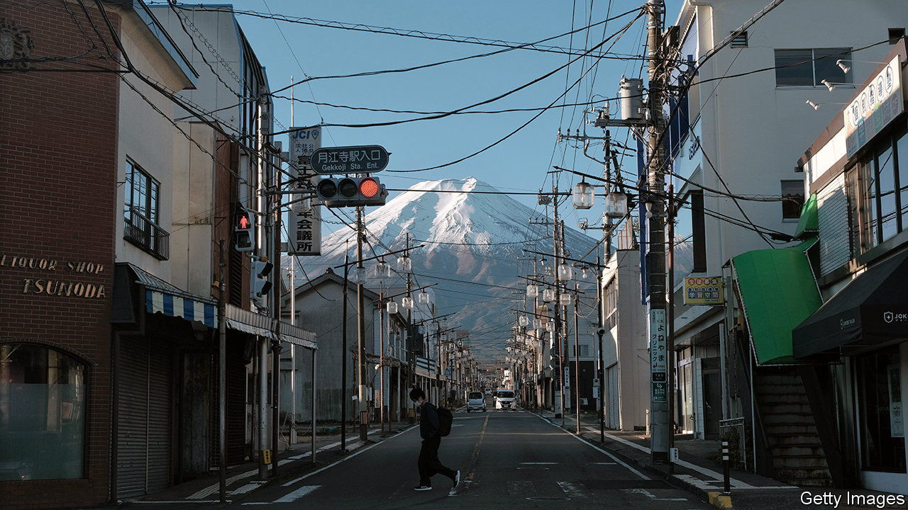

###### Decentralising Japan

# Japanese firms are leaving Tokyo for the sticks 

##### The government would like to see many more follow 

 

> Oct 5th 2023 

WHEN WATANABE KOTA was young, he moved to Tokyo hoping to make a name as a musician in the big city. He failed, eventually returning to his native Yamanashi, an area west of Tokyo known for farming and Mount Fuji. But decades later, Mr Watanabe found himself reacquainted with his passion in an unexpected way. In 2021 Amuse, a big entertainment firm that manages top-tier Japanese artists and singers, moved its headquarters from Tokyo to Yamanashi. Mr Watanabe now works there. “I couldn’t believe a famous company like Amuse would move to such a sleepy place,” he says. 

A growing number of Japanese companies are leaving Tokyo for the sticks. Last year 335 companies moved out of urban areas to the countryside, an increase of nearly 40% from 2019. The trend got a boost during the pandemic, as remote work boomed and cheap land prices in rural areas started to look increasingly attractive to employers who found that their pricey offices were half-empty. Executives at Amuse also decided to move to Yamanashi in the hope of improving employees’ work-life balance and boosting their well-being in a place with lots of nature. 

The decentralisation of corporate Japan has long been a national ambition. During Japan’s post-war boom, many of its citizens flocked to the growing capital. The authorities eventually started to view that as a problem, especially in the 1990s when the economy entered a period of stagnation. With depopulation a growing problem in rural areas, the government started to promote outward migration from Japan’s cities, hoping to disperse employment and corporate-tax revenue. Under the banner of “regional revitalisation,” central and local governments offer tax incentives and subsidies to encourage companies to move their headquarters or some office functions to less populous areas.

Mitigating the risk from natural disasters offers another rationale, especially in a country as prone to earthquakes as Japan. Experts reckon there is a 70% chance of a magnitude 7 or higher quake hitting Tokyo within the next 30 years. “Business continuity is the most important thing for us,” says Iwata Hajime of AXA Life Insurance. He describes the earthquake and tsunami of 2011 in the northern Tohoku region as a turning point. The company, like some others, started mulling the idea of distributing its personnel and resources, since concentrating them in Tokyo felt too risky. In 2014 the firm opened its new headquarters in Sapporo, the capital of the northern island of Hokkaido.

Japan nonetheless remains too Tokyo-centric. Firms are not emigrating from the capital at the pace authorities would like. Though remote work has gained acceptance, in-person meetings remain an important aspect of Japanese work culture. Many workers therefore have to be in Tokyo to meet clients and business partners. And while some employees might enjoy life in the idyllic countryside, plenty prefer the conveniences of the capital. Those with children worry about losing access to high-quality schools and colleges.

Another problem has been a lack of planning and co-ordination among the authorities. Instead of creating new economic hubs, many relocation efforts amount to “simply scattering [firms] across the country”, says Sato Motohiro of Hitotsubashi University in Tokyo. He believes that this is a hangover from Japan’s bygone boom period, where officials promoted an idea of “balanced development” in which the country’s thousands of municipalities were expected to grow at roughly the same pace. In recent years some alternative growth centres have emerged, though not enough to challenge Tokyo’s dominance. Hokkaido has attracted enterprises with its vast spaces. Kyushu, the southern region where TSMC, a Taiwanese semiconductor firm, is building a factory, promotes itself as Silicon Island. “The government needs to think more about differentiating between areas that need investing in, and those that don’t,” says Mr Sato. “Otherwise, Tokyo will keep winning.” ■

