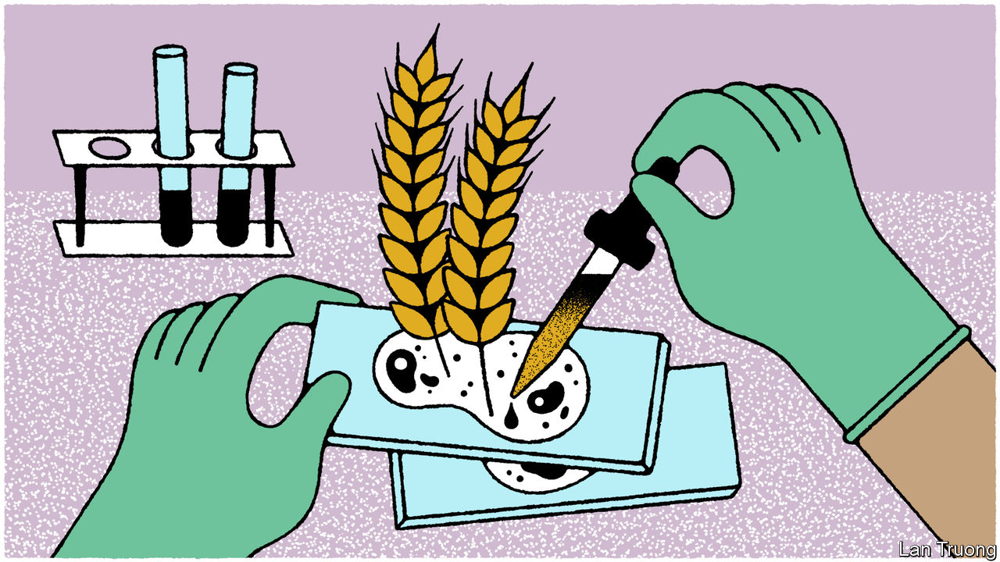

###### Banyan

# M.S. Swaminathan, the man who fed India 

##### The father of India’s green revolution has died 

 

> Oct 3rd 2023 

H IS FAMILY wanted him to become a doctor. But the devastation of the Bengal famine of 1943, which killed between 2m and 3m people, put M.S. Swaminathan on a different path. A follower of Mohandas Gandhi, the young Tamilian renounced medicine for unglamorous agriculture. His role in newly independent India would be to ensure its poor had enough to eat.

Mr Swaminathan, who died in Chennai on September 28th at the age of 98, made an immense contribution to agricultural research and policy. He was instrumental in spreading high-yield varieties of rice and wheat, which helped turn India from a country so dependent on food imports that it was said to be living “ship to mouth” in the 1960s to self-sufficiency in rice and wheat by the mid-1970s. In later decades he used his stellar reputation to argue for food security in many developing countries. The world has made enormous progress in that regard. Yet as Mr Swaminathan warned repeatedly in recent years, the goal of adequate calories for everyone is coming under threat again, especially from climate change.

The Bengal famine that inspired Mr Swaminathan’s work was chiefly a political, rather than a technical, failure. The British Raj had diverted food from India to supply allied troops fighting in the second world war. In independent India, racked by conflict and lacking capital, the main problem was low agricultural productivity, with insufficient grain to support the country’s rapidly growing population. Doomsaying foreign experts predicted more famines and mass death.

Mr Swaminathan and his colleagues proved them wrong, chiefly by promoting new grain varieties that were better able to absorb fertilisers. Conventional plants, when given fertiliser, grew long stems that could not support their grains, causing them to tip over and spoil. New wheat and rice varieties developed by Norman Borlaug, an American agronomist, and scientists at the International Rice Research Institute were shorter and sturdier. Yields rocketed after they were introduced to north India in the 1960s, heralding what became known as the “green revolution”. Without Mr Swaminathan, Mr Borlaug later wrote, “It is quite possible that there would not have been a green revolution in Asia.”

These efforts helped transform India into an . It has not experienced a major famine since independence. By 1974 it no longer needed imports to meet its rice and wheat needs. Today it is the world’s biggest exporter of rice, in 2022 accounting for some 40% of the global market. It also exports a small amount of its wheat, of which it is the world’s second-largest producer.

India’s recent decision to  of some varieties of rice and impose tariffs on others illustrates the threats to Mr Swaminathan’s legacy. The growth of agricultural yields across the world has slowed in recent years amid rising temperatures and increasingly unpredictable growing conditions. India imposed the latest restrictions following an erratic monsoon. The rains arrived late, delaying the rice-planting season. When at last they came, they were so fierce that fields were inundated and crops destroyed, with some farmers losing what little they had managed to plant. The previous summer, heatwaves shrivelled as much as 15% of the wheat crop in some regions. Such extreme weather will become increasingly frequent as the Earth warms. India and the rest of South Asia are particularly vulnerable. 

Even as he campaigned for women’s empowerment and policies to improve nutrition in recent years, Mr Swaminathan sounded the alarm on what global warming would mean for food security. “Farmers can no longer rely on historical averages for rainfall and temperature,” he wrote in 2011. Drought and floods may “spell disaster”. His successors are developing wheat and rice varieties that are better able to cope with these threats. 

Yet there are signs that such innovations may be insufficient, meaning vast swathes of arable land could eventually be abandoned. Other methods popularised during the green revolution have, meanwhile, fallen out of favour. Mechanical irrigation and intensive monocultures, for example, have turned out to degrade the environment by depleting groundwater and stripping the soil of nutrients. Yet they remain in widespread use in India and elsewhere, storing up vulnerabilities in the global food system. A new and greener revolution in food production is urgently needed. ■


