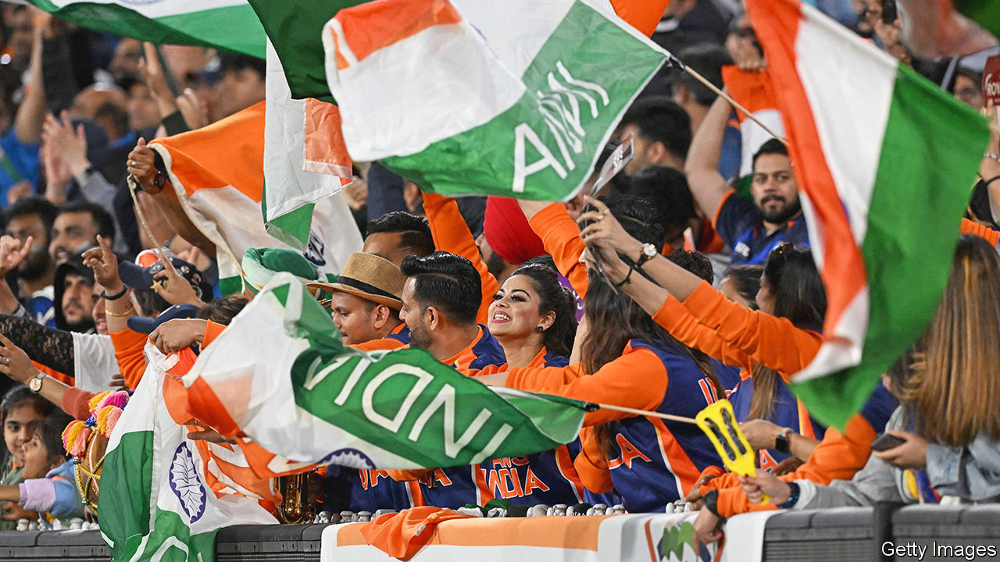

###### The Cricket World Cup

# Narendra Modi has seized and politicised Indian cricket 

##### India dominates the sport. The way it uses its power is worrying 

 

> Oct 4th 2023 

“Cricket is an Indian game accidentally discovered by the English.” The first line of Ashis Nandy’s “The Tao of Cricket”, published more than 30 years ago, seems truer than ever. India is hosting the quadrennial Cricket World Cup, which begins on October 5th, as by far the dominant power in the world’s second-biggest game by viewership (after football). The sport is increasingly run according to the demands of Indian administrators, whether in India or the dozen-odd other countries where it is a front-rank pursuit. They are backed by the revenues generated by India’s vast, cricket-mad TV audience. The six-week-long cricket World Cup, which will see the world’s ten strongest national sides compete in the one-day format of the game, may be the richest, most watched and also the most overtly politicised ever held.

More than 712m Indians—roughly the number that watched televised cricket in 2018—are expected to tune in, especially if their team does well, as is predicted. Indian companies are vying for their eyeballs, with unicorns such as Upstox, a fintech firm, and Dream11, a gaming one, joining old stagers such as MRF Tyres among the event’s 18 official sponsors. The World Cup will provide a tableau of India’s economic emergence—and the disruption it is bringing to a game sometimes described as Indians’ single shared passion.

Given that status, cricket has long been considered illustrative of India, even as the country has changed. Mr Nandy’s book, published in 1989, is remembered for its opening aphorism but not its argument. Which was that cricket’s agrarian roots and leisurely rhythms presented a “critique of urban industrial society” acutely relevant to underemployed Hindus. If there was ever truth to that, it was already being swept away by a modest rise in India’s economic prospects during the 1980s, in cricket and otherwise. The country’s first hosting of the World Cup, in 1987, provided an early demonstration of this. 

It also established a pattern. The tournament, by far the biggest international event India hosts, has returned twice to the country, in 1996 and 2011, each time providing a vivid account of India’s progress. The rendition held in 1996 showcased the more impressive growth launched by liberal reforms passed in 1991. It is remembered for a fierce advertising battle between Coca-Cola and Pepsi, both recently given unfettered access to the Indian market.

The contest in 2011 marked another step-change. India’s cricket industry had ballooned on the back of a new domestic tournament, the Indian Premier League (IPL), which uses an . Also striking was a new confidence. When India’s team went on to win the tournament, Indian commentators proclaimed a new era of Indian domination. What, in the light of these World Cup milestones, will the next six weeks reveal?

More growth, obviously. Advertising revenues for the tournament are projected to be between 20bn and 22bn rupees ($240m-264m), at least 48% more than was generated by the previous World Cup, held in England. Such numbers explain the Indian cricket board’s dominance. Last year it sold five-year broadcast rights to the IPL for $6bn. Its total revenues were 44% more than those of its closest rival, the England and Wales Cricket Board. 

Cricket’s popularity commands political attention, as the tournament will also show. It has indeed long been coveted by Indian politicians; Jawaharlal Nehru captained a Prime Minister’s XI. Yet in recent decades, the growth of television—then smartphone—ownership, which took cricket from a few big cities to India’s furthest corners, hugely increased its political potency. Among the politicians who piled in, Sharad Pawar, India’s agriculture minister between 2004 and 2014, ran cricket in Maharashtra, India and, through the International Cricket Council, the world. As chief minister of Gujarat, Narendra Modi took over the state’s cricket board in 2009. As prime minister he has achieved something new: a systematic takeover of cricket by his Bharatiya Janata Party (bjp).

The World Cup’s opening game, pitting England against New Zealand, is in the 130,000-seat Narendra Modi Stadium in the Gujarati city of Ahmedabad. Completed in 2020, the world’s biggest cricket stadium was first used to host a rally for Mr Modi and Donald Trump. It is the prime minister’s Coliseum, a venue for Modi-themed cricket extravaganzas, BJP rallies or both. Ahead of a match between Australia and India there in March Mr Modi appeared alongside his Australian counterpart, Anthony Albanese, in a sort of golden chariot. The adoring crowd reportedly included 80,000 BJP workers, given free tickets. 

If India makes it to the World Cup final there, on November 19th, Mr Modi will no doubt attend. So will his de facto deputy, Amit Shah, another former boss of cricket in Gujarat; and Mr Shah’s son, Jay Shah, who runs India’s cricket board. Cricket under Mr Modi, like so much else, has been centralised and co-opted.

As well as illustrating Mr Modi’s flair for amassing power, his party’s cricket management reflects its troubling use of it. Indian Muslims are fairly represented in cricket. Around 12% of professional players are Muslim, in line with their share of the population. Yet those who play for India are targeted by the Islamophobic trolls that have multiplied under Mr Modi. 

Pakistan’s cricketers are faring worse. Once superior to India’s (elegant Indian batsmen struggled against fierce Pakistani fast bowling) cricket in Pakistan has deteriorated with the country. India is twisting the knife. The younger Mr Shah, who also runs the Asian Cricket Council, has helped throttle cricket ties between the two countries. Pakistan’s players, in a gratuitous slight, were the last to receive their visas and schedule for the World Cup.

Such bullying Indian behaviour has been a feature of its rise in cricket, which has intensified under the BJP. The spread of private Indian cricket leagues is  of international competition, one of cricket’s distinctive features, and weakening foreign cricket boards. India’s cricket bosses are deaf to the complaints this is raising. Viewing cricket as an arm of national power, they are mainly intent on increasing their control of it. The ICC’s media revenues were in the past split fairly evenly between cricket-playing countries. Between 2024 and 2027 India will pocket 39%. How it spends the cash is unclear. Most Indian cricket loot is handed to state-level boards, often run by politicians. Hardly any provide audited accounts. 

Indian cricket bosses dismiss foreign criticism as sour grapes. In fact the cricket world has accepted the reality of India’s dominance; no one disputes its right to enrich and reshape its game. Yet great power is supposed to bring more responsibility, which India’s bosses seldom display. As an early demonstration of the power India is accruing in many fields, its behaviour in cricket is largely discouraging. ■

