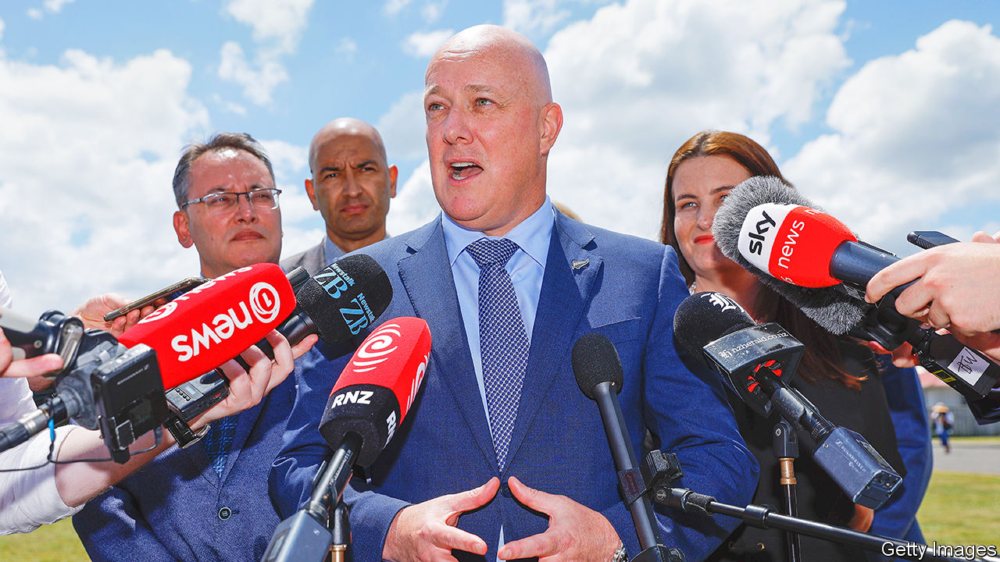

###### Left behind

# New Zealand tires of its cuddly liberal government 

##### A coalition of right-wing parties is expected to win the coming elections 

 

> Oct 5th 2023 

KIWIS WERE living in happy isolation ahead of their general election three years ago. Even as covid-19 caused havoc overseas, they were safe behind closed borders, and so thankful to the then prime minister, Jacinda Ardern, that they gave her Labour Party the first majority in the history of New Zealand’s system of proportional representation. Their gratitude has faded. Ms Ardern resigned in January amid . Her successor, Chris Hipkins, lacks her sparkle. New Zealanders are expected to vote out his centre-left government in elections on October 14th, ushering in a coalition of right-wing parties.

The polls suggest Labour could lose half its support. In 2020 about 50% of New Zealanders voted for the party, its best result in over 70 years. Mr Hipkins, a former health minister, looks set to win about 26% of the vote. The centre-right National Party, which is led by a former boss of Air New Zealand, Christopher Luxon (pictured), is the main beneficiary, with 36%. Still far short of a majority, it will need to form a coalition with at least one and possibly two hard-right parties campaigning against woke-ism and the growing use of the Maori language in public life. That would mark a dramatic lurch away from Ms Ardern’s warm and inclusive politics. 

Labour are to some degree victims of the heady expectations she raised. Ms Ardern steered New Zealand deftly through crises, but failed to fulfil her promise of transformational change. Since she was elected in 2017, pledging to cut poverty and make housing more affordable, life has grown harder for many. House prices shot up by 40% during the pandemic and remain unaffordable, despite a recent correction. Inflation has eroded wages; interest rates have soared. Locals gripe about expensive rent and an understaffed health system. Newspapers are packed with stories of gang crime and violent robberies. “The absolute majority gave Labour every chance to deliver, and they spectacularly failed,” says Sir John Key, a former conservative prime minister. 

Mr Hipkins has tried to claw back support by scrapping “any policies which had a woke smell about them”, as Matthew Hooton, a former adviser to the National Party, puts it. Plans to toughen hate-speech laws and lower the voting age have been ditched, and the focus has turned to more humdrum areas such as raising child-care subsidies and cutting public-transport costs. Yet Mr Hipkins’ stint in power has been overshadowed by scandals. Five ministers have been sacked or quit this year, mostly for misconduct. One shared cabinet information with donors. The justice minister, Kiri Allen, crashed her car while drunk and then resisted arrest. 

The National Party’s Mr Luxon has pledged to “get our country back on track” by cutting taxes,  and trimming the public sector. But New Zealanders do not trust his party to solve their problems either. Combined, Labour and National are likely to receive their lowest ever share of the vote, says Mr Hooton. Never before have both the two main parties been so unpopular. New Zealand’s system of proportional representation is boosting minor parties on both sides.

To reach a majority of 61 seats in the country’s unicameral parliament, Mr Luxon will need support from ACT, a growing libertarian party, and possibly an old stalwart, New Zealand First. Its 78-year-old leader, Winston Peters, lost his seat at the previous election, but is staging a comeback by stoking anger against a “cultural cabal” of “elite virtue-signallers”. The two smaller parties disagree on most things, but both appeal to disaffected conservatives by pledging toughness on crime and thrusting race into political debate by promising an end to the so-called “Maorification” of New Zealand. Between them, they could win almost 20% of the vote.

A putative right-wing coalition would not signal that New Zealand is “moving into that brand of hard-right politics that we’ve seen in Italy and Austria,” says Sir John. Its electoral system keeps politics relatively centrist and “punishes small parties who are in government that don’t act as good, stable partners”. Ms Ardern pioneered a cuddlier politics, but Kiwis now seem to want a spikier approach. ■

