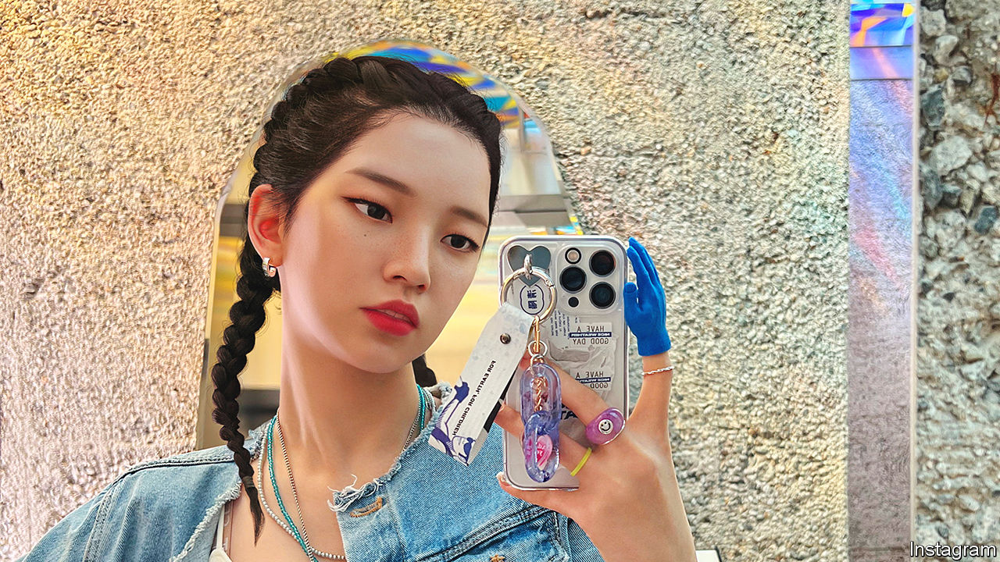

###### Even better than the real thing

# Virtual influencers are burning up South Koreans’ Instagram feeds 

##### They are cheap to hire, always look great and they don’t bully their colleagues 

 

> Oct 5th 2023 

South Korean television presenters have been causing trouble. Within the past year one was fired for swearing on live television and another for slandering a dead comedian. A third stands accused of abusing junior colleagues. A solution is to hand: virtual humans.

Increasingly common globally, computer-generated influencers are proving especially popular in South Korea. The country’s first, Oh Rozy (“One and Only”), was created by a Seoul-based firm, Locus-X, and appeared on Instagram in 2020. She purports to be a beautiful 22-year-old who works as a singer, model and a sustainability champion. Appearing in adverts for companies including Calvin Klein and Tiffany, and in television shows, Rozy, as she is known to fans, is estimated to have made more than 2.5bn won ($1,8m) last year. She is perhaps best-known for an advert for an insurance company in which she danced across the rooftops of Seoul. 

After Rozy’s debut more than 150 other digital humans hit South Korea’s social-media and advertising channels in less than three months, according to Baek Seung-yeop, the boss of Locus-X. Virtual k-pop singers are also becoming popular. This year the debut single of a computer-generated girl band, MAVE:, featuring four avatars called Siu, Zena, Tyra and Marty, racked up over 26m views on YouTube. South Korea’s tourism board recently made Yeo Lizzie, another digital confection, its honorary ambassador, replacing Son Heung-min, captain of the national football team.

Generated with 3D-modelling technology and AI, the avatars are stunningly realistic. Rozy’s 800 expressions are based on a human model. The technology has long been used in films and video games, both South Korean strengths, and is becoming more sophisticated. An even bigger change is the avatars’ ability to interact with their audience. Rozy responds to social-media comments and holds Q&amp;A sessions with fans. (Asked how she is so stylish, she answered that you need to know your body type and to have self-esteem.) 

Apart from being cheaper, virtual celebrities have other advantages over human ones. “They don’t complain” and firms “don’t have to worry about them ruining their reputation”, says Kim Sang-kyun from Kangwon National University in Gangwon province.

Rozy’s success has spawned a sister and twin brothers. Lucy, a virtual face of Lotte, a conglomerate, has booked her first acting gig. South Korea’s newest celebrities may not exist in flesh and blood, but their influence is all too real.■

