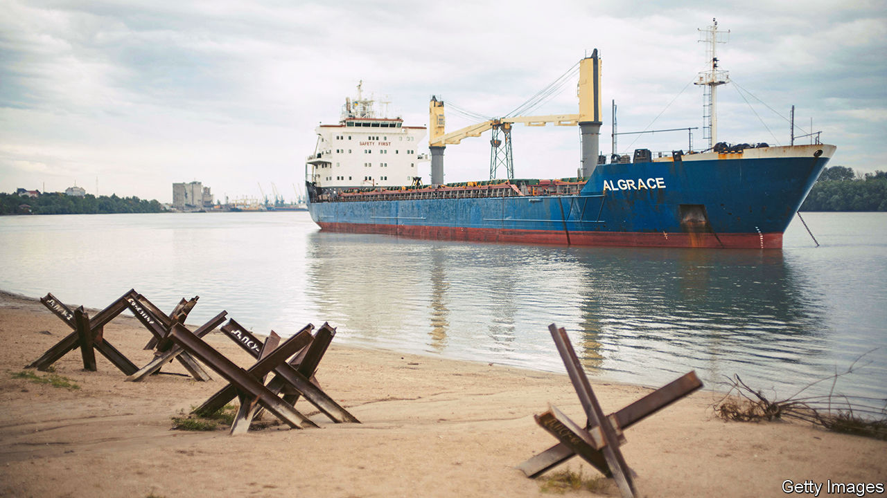
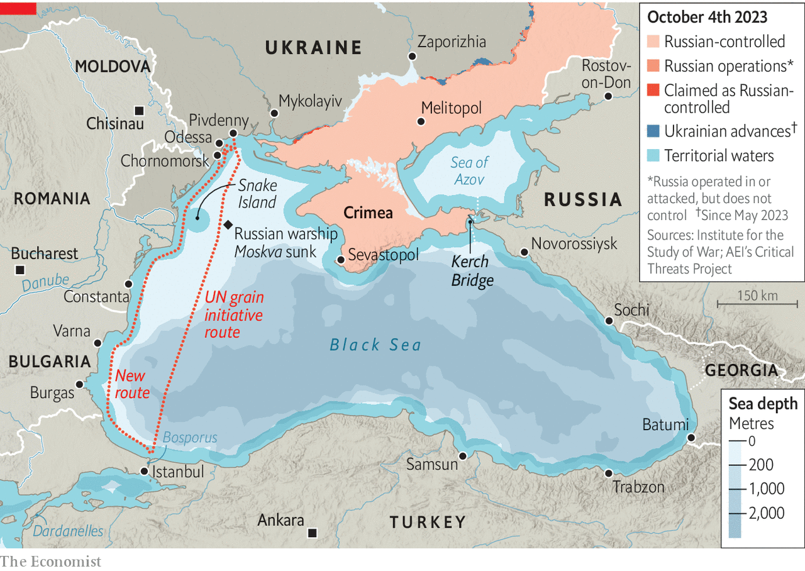
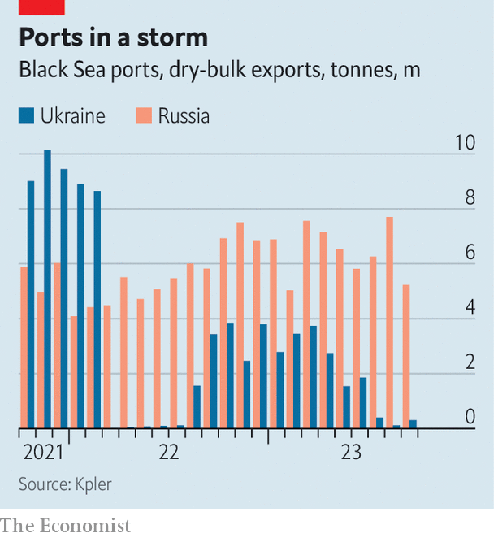
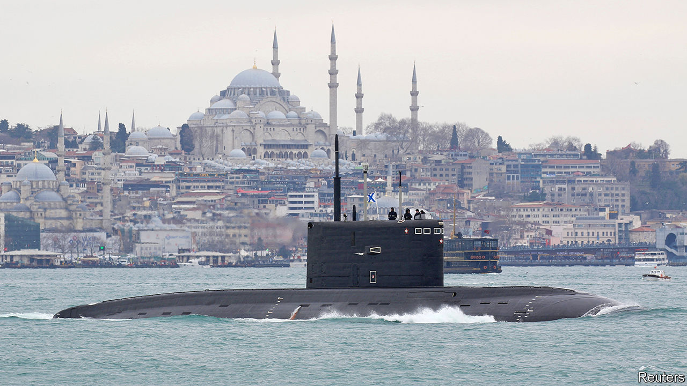

###### Ripple effect

# The war in Ukraine is threatening to wash across the Black Sea 

##### And to roil grain and oil markets again 

 

> Oct 5th 2023 


WHEN RUSSIA invaded Ukraine last year, the Black Sea seemed unlikely to become much of a battleground. The Ukrainian navy, after all, had only one warship, which it was forced to scuttle as Russian troops advanced on the shipyard where it was being repaired, in the city of Mykolaiv. Snake Island, a maritime outpost guarding the western approaches of Odessa, Ukraine’s biggest port, fell to Russian attackers on the first day of the war. Odessa itself braced for an amphibious assault that would have cut Ukraine off from the sea altogether.

The fact the landings never came was the first sign that Russia’s dominion over the sea was not as absolute as it seemed. A more ringing indication of that came in April of last year, when Ukraine managed to sink the flagship of Russia’s Black Sea fleet, the , using a newly developed anti-ship missile. Two months later intense Ukrainian bombardment drove the occupiers from Snake island. But it is only much more recently that Ukraine has begun to demonstrate a capacity to strike targets across the Black Sea. 

In early August a Ukrainian naval drone—another new weapon—damaged a Russian landing-ship just off Novorossiysk, a big Russian port far to the east of the war zone. The following day another drone damaged a Russian oil tanker off Crimea, the peninsula that dominates the Black Sea, which Russia seized from Ukraine in 2014. On October 1st aerial drones struck a helicopter base in Sochi, some 600km away from the closest Ukrainian-held territory. Most dramatically of all, over the past month, Ukrainian missiles and drones have repeatedly hit targets across Crimea, culminating in the destruction of the headquarters of Russia’s Black Sea fleet in Sevastopol on September 22nd.

Russia also seems to be intensifying the war at sea. In July it withdrew from a pact overseen by the UN whereby it allowed Ukrainian grain exports to pass safely across the sea. It has threatened to sink any cargo ships calling at Ukrainian ports and has repeatedly bombed Ukrainian docks and grain silos in an effort to throttle Ukraine’s maritime trade. Since Russia and Ukraine both have the capacity to strike at shipping and since, as a diplomat puts it, the Black Sea is to grain what the Persian Gulf is to oil, an escalation in naval warfare could have a harrowing impact on global food markets. In fact, the Black Sea is also a big conduit for oil, and is central to the economies not only of Russia and Ukraine, but also Turkey and other littoral states. If it truly becomes a war zone, the world will feel the repercussions. 

Sea gall

For the most part, the war in Ukraine has been dominated by infantry, tanks and artillery, as well as long-range drones and missiles. But even though the six amphibious assault ships that Russia deployed to the Black Sea just before the outbreak of hostilities have not been used, the threat to Ukraine’s southern shores has in some ways shaped the conflict. For one thing, the possibility of a coastal landing meant that Russia could menace Ukraine from three directions, and obliged Ukraine to spread its forces thinly in response.

Much the same logic has applied to the war in the skies. Excluding Iranian-made drones, around a fifth of all Russian missile strikes on Ukraine between January and March of this year originated at sea. Attacking from the sea, as well as from land and air, has allowed Russia to place a greater stress on Ukraine’s air defences, which have to watch for attacks from every direction bar the west.

Ukraine’s response has in some ways been a triumph. The sinking of the  has obliged Russia to keep its ships away from the shore. And the steady bombardment of Sevastopol has turned a huge naval base into something of a liability. Several ships previously berthed there have been pulled back to Novorossiysk. “They are like mice running away,” scoffs a Ukrainian naval officer. Ukraine has achieved “the functional defeat of the Russian Black Sea Fleet”, crowed James Heappey, Britain’s junior defence minister, this week.

 


But for all its successes, Ukraine’s main goal, to ensure that cargo ships can come and go safely from Odessa and its other ports, remains elusive. After Russia withdrew from the UN’s grain initiative, Ukraine set up a new shipping route that hugs its coastline until the Romanian border to the west of Snake Island (see map). The intention is to keep civilian vessels as far from Russian guns as possible, and to get them as quickly as possible into the territorial waters of Romania, a member of NATO, where Russia would presumably hesitate to launch attacks. So far ten ships have come to Odessa this way, loaded grain and set sail again, without incident, despite Russia’s threats.

A senior Ukrainian official tells  that intelligence indicates Russia is planning an attack on civilian shipping, in an attempt to disrupt the new export route. Russian warships can fire missiles with a range of 2,500km, which would allow them to strike cargo vessels from a safe distance. By the same token, Russia can use submarines to lay mines even if its surface ships are forced to stay away, suggests Sidharth Kaushal of the Royal United Services Institute (RUSI), a think-tank in London (although Ukrainians argue that the shallow waters along the new export route would make that difficult). Even if Ukraine were somehow to sink the entire Russian fleet, missiles fired from Crimea could easily destroy a lumbering cargo ship off Odessa.

Another Ukrainian official notes that Russian strikes on Ukrainian ports are already raising insurance premiums across the Black Sea: “Insurers see where things are headed. They are not daft.” But, adds the first, “Two can play at this game.” Ukraine has warned that, if Russia attacks civilian vessels, it will retaliate in kind. It has been demonstrating its capacity to hit distant naval targets not to escalate the war in the Black Sea, he says, but to deter Russia from doing so.

 


The stakes for both countries are high. Before the war, roughly 60% of Ukraine’s exports passed through its ports on the Black Sea. The volume of trade has since contracted dramatically, both because of the Russian blockade and because of the broader disruptions caused by the war to farms, factories and infrastructure. Even when the grain initiative was operating, Ukraine’s exports were a fraction of what they once were (see chart).

Some of the missing volumes have been diverted to barges on the Danube river. Ukrainian officials say they are managing to export over 3m tonnes of grain a month in that way at the moment. Another 1m tonnes is being exported by train and a smaller amount by lorry. But these alternatives are all much slower and more expensive than piling giant freighters with cargo. The cost of exporting a tonne of grain by river barge, for example, is roughly $120, versus $30-40 for exports by sea. Russia is bombing the new routes as well. What is more, Ukraine simply does not have adequate road, rail and barge capacity to substitute for deep-sea ports. The result is a further blow to an economy already gutted by the war, and further loss of tax revenue and foreign exchange for a government that is borrowing unsustainably.

But Russia has a lot to lose as well. More than 80% of its grain exports and about 30% of its oil exports pass through ports on the Black Sea. These shipments have barely been affected by the war so far. Russia’s military force in Syria is also dependent on fuel and supplies shipped via the Black Sea. This “Syrian express” probably ranks high on Ukraine’s list of potential targets should the war at sea expand in scope.

Crimea and punishment

To inflict serious injury on the Russian economy, Ukraine does not need to sink all Russia-bound ships, but simply to damage enough of them that insurance premiums shoot up and Russian ports become commercially unattractive. “We don’t have the drones to stop all Russian trade. But if you are asking if we can dramatically increase the financial stakes? Sure, no problem,” says a Ukrainian official.

That would be bad not only for Russia, but also for global food markets. In the early stages of the war, they were gripped by panic. After all, when fighting broke out, Russia and Ukraine together accounted for an eighth of the calories traded worldwide. In 2021 they were the world’s first and fifth biggest exporters of wheat, shipping 39m tonnes and 17m tonnes respectively—28% of the world’s traded supply. Both also grow a lot of grain used to feed animals, such as maize and barley, and are the top two producers of sunflower seeds, giving them an 11.5% share of the vegetable-oil market. 

Within days, the invasion sent wheat prices to more than $12 a bushel, up from $7 two months before; the cost of maize shot to its highest in a decade. This was largely because of the Russian blockade of Ukraine’s ports on the Black Sea. Traders also feared that the war and Western sanctions might impede Russian exports. Many, including warned that global food shortages were looming. 

Agricultural markets are much calmer now, despite the growing risk of escalation in the Black Sea. Wheat currently costs little more than $5 a bushel, less than it did before the war began. In fact, prices fell back to pre-war levels during the summer of 2022 and have stayed there since.

That was less because of the UN’s deal to revive Ukraine’s grain exports than because of bumper crops elsewhere. Russia, whose farming industry is exempt from Western sanctions, harvested an unprecedented 100m tonnes of wheat in 2022. Other countries, from Brazil to India, also enjoyed bumper crops.

This year looks much the same. Ukraine is growing less wheat than before the war and its exports are down sharply because of the scrapping of the grain deal. But Russia has again produced a bountiful harvest, as have many other exporters. Whereas last year crops were threatened by La Niña, a climatic phenomenon that often saps yields in big cereal-growing regions in the northern hemisphere, this year, notes Carlos Mera of Rabobank, a Dutch lender, the reverse pattern, El Niño, promises more benign conditions.

Attacks on commercial shipping in the Black Sea would doubtless send prices leaping again. Insurers would raise their rates or refuse to underwrite cargoes at all. Grain would not be the only casualty: some 2m barrels of oil and a further 1m barrels of refined petroleum products are exported through the Black Sea every day.

But the effects might again be short-lived. The Russian government is already insuring lots of the oil tankers that visit its ports, to help shipping firms evade Western sanctions. It could do the same for other exports as well. Despite rising tensions and Western pressure, lots of shipping firms are willing to transport Russian goods, says Matthew Wright of Kpler, a ship-tracking firm. What is more, Russia has a very dense network of oil pipelines. It could probably divert a good part of the oil that is normally shipped across the Black Sea to terminals in the Baltic. (The refined products would be harder to move around in this way.) 

War and peas

Transporting grain by road from Russia’s farming heartlands in the west to distant terminals in St Petersburg, the Baltics or the Pacific would be slow and prohibitively expensive. (Ukraine already struggles to truck much smaller volumes over shorter distances.) But Russia has several grain terminals on the Black Sea and the adjoining Sea of Azov, so it could use an ever-shifting assortment of ports and shipping routes to keep cargoes out of harm’s way. Given that Russia has struggled to choke off Ukraine’s grain exports despite its vastly superior navy and air force, it is hard to imagine Ukraine snuffing out Russian trade. 

For all these reasons, Viktor Kurilov of Rystad Energy, a consultancy, reckons attacks on commercial shipping might cause crude-oil prices to rise by only $5-7 a barrel before settling $1-2 above where they would otherwise have been. Wheat markets might be jolted more severely, at least for a time. That would not be painless: the brief spikes in food prices last year, the UN calculates, helped lift the number of people around the world facing severe hunger by 65m. But a lasting cataclysm is unlikely. 

 


A critical variable in all this is the stance of Turkey, in effect the gatekeeper to the Black Sea. Under a treaty called the Montreux Convention, Turkey is obliged to let commercial shipping pass unhindered through the Bosporus and Dardanelles, the narrow straits connecting the Black Sea to the Mediterranean. But the treaty places restrictions on the number and size of transiting warships. When war breaks out on the Black Sea, it gives Turkey the power to prevent belligerents from sending in reinforcements and to close the straits entirely to warships from non-littoral countries. So when Russia invaded Ukraine it barred Russia from reinforcing its Black Sea fleet, but also stopped NATO countries from sending in ships, despite being a member of the alliance itself. 

With the collapse of the grain deal, Turkey is under pressure to help prevent Russia from strangling Ukrainian trade. Bulgaria and Romania, two NATO members with coastline on the Black Sea but relatively weak navies, would welcome a show of force from the alliance. Some Ukrainians are calling for Western naval convoys to protect commercial shipping.

But Turkey is loth to allow anything that increases the risk of a broader conflagration and that antagonises Russia. By sitting on the fence, Turkey’s president, Recep Tayyip Erdogan, has won valuable concessions from his Russian counterpart, Vladimir Putin. Russia let Turkey delay some payments for Russian gas, worth perhaps billions of dollars, a sop that helped Mr Erdogan conceal the scale of his economic mismanagement before elections earlier this year. Turkey’s refusal to join other NATO members in imposing harsh sanctions on Russia has also been lucrative: trade between the two countries nearly doubled last year, to $62bn.

Some analysts suspect that Mr Putin also promised Mr Erdogan that Russian troops sent to enforce a ceasefire would instead stand aside as Azerbaijan, Turkey’s main regional ally, seized control of a disputed province from ethnic-Armenian rebels in late September. “Turkey is using Russian weakness to extract concessions,” says Yoruk Isik, who runs Bosphorus Observer, a consultancy. “As long as it continues to get them and as long as trade with Russia continues,” he adds, “Turkey will do its best not to confront Russia.”

Russia is equally reluctant to rock the boat, as it were. If Russia were to attack commercial shipping, the pressure on Mr Erdogan to allow NATO ships into the Black Sea would increase dramatically. One thought holding Mr Putin back may be the risk of pushing Mr Erdogan into a less accommodating position.

It is just another way in which neither side is likely to prevail completely in the war at sea. Ukrainian drones will continue to embarrass Russia, but the Russian navy will remain a menace to Ukrainian cities and shipping. Russia can probably push insurance rates sky-high, reckons Mr Kaushal of RUSI, “irrespective of how uncomfortable the Ukrainians can make Sevastopol”. And although naval battles will never be the main focus of the fighting, fears of an alarming flare-up will always linger. ■

