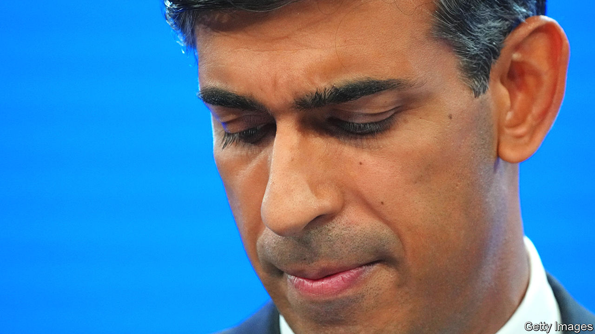
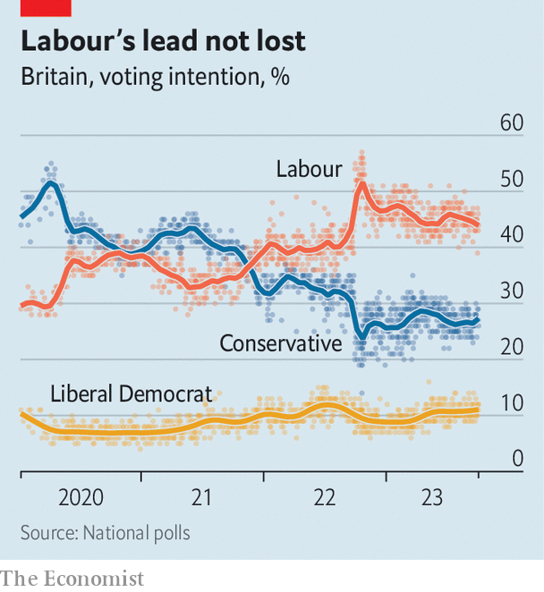
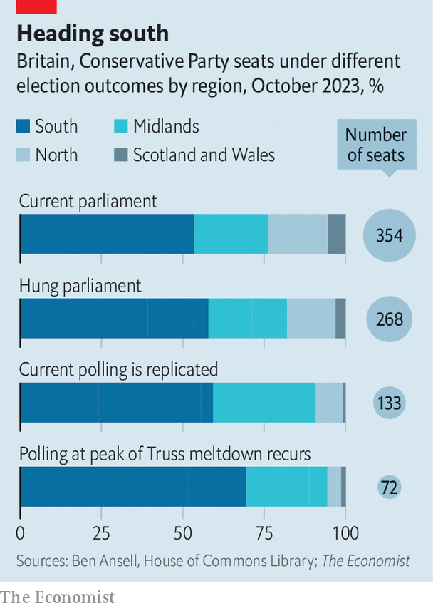

###### Tory story

# A glimpse of the Conservative Party after Rishi Sunak 

##### Edging to the right, more English, but not more unified 

 

> Oct 5th 2023 

Rishi sunak launched his bid to become the leader of the Conservative Party in the summer of 2022 as a mild-mannered technocrat who would tell hard truths about Britain’s public finances. Then, as Liz Truss, his rival, pulled ahead during that contest, he switched gear, turning himself into a red-blooded culture warrior who would defend “our history, our values and our women”. 

Ms Truss won that race, but  soon took over as prime minister and is now trying a similar sort of reinvention. A year of comparatively cautious, administrative government has only modestly repaired the damage Ms Truss’s tenure did to the party’s poll ratings. Defeat beckons in the next election, due by January 2025.

 


Labour has a 19-point lead, according to a poll released by Savanta on October 4th. At 86%, the proportion of Britons who think the country “needs a fresh team of leaders” is ten points higher than in March 2010, shortly before Gordon Brown’s Labour administration was ejected from office, according to Ipsos. Only 21% of voters think the Tory party is “fit to govern”. Tom Tugendhat, the security minister, observed that support for his party among 18- to 24-year olds had fallen to one in 100. “I know that a lot of us have aspired to the 1%, but that isn’t the 1% that we’ve aspired to.”

And so Mr Sunak is switching gears again. After 13 years of Tory government, Mr Sunak will fight the next election insisting that the Conservatives are agents of transformation. “It is time for a change and we are it,” he declared at his party’s annual conference in Manchester. , an expensive and much-delayed rail project. Out with smoking, with the legal age to buy cigarettes set to ratchet up each year. Out with the current post-16 school curriculum, perhaps. Before the conference Mr Sunak had junked deadlines for households to meet net-zero targets. 

Few in Manchester had much expectation of this transforming their prospects. The best that loyalists are hoping for is a hung parliament. Indeed, the bars and fringes were strikingly unfussed by how to fight the election. Another topic dominated: the battle for the party that would follow defeat. Its shape is already discernible. 

The party has been trending to the right on culture for years, ever since Brexit, but Mr Sunak’s new strategy has made it more strident still. Notwithstanding the prime minister’s ambitions to write the global rule book for artificial intelligence, his science secretary’s speech was billed by Tory HQ as “kicking woke ideology out of science”. Notwithstanding the fact that one of the government’s five priorities is NHS waiting times, the health secretary focused on sex-based terminology in health care. 

A cabinet full of former accountants and management consultants attempted to peddle lines from online conspiracies. Mark Harper, the transport secretary, promised to halt what he termed the “sinister” spread of “15-minute cities”—an urban-planning concept that cranks see as an instrument of government oppression. Claire Coutinho, the environment secretary and a protégé of Mr Sunak, claimed without basis that Labour would introduce a meat tax, noting that Sir Keir Starmer, the opposition leader, doesn’t eat it. 

Suella Braverman, the home secretary who openly manoeuvres to succeed Mr Sunak, thrilled members with a dark and swirling address that warned of a “hurricane” of migration, and of a political class “too squeamish about being smeared as racist to properly bring order to the chaos”. British cities could “go the way of San Francisco or Seattle”, she said, an allusion that may be lost on Britons without access to Fox News. Ms Braverman is a standard-bearer for leaving the European Convention on Human Rights, which will become a litmus test for the next Tory leader, and which may split the party as Brexit did. Rhetoric is a ratchet; norms that are set in a weekend can take years to unwind. 

The Conservative Party is becoming more strident, then. The next election is also likely to leave it more English and more southern. Using a model built by Ben Ansell of Nuffield College, Oxford, which applies a uniform national swing and allows for tactical voting,  has looked at a series of election scenarios ranging from a Conservative majority of one to a repeat of the party’s polling during the Truss meltdown, which would reduce it to just 72 seats. 

 


Even a less cataclysmic defeat would reduce the sprawling coalition built by Boris Johnson, which stretched from Cornwall to Aberdeenshire, to its safest English seats (see chart). If the current Labour poll lead of 19 points came to pass at the next election, the share of Tory seats in southern and eastern England would rise from 54% of its MPs to 59%. MPs in Scotland, Wales and northern England would shrink from 24% of the party to 9%. (Boundary changes are liable to compound these effects.) The Northern Research Group, a faction of Tory MPs from the north of England, would fall from 38 listed members to just three. 

But even if the Conservatives tilt right and become more concentrated geographically, the uneasy factional balance that characterises the modern Tory party would not be resolved. The evidence from the conference is that the fragmentation of the party into veto-wielding groupings is not abating. Since moderates and hardliners are sprinkled fairly evenly between marginals and safe seats, no election outcome is likely to make one faction dominant.

As part of our modelling, we mapped likely seat losses in various scenarios against Tory MPs’ declared support for current factional groupings. Once departing MPs are accounted for, members of the pro-Brexit European Research Group (whose leading lights have backed a new, socially conservative faction known as the New Conservatives) would still constitute between 22% and 25% of the party. The proportion of socially liberal One Nation Groupers would amount to between 9% and 15% of the party. Members of the Conservative Environment Network, a green-tinged faction, are set to comprise more than a third of the party in all scenarios. 

A new three-worded group is also on the march. Sunakites were confident, after Ms Truss’s calamitous mini-budget a year ago, that fiscal orthodoxy had re-established its primacy. They underestimated her. She emerged to a cheering fringe event at the conference to restate her wish for rapid corporation-tax cuts (Britain’s rising borrowing costs went unmentioned). 

Her faction—the Conservative Growth Group—claims to have 60 backers. Sir Jake Berry, another Tory MP, declared he has the supporters to form a “blocking majority” that would prevent the tax burden breaching its current high of 37% of GDP. All this jockeying would make for a gory spell in opposition. However unlikely, it would mean an even gorier fifth term in office. ■


