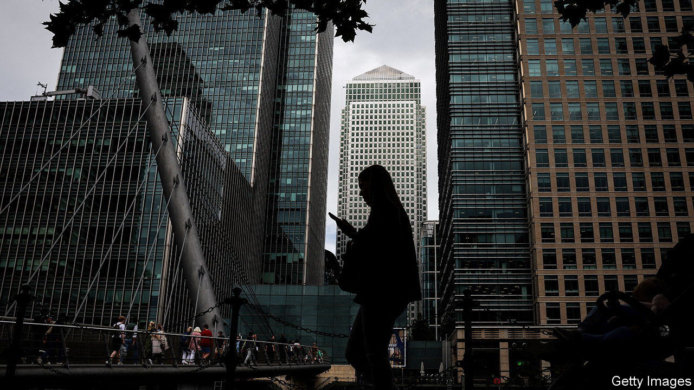
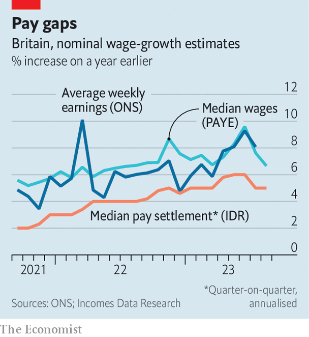

###### Our survey says

# Britain’s labour-market figures are less reliable than they were 

##### How tight is tight? The problem of deciphering the jobs market 

 

> Oct 5th 2023 

An accurate speedometer is a prerequisite to safe driving. So it is with monetary policy. The Bank of England has hit the economic brakes very hard since late 2021, increasing its benchmark policy rate from 0.1% in early December 2021 to 5.5% now. Although the bank paused its policy tightening at its latest meeting in September, it warned that rates may still have to rise further to reduce inflationary pressure. Policymakers fret that despite a slowing economy, the jobs market remains tight and rapid wage growth could entrench . One problem the bank faces is that core jobs-market data are now much less reliable than they once were. The speedometer may be faulty.

The most important figures on the state of the British labour market are produced by the Office for National Statistics (ONS). The ONS uses the Labour Force Survey (LFS), a monthly sample of tens of thousands of households that was once conducted in person but switched to telephone interviews during the lockdowns of 2020. Though still regarded by some as the gold standard of labour-market data, the LFS is looking increasingly debased.

The reason is a long-term decline in the number of people responding to the survey. A decade ago the LFS achieved a response rate of almost 50%; by late 2019 that had fallen to 38.5%. The rate has plummeted further since the pandemic, with just 14.6% of those contacted responding between April and June this year. A survey that had almost 85,000 responses in 2013 now attracts under 43,000. Those who do respond are increasingly older Britons and those less likely to be in work, forcing the number-crunchers to make their own adjustments. The ONS itself notes that it is experiencing higher sampling variability than in the past.

In recent months the headline LFS measure of the number of people in work has shown stronger growth in employment than other sources published by the ONS such as the Workforce Survey, gathered from employers, and real-time information collected directly from tax-receipt data from His Majesty’s Customs and Excise. Few doubt that the jobs market is tight by historical standards, but just how tight is a murkier question.

 


Officials at the Bank of England are also concerned about data on earnings growth. The headline measure of average weekly earnings, also put out by the ONS, has become, as the most recent minutes of the bank’s monetary policy committee (MPC) put it, “difficult to reconcile with other pay indicators”. More timely data derived from Pay As You Earn tax receipts point to a sharper slowdown in recent wage growth than the headline ONS numbers (see chart). 

Data on pay settlements compiled by Income Data Research (IDR), a pay-benchmarking service, also show the pace of wage growth slacking. “We are seeing a return to the trend we saw at the start of the year,” says Zoe Woolacott of IDR, rather than a continued acceleration in pay pressure. The bank’s own survey of corporate bosses also puts wage-growth rates below the official numbers. When it comes to calibrating interest rates, a difference of up to two percentage points in reported growth rates is a material one. The MPC minutes described the picture as “puzzling”. 

At least multiple sources of data are available on wages and employment. The uncertainty is more acute for the number of unemployed and inactive workers, where the LFS has traditionally been the only major source.

The ONS is keenly aware of the issues. In 2022 it announced a programme to transform how the LFS operates by moving to an online-first approach backed up by phone calls and a “knock to nudge” technique, whereby those who do not initially respond will receive a household visit from the statisticians. The ONS hopes to switch to these new data-collection methods entirely from March next year. That should lead to less volatility and more accurate labour-market statistics. 

But the Bank of England does not have the luxury of waiting another six months for the data quality to improve. Policymakers believe that the tightness of the jobs market and the pace of wage growth are the two most crucial factors when deciding if further rate rises are required. They are at least aware that their main speedometer may be faulty. But deciding how hard to press on the brakes will not be easy. ■


