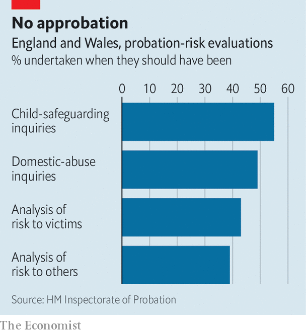

###### Crime and public safety

# Britain’s probation service is in deep trouble 

##### A crucial part of the criminal-justice system is failing to do its job 

 

> Oct 5th 2023 

After he was convicted of arson Damien Bendall should have been sent to prison. But the probation officer who wrote a pre-sentence report on him failed to consider police evidence showing that Mr Bendall was a violent criminal who posed a threat to young girls. He was given a suspended sentence and allowed to live with his pregnant girlfriend. Months later, in September 2021, he murdered her and three children, one of whom he raped.

The probation officer, a review later revealed, was inexperienced, and the report he produced “very poor”. He had determined that Mr Bendall was “low risk” to partners and children and “medium risk” to the public; in fact, he should have been classed “high risk” in both categories. The colleague who took on the job of managing Mr Bendall during his suspended sentence was inexperienced, too, having been recruited only six months earlier.

This case is unusually awful, but it is illustrative of problems rife in the Probation Service, which oversees criminals serving sentences outside prison and some of those who have been recently released. In the latest annual report on the service, Justin Russell, the former chief inspector of probation (he stepped down in September), paints a disturbing picture of how this crucial part of the criminal-justice system is largely failing to do its job.

Mr Russell was most concerned about public protection. When it came to keeping the public safe, inspectors deemed the handling of two-thirds of individual cases to be insufficient. The proportion was even higher for those criminals categorised as “medium risk” (most murders committed on probation are by people in this camp). 

 


Heavy workloads meant staff were spending too little time on each case, he said. Working from home wasn’t helping. Senior staff lacked time to scrutinise the work of younger colleagues, or to coach and support them; as a result “mistakes are being missed”. These include some shockingly basic ones. Probation officers routinely assess the risk that criminals pose, whether for pre-sentence reports or to determine levels of oversight outside prison. Mr Russell found that officers were making domestic-abuse inquiries in less than half the cases they should have been; safeguarding inquiries with children’s services were being made in only 55% of cases that needed them (see chart).

Public safety is not the only casualty of a faltering probation service. Research shows that individual supervision of convicted criminals by highly skilled staff much reduces reoffending rates. But instead of meeting convicted criminals face-to-face and giving them the support they need to make a better fist of life, overworked probation officers are too often checking in by phone instead. Youth-offending services perform much better (a majority are rated “good” or “outstanding”), in part because their workers have much lower caseloads. 

What has gone wrong? Part of the answer lies in the service’s part-privatisation in 2014, when it was split in two: a national, publicly run service dealt with the most serious criminals, while Community Rehabilitation Companies (crcs) were given financial incentives to reduce reoffending among other criminals. This went so badly that in 2021 the decision was reversed.

By then, however, a lot of senior staff had left, largely because the crcs had tried to increase profits by getting rid of more expensive workers. (Because the crcs didn’t publish staffing numbers, this did not become apparent until the service was renationalised, when bosses realised they were thousands of officers short.) The probation service is now recruiting hard, but “it takes time for the skills to bed in”, says Anthony Goodman, a professor of criminology and sociology at Middlesex University and a former probation officer. “You can’t just give someone a checklist and say, ‘This is what you need to do’.”

The Probation Service’s failings have roots in longer-term changes, too. Probation officers were once appointed by magistrate courts; in recent decades control over appointments and policy has gradually moved from the judiciary to a national service based in Westminster. Peter Raynor, a professor of criminology at Swansea University and a former probation officer, says centralisation also affects the way courts sentence criminals, especially when it comes to community sentences, which result in lower reoffending rates than prison terms but are too little used. “When probation is locally run and local sentencers are involved, the courts have more knowledge about community sentences and more confidence in them.”

In his report Mr Russell said the time had come for an independent review to look into whether probation should “move back to a more local form of governance”. The case for a return to more localised control looks compelling. ■


