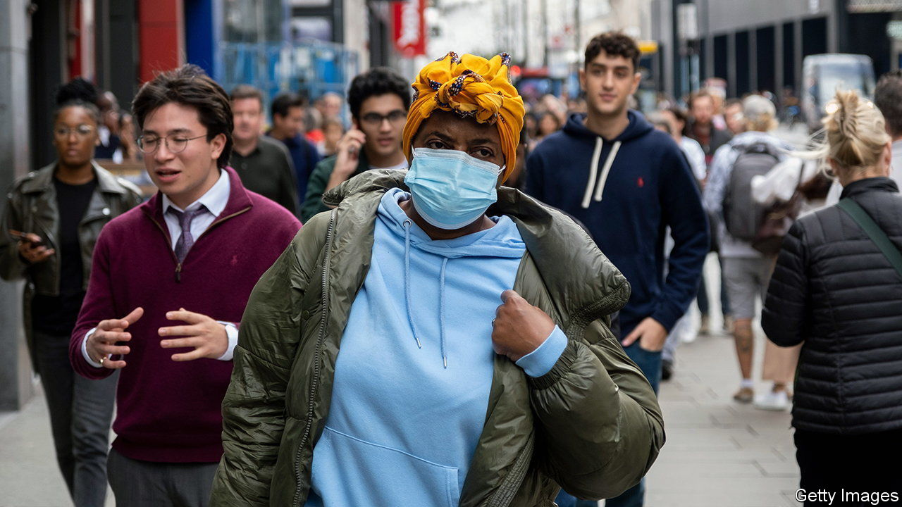
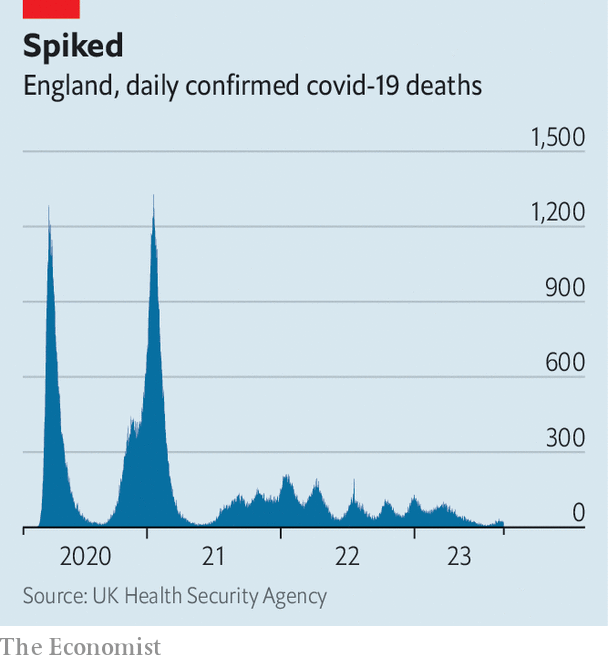

###### Post-pandemic Britain

# How Britain lives with covid-19 today 

##### Cases are rising again, but the public have other worries 

 

> Oct 5th 2023 

Covid-19 is still making headlines. On October 3rd Britain’s official covid inquiry began a fresh set of public hearings, looking at the government’s decision-making around interventions such as . Entries released from the diary of Sir Patrick Vallance, the chief scientific adviser during the pandemic, criticised the “flip-flopping”, “bipolar decision-making” and “chaos” of Boris Johnson’s government. What, though, of the disease itself? 

 


As Britain heads towards the fourth anniversary of the outbreak of covid-19, it is easy to forget what life was like at the height of the pandemic. At the peak of the crisis, when hospitals were running out of body bags, more than 1,000 people in England were dying with the virus a day (see chart). In the week ending September 22nd, around 35 a day did. Cases are rising again, and many people remain affected by long covid. But the decreasing virulence of variants and the delivery of 150m covid vaccines have reduced the number of people the virus can kill or hospitalise. Now when covid hits it does so in small waves, not tsunamis. 

As the threat from covid-19 has changed, so too has the strategy to combat it. During the third lockdown, in January 2021, Britons viewed the government’s online covid dashboard 76.5m times in 24 hours. In September the government replaced it with a version that also tracks flu and other respiratory diseases. In the National Health Service (NHS), executives now use the jargon of covid “recovery” rather than “response”. Operational guidance for the NHS puts “” above covid in its list of priorities for 2022-23. 

Britons, in turn, have grown used to living with covid. The protocols that used to govern behaviour are largely things of the past. Walk down a typical high street or get on the Tube and masks are rarely seen. Vaccine passports have disappeared faster than the government can incinerate its stockpiles of defective personal protective equipment. In schools official guidelines recommend that covid can be contained by regular handwashing and keeping classrooms ventilated, and that children or staff should take three or five days off respectively if they catch it. But knowing if you are infected is harder now that tests are not available free to the general public.

For some, vaccines remain imperative. Seven in ten over-75s have taken up the offer of a covid booster since the spring. In the London borough of Brent, one of the areas hardest hit by the disease, a mobile “vaccine bus” still criss-crosses the borough, offering jabs to all who proffer an arm. The central mosque, which has already jabbed 14,000 people in a basement, plans another round of vaccinations this month. Down the road from the mosque, a yellow poster in a pharmacy window stands out: “Free flu and covid-19 vaccines: Grab a jab—All eligible welcome”. 

Not everyone has as many options as people in Brent. Although the under-65s and those not deemed especially vulnerable can buy a flu jab, a private market in covid vaccines is currently elusive. (The government points out that this is at the discretion of manufacturers.) 

Monitoring the spread of covid depends mainly on government-run surveillance programmes—especially a new winter covid-infection survey, which will send out up to 32,000 lateral-flow tests each week to a representative sample of the population. One of the main aims, says Steven Riley of the UK Health Security Agency (UKHSA), is to detect any changes in the way the virus is spreading, and the risk to hospitals of surging demand. Last winter, flu hospitalised many more people than covid, including over 10,000 children. But the UKHSA is more worried about how covid could mutate than flu, says Professor Riley. Following the identification of a new covid variant, known as BA.2.86 or “Pirola”, the government has brought forward its autumn booster programme. 

For most Britons, attention has shifted away from the disease to other problems, including those worsened by covid. At the back of the mosque in Brent, a health centre built in 2021 offers screening for certain cancers that are being diagnosed later, in part because of pandemic-era backlogs. At its front, tables teem with crates of bananas and courgettes for those struggling with the cost of living. The virus was once the only thing people thought about. For many, it is now background noise. ■


