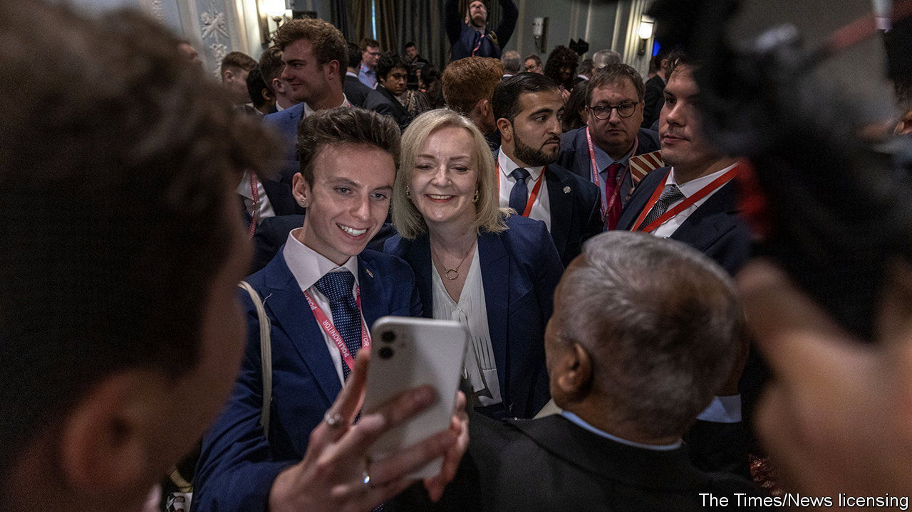

###### Political fashions

# Impressions of a first-time visitor to the Tory conference 

##### Why do so many Conservatives wear ties? 

 

> Oct 3rd 2023 

This year’s Tory party conference raised many troubling questions. What would happen to , a high-speed-rail-project? What to do about inflation? Above all: why do so many Tories still wear ties? 

The tie, which has elsewhere largely fallen out of favour, was there in abundance. There were spotted ties and silk ties; floral ties and faded ties; a pheasant tie (its owner likes to eat them—pheasants, that is) and paisley ties. Some were worn on principle (“Got to keep up the high standards”). As midnight looms, a drunk Tory appears in a slightly askew bow tie. Conference, he slurs, is “good fun”. Behind him, a man in a stripy tie wobbles towards a flower bed. 

People who have not been to the Conservative Party’s annual conference might assume that the “conference” bit is what matters. For Tory members, though, it is all about the party. A conference does take place. In airless auditoriums people in lanyards give ill-attended speeches; in the nearby exhibition hall, people mill around the Alzheimer’s Society stall and the Tory merchandise one (the Thatcher water bottles were selling well).

But all that is a sideshow. The real action goes on in between sessions, as people in blue suits, blue shirts and brogues go to parties, drink white wine and use words such as “thus” in conversation. Above all, they freely express the love that dare not speak its name—Conservatism. Even impending political apocalypse (the Tories are far behind in the polls) cannot dampen their ardour; Liz Truss, the members’ choice to be party leader last summer, could still generate an enthusiastic crowd with an unironic speech about making Britain “grow again”. 

En masse, Tory party members are a striking breed. The men (and almost all Tories in Manchester seemed to be men) tend to have smart haircuts, polite smiles and look as if they are probably called Hugh. Tory females have the air of women who would know their way around a horse’s withers. Stand in the conference centre and the (relative) diversity of Tory cabinets starts to feel not just laudable, but more like a minor miracle. 

Tories themselves bridle at the suggestion that they are not diverse. A young party member in a bow tie, pointing at a pink-cheeked friend, says that he is even from Scotland. Many are much less upper-crust than they seem; it requires a lot of effort and aspiration to appear this out of touch. Then again, some really are just posh. In the queue for an event one woman looked irritated when they could not find her name on the list. Look for me, she says, under “Lady” instead. ■


