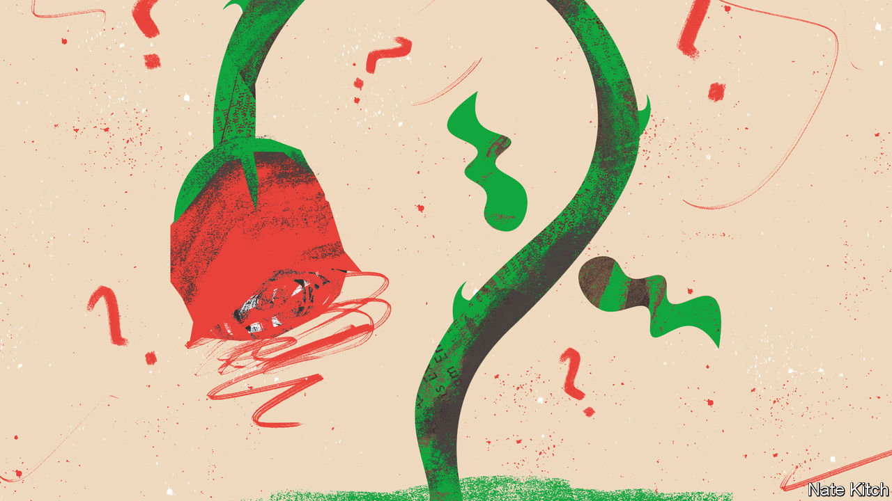

###### Bagehot

# Is Britain’s Labour Party a bunch of Tories, naifs or liars? 

##### The question that hangs over Sir Keir Starmer’s fiscal policy 

 

> Oct 5th 2023 

Welcome to the Great British Politics Quiz. Round one: match the politician to the quote. Politician a) Rachel Reeves, Labour’s shadow chancellor; b) Jeremy Hunt, the chancellor; c) Liz Truss, a former Tory prime minister; and d) Sir Keir Starmer, the Labour leader. Quote 1: “I want lower taxation. We’re not looking to the lever of taxation, we’re looking to the lever of growth.” Quote 2: “After a once-in-a-century pandemic and the biggest energy crisis in a generation, the level of tax is too high.” Quote 3: “I don’t see the way to prosperity as being through taxation.” Quote 4: “[The] unprecedentedly high tax burden is one of the reasons our economy is stagnating and why we need to cut taxes to help make Britain grow again.”

Do not worry if you did not score well (a=3, b=2 c=4, d=1). When it comes to tax, it is hard to tell Britain’s two main parties apart. Consensus rules British fiscal policy. Each party laments a tax burden that is near a post-war high. Each longs for tax cuts. Labour has ruled out any increase in income tax, national insurance or vat, which account for the bulk of government revenue. Ms Reeves has rejected the idea of new wealth taxes. Her planned revenue-raising measures are piddling. Labour’s pledge to put VAT on private schools would raise £1.6bn ($1.9bn)—a rounding error in a £1trn government budget. Likewise, if the Conservatives do unveil income-tax cuts before the election, Labour will be tempted to match them. 

Labour’s fiscal policy has three possible explanations. The first is that the party does not want to raise taxes. The second is that it does not need to raise them. The third is that it will raise them and is denying it for now. A simple question faces British voters on Labour and taxes: are they closet Tories, naifs or liars? 

Copying the Conservatives on tax is a long-standing Labour tactic. Under Sir Tony Blair, Labour bound itself to Tory spending plans in the run-up to the 1997 general election. This tactic has become less of a sacrifice now that the Conservative Party has been dragged to the left on tax. Under Jeremy Corbyn, Sir Keir’s predecessor, Labour pledged to crank up taxes to 37% of gdp—a level that will be reached in 2024, according to the plans of Rishi Sunak, a self-proclaimed low-tax lover. What was once painted as borderline communism is now cross-party consensus.

Take Labour at its word and extra revenue on top of that is not needed. The public services may be straining at the seams. But it is a fundamental tenet of  that they need better management rather than more money. Reform is the watchword. Whitehall has been distracted by leaving the European Union since 2016, and a carousel of Conservative prime ministers meant that the task of grinding out improvements was forgotten. 

A few supply-side reforms, such as loosening planning rules, would result in improved public finances, argues Labour. Since taxes are already much higher than they were, even a little economic improvement involves much more money flowing towards the public services. At the start of this parliament the state snaffled only 33% of GDP in tax. “Why have we got such a high tax regime?” asked Sir Keir this summer. “It’s because we’ve got low growth. That’s why I call it a doom loop.” 

Higher growth can help in the long term. But when schools are crumbling, ready cash is needed quickly. And pretending that public services can be improved without extra cash—believing in the —is not serious. Labour is caught in what Mark Blyth, an academic at Brown University, calls a credibility trap: “The more it promises to not spend any money, the less credible its other promises sound.” Labour’s claim that it can improve public services without spending is as plausible as the Conservative Party’s insistence in the austerity era that it could squeeze them without doing any harm. Each idea crumples as soon as it makes contact with reality. 

All political parties are, at times, economical with the . Voters say they want honest politics, with politicians being straight about the messy compromises inevitably involved in governing. Take polls at face value and a decent majority of voters are happy to pay higher tax for better public services. But recent history shows that voters are happily taken in by charlatans who promise the world. Being honest with voters is the first step towards being punished by them. 

Labour’s extreme caution is, therefore, understandable. Its leaders know that they lose general elections when voters do not trust them on the economy. They have bound themselves to fiscal rules that ban borrowing for day-to-day spending and require that debt falls over the medium term. “There will be no exceptions“, wrote Ms Reeves last month. In public and private, it is a point repeated to absurdity. If an asteroid struck Britain, all that would remain would be a few cockroaches and Labour’s insistence that debt falls over the medium term. 

Show me the money

Dishonesty lurks at the heart of both parties’ proposals. The Conservatives’ spending plans beyond 2025 are make-believe, with swingeing real-terms cuts to public services pencilled in that no one in Whitehall expects to happen. Likewise, Labour expects to be able to radically improve Britain’s public services without raising taxes or bursting out of its fiscal girdle. Neither will admit otherwise before an election. 

So which is it? Is Labour a bunch of Tories, naifs or liars? It is a mix of all three. Fiscal conservatism combines with naivety and deceit. If Labour wins, it is likely to find its Panglossian plans scuppered by reality. Expecting new management to improve Britain’s exhausted public services is naive at best and dishonest at worst. It will take money to stop schools falling down and to drag the nhs into the 21st century, even if Labour refuses to admit it. The bill will come due. Labour will have to pay it, somehow. ■


