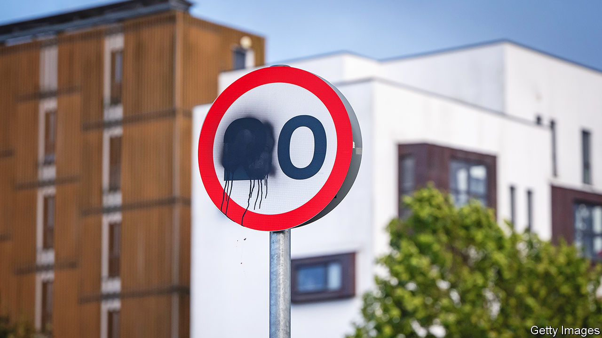

###### The war on the war on motorists

# Rishi Sunak’s misguided attempt to woo irritated British drivers 

##### A fight over speed limits, bus lanes and potholes is a dead end 

 

> Oct 2nd 2023 

The Manchester Central Convention Complex began life as a grand railway terminus. It will also be remembered as the place where hs2, Britain’s biggest rail project in a generation, was . In a speech there on October 4th, closing the Tory party conference, Rishi Sunak scrapped the northern leg of the high-speed line. The £36bn ($44bn) saved, the prime minister said, will be spread among hundreds of transport projects, mostly in the Midlands and the north of England.

Remarkably, more than a quarter of that money will go on fixing potholes. In addition, more than 70 road schemes made the list of replacement projects, including “the Shipley bypass, the Blyth relief road” and upgrades to several a-roads. Mr Sunak, it seems, has a taste for tarmac. That was also apparent before the conference, when he declared an end to the “war on motorists”. The use of 20mph zones will be curbed, and rules on bus lanes tweaked. This isn’t just a parochial agenda for the leader of a G7 country; it’s a misguided one. 

The idea of making roads a political battleground has its roots in a by-election held in Uxbridge and South Ruislip in July. Against expectations, the Tories clung onto the seat after a backlash against an , a scheme championed by the (Labour) mayor of London that makes drivers of the most polluting vehicles pay a daily charge. Mr Sunak wants to repeat that success nationally by tapping other sources of road rage.

Driving in Britain is often annoying, and at times miserable. There are 33m cars registered in the country; outside the capital, poor public transport means many depend on their cars for every journey. In 2022 drivers in Britain’s ten most congested cities spent 80 hours stuck in traffic, double the amount in Germany. Even with the upgrades, the jams are set to worsen. Traffic could increase by as much as 54% by 2060 because of population growth and cheaper-to-run electric vehicles, according to the Department for Transport.

Yet Mr Sunak’s claim of a “war on motorists” is hogwash. Few groups have been more coddled over the decades than drivers. To take one obvious example, fuel duty has been frozen for 13 years, at a cost to the Treasury of around £80bn ($98bn), almost as much as the price of a high-speed train line. Meanwhile, fares for trains and buses have risen much faster than the cost of driving. The result is what economists call “induced demand”: more people drive because it is easier to do so. 

What’s more, Mr Sunak’s ire is directed at policies that aim to curb the worst impacts of cars. London’s ULEZ is crudely designed but will save lives by making the city’s air less toxic. Cutting speeds in built-up areas is supposed to prevent crashes, which have killed more than 2,000 pedestrians in Britain in the past five years. And because traffic flows more smoothly, studies show that 20mph schemes tend to increase average journeys by less than a minute. Mr Sunak chides the Welsh government for making 20mph the default in built-up areas. But the same policy has been introduced in Edinburgh, much of London and in other areas across England without causing an uprising. 

Drivers can feel unfairly targeted when alternative modes of transport are unrealistic: when buses are slow, trains are unreliable and cycling is unsafe. But that is an argument for improving public transport. Many doubt whether the various rail schemes promised in place of hs2 will actually happen. Nor will Mr Sunak’s suggestion of allowing cars into bus lanes at certain times help. Speed limits, potholes and parking should anyway be the preserve of local councils, not Westminster. 

Might Mr Sunak’s manoeuvre still work politically? Voters in the “red wall”, seats in the Midlands and the north of England that the Tories won in 2019, are especially fond of driving. Scrapping hs2 will allow Mr Sunak to dangle goodies in marginal seats, and challenge Labour not to turn its back on drivers. Yet for many voters the overriding impression will be of a country that cannot build things. And although potholes are annoying, they are not the main thing people want fixed. ■


