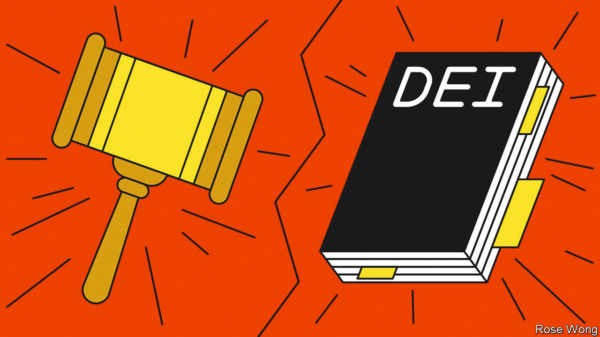
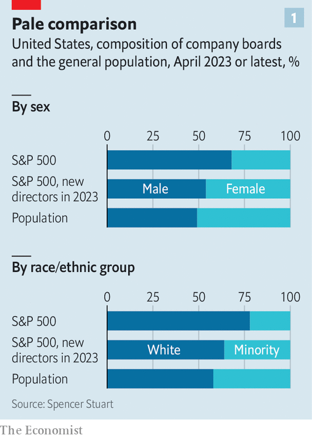
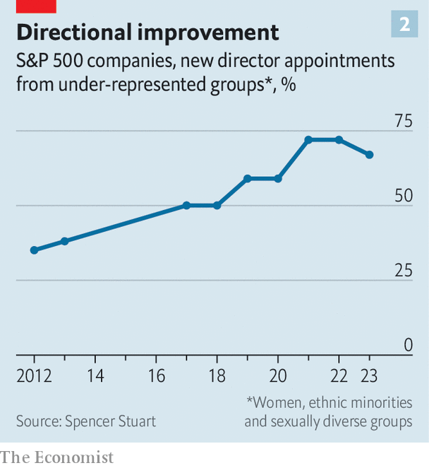

###### Unity on diversity

# America’s bosses grapple with threats to diversity policies 

##### Will lawsuits and economic uncertainty be the undoing of DEI? 

 

> Oct 2nd 2023 

On june 29th America’s Supreme Court ended 45 years of  in university admissions. The decision did not change the laws that govern companies’ hiring and firing decisions. But it did put wind in the sails of those who think efforts by firms to increase the  of their workforces have already stepped beyond the rules. Bosses and their lawyers have since scrambled to make sense of the judgment’s implications. One big law firm, Morrison Foerster, wrote a memo to clients after the ruling, counselling them to ensure their diversity policies do not create “unlawful preferences”.

The firm is now alleged to have ignored its own advice. In August American Alliance for Equal Rights (AAER), an organisation run by Edward Blum, the activist who brought affirmative action to the Supreme Court, sued Morrison Foerster. AAER alleges that one of the firm’s programmes for law students, a highly prized fellowship open only to applicants from “underrepresented” groups, illegally discriminates on the basis of race. Days later the law firm broadened the requirements of its fellowship in online advertisements. 

Morrison Foerster is not alone. In the most recent quarter chatter about diversity on big American firms’ earnings calls dropped by more than a third, compared with the same period last year, according to data from Bloomberg. Annual general meetings have lost their revolutionary zeal: support for proposals on social issues declined this year, and companies faced a record number of “anti-woke” proposals. Haranguing from progressives has eased ever since Joe Biden replaced the race-baiting Donald Trump in the White House in 2021. And bosses, confronted by higher interest rates, labour unrest and souring geopolitics, hardly need a lawsuit over their hiring practices.

Companies are, then, less vocal about their diversity, equity and inclusion (DEI) initiatives, a brew of policies aimed at making workforce demography reflect more closely that of the country as a whole. Such policies are under their sternest scrutiny yet. But a closer examination suggests that businesses are not disavowing such schemes. For all the remonstrations, DEI is not about to die.

 


Although the idea of DEI has been around for years in America, it gained prominence after the murder in May 2020 of George Floyd, an unarmed black man, by the police in Minneapolis. This outrage led to anti-racist protests across the country, and to a gasp of condemnation from C-suites. DEI became the toast of boardrooms, shareholder meetings and employee town halls. 

Companies rushed to disclose more details about the composition of their workforces and set public targets for the ethnic and gender mix of their workers, managers and boards (see chart 1). CEOs shelled out on “racial equity audits”, where a law firm tells a company how racist it is. Wannabe chief executives studying for an MBA at the University of Pennsylvania’s prestigious Wharton School could major in DEI studies. A survey of several big economies in May by EY, a consultancy, found that 73% of 18- to 26-year-olds would prefer to work at a firm that cares about DEI. 

 


Russell Reynolds, a headhunter, found that by 2022 three-quarters of big firms in the S&amp;P 500 index had a “chief diversity officer”. More than half of large businesses link bosses’ compensation to hitting DEI targets. According to McKinsey, a consultancy, 82% of 200 firms have a formal diversity programme for choosing their suppliers. Since 2020 around seven in ten new appointments to the boards of S&amp;P 500 companies have been “diverse”, which is to say not straight white men. That is up from 50% in 2018 and 38% in 2013, according to Spencer Stuart, another recruiter (see chart 2). By the end of this year, firms listed on the Nasdaq exchange are required to nominate, or explain why they have not nominated, at least one “diverse” director (rising to two over the next few years). 

Three years on from Floyd’s killing, DEI initiatives are facing challenges on two fronts. The first, as illustrated by Morrison Foerster’s predicament, is legal. Racial-discrimination cases have been a headache for companies’ general counsels for years. On September 28th America’s Equal Employment Opportunity Commission sued Tesla, a carmaker, over alleged harassment of its black employees. Today cases alleging that DEI initiatives are guilty of “reverse discrimination” are as likely to keep executives awake at night. On September 30th, for example, an appeals court granted AAER’s request to block a venture-capital programme open only to firms owned by black women, overturning a lower-court ruling last month that went against Mr Blum’s organisation. 

Mr Blum now foresees “a renewed enthusiasm to end these racial quotas”. America First Legal, which is run by a former adviser to Mr Trump, has filed complaints against more than a dozen large American companies. Two weeks after the Supreme Court ruling ended affirmative action at universities, Republican attorneys-general from 13 states penned a letter to the chief executives of America’s 100 biggest firms, chastising companies including Microsoft and Goldman Sachs for their DEI initiatives and threatening “serious legal consequences”. 

Ishan Bhabha of Jenner and Block, a law firm, says that the DEI schemes most likely to face such consequences involve the setting of quotas. The more specific a firm’s DEI targets, and the more explicitly they are linked to executives’ earnings, the bigger the risk that they look like an actual quota. Many companies’ targets do look quite specific. A recent study by Atinuke Adediran of Fordham University analysed hundreds of DEI policies. It found that those which aim to achieve goals by a certain date (as when State Street, a financial firm, vowed in 2020 to triple its “Black and Latinx leadership” over three years) outnumber those which lack a clear time horizon (Procter &amp; Gamble, a consumer-goods giant, says it wants “40% representation of multicultural employees” at every management level).

The threat of lawsuits may lead companies to adapt their DEI policies, not least by giving general counsels a greater say in crafting them, rather than ditch the initiatives outright. And any legal challenges will anyway take years to rumble through America’s courts. In the meantime, observes Esther Lander of Akin Gump, a law firm, companies are insisting in public that they will not allow the anti-DEI backlash to thwart their efforts, even if they are “quietly wondering whether any of their initiatives are problematic”. 

Another challenge is a slowing economy, which might be expected to have a more immediate effect on companies’ diversity programmes. In leaner times shareholders usually prioritise profits above all else. Employees, including young ones who profess to caring about DEI, may also put material concerns ahead of moral ones if the job market tightens. 

There is some evidence of trimming in DEI-land. Data from Revelio Labs, a workplace-data firm, show that hiring for roles administering DEI programmes at S&amp;P 500 firms has slowed by half since last year. Churn among workers in such roles, both voluntary and involuntary, is around twice what it is for other positions. Other executives are feeling the pinch, too. This year uncertain “macroeconomic conditions” led Alphabet, Google’s parent company, to slash the “ESG bonus” it awarded senior staff by 50%, to (a still juicy) $775,000 apiece. Half of the bonus scheme’s potential payout is related to meeting the tech giant’s DEI goals (as laid out in its 115-page “diversity annual report”). 

This belt-tightening does not, however, amount to a fundamental rethink of DEI policies. Although some chief executives find the moral case for greater racial and gender diversity a good enough reason to pursue it, and some of their shareholders agree, the more common justification for DEI is its purported effect on the bottom line. Many companies invoke a series of studies by McKinsey, which found that businesses with greater ethnic, racial and gender diversity are likelier than less diverse ones to enjoy higher profits than their industry average. 

Race to the top

The reality is more complicated. McKinsey acknowledges that “correlation does not equal causation” and that “greater gender and ethnic diversity in corporate leadership doesn’t automatically translate into more profit”. Plenty of scholars who have looked for a causal link have failed to find one. A paper by Jesse Fried of Harvard Law School examines the research on which Nasdaq relied to justify its board-diversity requirements. The exchange, Mr Fried writes, focused on studies like McKinsey’s while ignoring others that showed a negative effect on firms’ performance.

Regardless of such scholarly reservations, much of corporate America has persuaded itself that diversity is a driver of profits. A group of 69 of America’s biggest companies submitted a brief defending affirmative action to the Supreme Court as it weighed the practice’s fate at universities. In it the authors declared that “racial and ethnic diversity enhance business performance”. In support, they argued that racially diverse teams make “better decisions”. The HR Policy Association, an organisation which represents human-resources professionals, said in its own friend-of-the-court submission that it was not aware of any credible argument that commitments to diversity “should not be vigorously pursued”. The rest of America Inc seems to agree, even if that agreement may be the result of the very groupthink that DEI is meant to avert. ■


