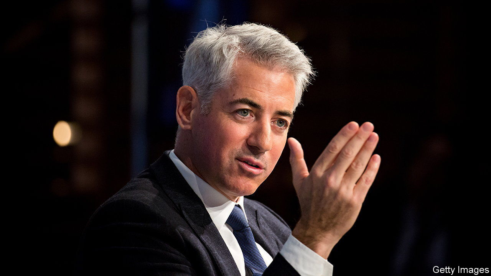
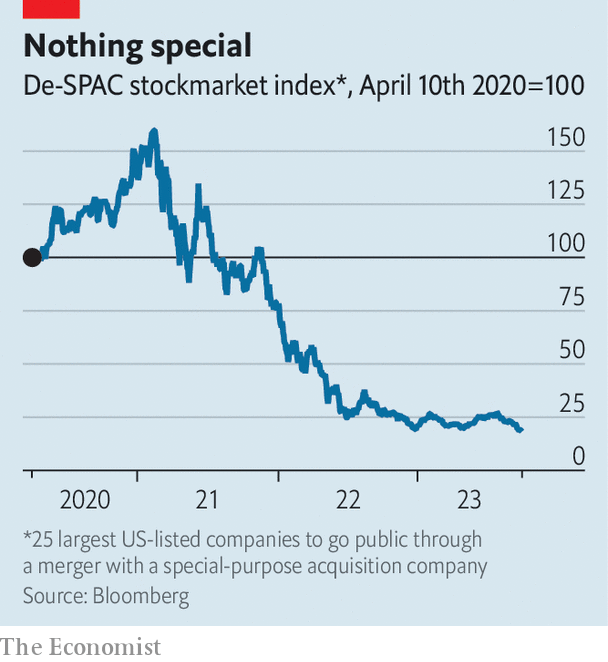

###### Make SPARCs fly

# Bill Ackman wants another shot at shaking up IPOs 

##### A new spin on blank-cheque firms, without some of the bad bits 

 

> Oct 5th 2023 

BILL ACKMAN is hunting for deals. The boss of Pershing Square, a hedge fund, is on the lookout for “large private growth companies” which are seeking to raise $1.5bn or more, but are wary of the “risks and expenses” of a conventional initial public offering (IPO). His solution: a special-purpose acquisition-rights company, or SPARC. On September 29th regulators approved the novel investment vehicle, which Mr Ackman bills as a fairer, cheaper alternative to its tainted cousin, the special-purpose acquisition company (SPAC), which enjoyed a boom in 2021. 

There is much to like about this financial innovation. First, unlike SPACs, which raise a pot of money via an IPO and then scour the market for potential targets, the SPARC will find a merger candidate first. Helpfully, Mr Ackman has more time to make the deal—ten years, compared with two years for SPACs. He has also lined up potential investors: Pershing Square has granted SPARC rights at no cost to shareholders of its previously disbanded SPAC. Pershing Square itself can retain up to 5% of the new company. 

Once a deal is agreed with a target firm, the SPARC’s shares can start trading on an exchange. The SPARC rights-holders can then purchase stock at a price agreed in the deal within four weeks of the stockmarket debut. If an investor chooses not to exercise the rights, they expire. By pledging to chip in between $250m and $3.5bn as anchor investor, Pershing Square is aligning its incentives with those of its investors.

For the firm merging with his SPARC, Mr Ackman promises certainty and lower fees. In an old-school IPO the amount of money a company raises is not determined until its shares are priced just ahead of its trading debut. By contrast, a business merging with a SPARC knows exactly how much capital it will raise: it is the price at which it will combine with the already listed SPARC. Moreover, a SPARC does not have to pay bankers expensive fees to find investors and underwrite the share issue. SPACs offer their merger targets the same certainty, but at a high cost to anyone other than early backers (or “promoters”), who receive preferential warrants (the right to buy shares at a set price later). 

 


For subsequent offerings Mr Ackman hopes to “roll over” the investors in the first SPARC, creating a pool of capital without the overhead of a finder’s fee. His pitch also appeals to two other groups. The first is startup founders who grumble about the hefty fees charged by bankers to shepherd a public listing. They also harbour suspicions that banks deliberately underprice offerings, at their companies’ expense, to get an opening-day “pop” for favoured clients. The second group is retail investors keen to get in on IPO action that banks typically reserve for those same clients.

SPACs got a bad name because of a poor stockmarket record (see chart) and a few spectacular implosions. Many failed to find a merger target in time and had to return cash to shareholders. Whether Mr Ackman’s vehicle can avoid the same fate will depend on whether he really can keep costs down and find an attractively priced target. Many tech startups raised funds at high valuations before interest rates shot up. Few will relish a public listing that would raise capital at a more modest valuation. The SPARC may be a bright idea. But it is not a sure-fire one. ■


