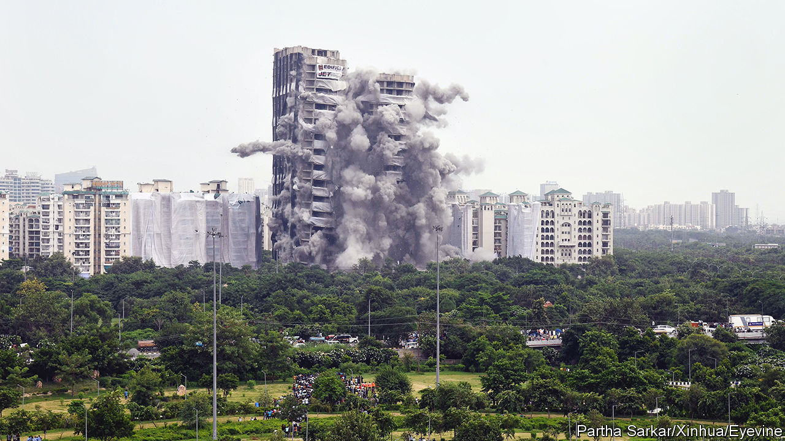
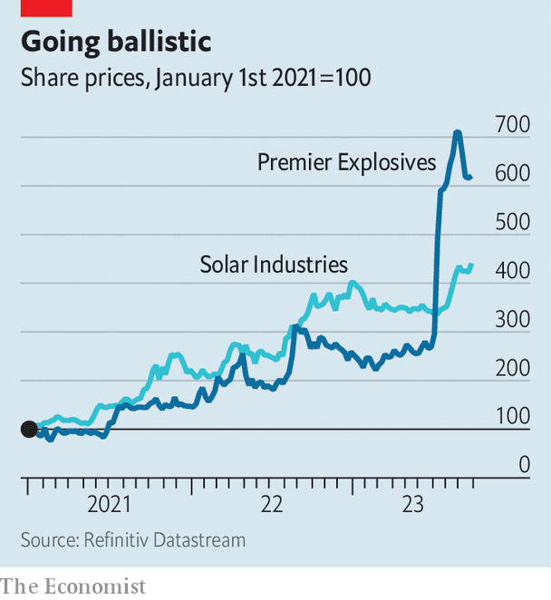

###### Explosive growth

# The Indian business of blowing things up is booming 

##### Literally 

 

> Oct 5th 2023 

THOSE WHO want to gauge India’s economic prospects often look to businesses that erect homes, produce consumer staples, manufacture inexpensive vehicles and provide basic services like electricity or discretionary ones like travel. Each of these sectors is currently sending mixed messages—enough good news to justify hope, but with caveats that counsel caution. One industry, though, is sending an unequivocal signal. And a loud one.

Since April the share price of Premier Explosives has more than doubled. That of a larger maker of things that go boom, Solar Industries, has quadrupled since 2021. Other dynamite producers are enjoying a similar streak. Besides being a gift to pun-lovers, this explosive growth reflects changes in an industry well placed to capture everything that is going right for India’s economy.

 


India began producing explosives in the 1940s, around the time it gained independence from Britain. Most of the engineers and technology came from Imperial Chemical Industries, a British concern. Coal India, a state-owned miner at the heart of both domestic energy production and industrial development, has long been the biggest customer. Because its mines are spread throughout India, and because transporting old types of explosive over long distances used to be best avoided, separate companies were created to serve Coal India’s individual sites. That geographical dispersion was preserved as other customers emerged, leading to a fragmented market. Today India boasts 36 large explosives producers.

For many years business was merely good. The rosier outlook of late stems from the confluence of several factors. Demand from Coal India, which is tasked with feeding the country’s growing energy needs, remains robust. This has been supplemented by a boom in the domestic construction industry. Explosives are used in the mining of limestone, which is needed to make cement and to produce steel. They are also indispensable in the vast land clearance for new roads and tunnels that is happening as part of the central government’s infrastructure ambitions.

Lastly, explosives-makers are benefiting from increased defence spending, in India and elsewhere. , a newspaper, has reported that Munitions India, created in a reorganisation of state-controlled companies in 2021 to manufacture ammunition, bombs and rockets, as well as explosives, is booked up with orders until March 2025. Buyers include seven companies in Europe, four in Africa and two in the Middle East.

In the past such exports were constrained by worries about transporting things that might blow up. The basic raw materials to produce explosives, such as various sorts of nitrates, were also well understood and widely available. Modern explosives are considerably more stable, which makes them less hazardous to move around, even as safety and environmental concerns are putting many countries off domestic production. Until recently it was China, the other big explosives manufacturer, that got a lot of the outsourced business. As geopolitical tensions mount, many customers, especially in the West, are seeking alternatives to Chinese suppliers. Excitement over firms like Premier and Solar will not be fizzling out soon. ■


