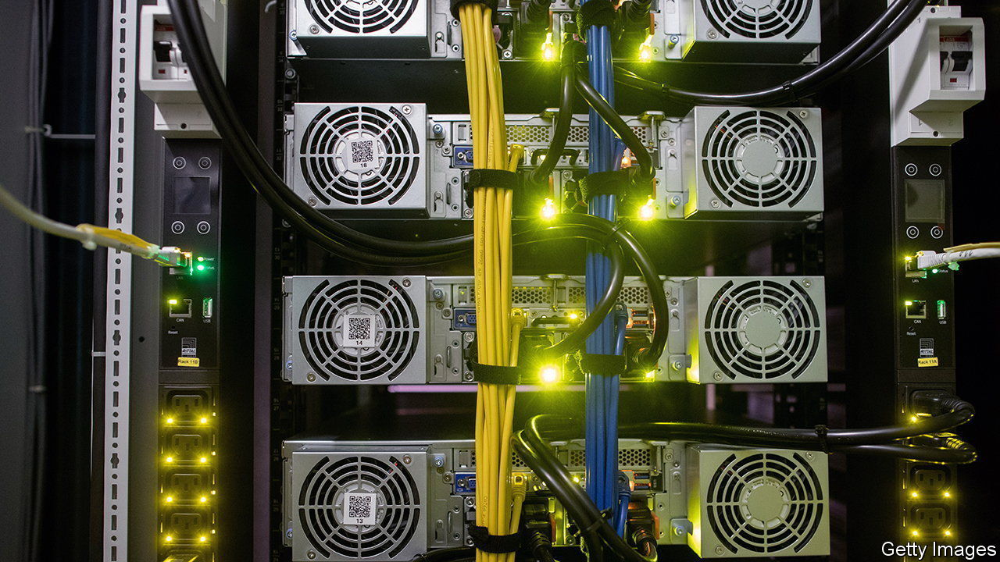
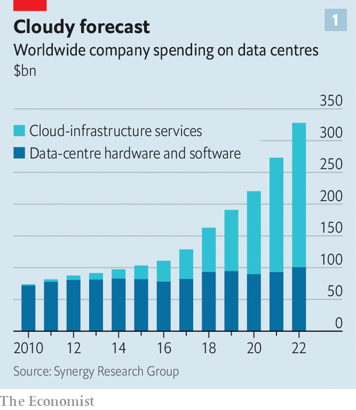
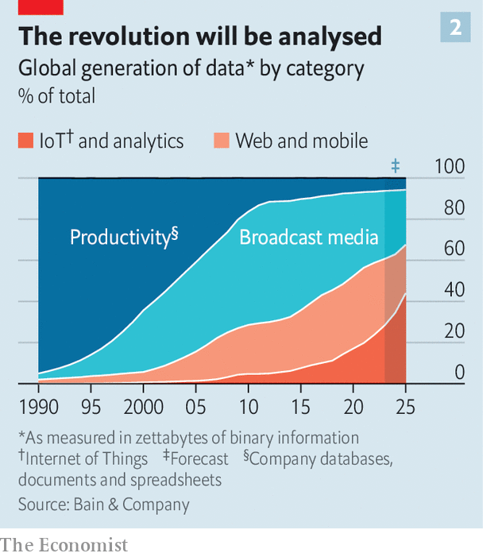

###### Head out of the clouds

# Why companies still want in-house data centres 

##### The unlikely persistence of on-premises computing in the cloud age 

 

> Oct 5th 2023 

Sometimes it seems as if the cloud is swallowing corporate computing. Last year businesses spent nearly $230bn globally on external (or “public”) cloud services, up from less than $100bn in 2019. Revenues of the industry’s three so-called “hyperscalers”, Amazon Web Services (AWS), Google Cloud Platform and Microsoft Azure, are growing by over 30% a year. The trio are beginning to offer clients newfangled artificial-intelligence (AI) tools, which big tech has the most resources to develop. The days of the humble on-premises company data centre are, surely, numbered. 

 


Or are they? Though cloud budgets overtook in-house spending on data centres a few years ago, firms continue to invest in their own hardware and software. Last year these expenditures passed $100bn for the first time, reckons Synergy Research Group, a firm of analysts (see chart 1). Many industrial companies, in particular, are finding that on-premises computing has its advantages. A slug of the data generated by their increasingly connected factories and products, which Bain, a consultancy, expects soon to outgrow data from broadcast media or internet services (see chart 2), will stay on premises. 

The public cloud’s convenience and, thanks to its economies of scale, cost savings come with downsides. The hyperscalers’ data centres are often far away from the source of their customers’ data. Transferring these data from this source to where they are crunched, sometimes half a world away, and back again takes time. Often that does not matter; not all business information is time-sensitive to the millisecond. But sometimes it does. 

 


Many manufacturers are creating “digital twins” of their brick-and-mortar factories, to detect problems, reduce down- time and improve efficiency. They are also constantly tweaking new products under development, often using data streaming in from existing products out in the world. For all such purposes data need to be analysed in as close to real time as possible, ideally with no “jitter” (inconsistency of data transfer), data loss or service outages, all of which are surprisingly common in the public cloud. Many firms also prefer to keep any data on which they train their AI models close to their chest. Giordano Albertazzi, chief executive of Vertiv, which provides data-centre infrastructure, thinks this may become a competitive advantage.

Running your own data centre close to your factory also pre-empts looming requirements on localisation and “data sovereignty” from governments afraid of letting data leak across their borders. Countries which have passed some version of data-sovereignty laws include China, where plenty of manufacturers have factories, and India (though its rules apply primarily to financial companies for now).

It is for such reasons that industrial firms are still spending on their data centres to house the data needed to hand, while shipping off less-time-critical information to the hyperscalers. Companies that embrace this dual approach include industrial champions such as Volkswagen, a German carmaker, Caterpillar, an American maker of diggers, and Fanuc, a Japanese manufacturer of industrial robots. 

Businesses that do decide to go it alone rather than rely on the hyperscalers have several options. They can build, equip and run their own facilities. These can be large or not so large. Companies like Vertiv and Schneider Electric sell small modular data centres that can be installed at or near industrial sites and linked to the data sources using 5G networks (whose range means these cannot be too far away).

Data users can also build their own data centres but rent the servers (computer-makers such as Lenovo and Dell now offer such a service) and outsource day-to-day management to specialist firms like Serverfarm. Or they can lease space in a data centre owned and managed by someone else. Tenants typically bring their own computing and networking kit, and foot the bill for running costs (including energy). In return, the landlord guarantees basics like space, physical security, access to power and cooling. 

The decision to build or rent may depend on a user’s data intensity. Consider a firm in America with a medium-sized data centre which thinks its computing load will rise roughly four-fold over a decade. In that case, building its own breaks even in seven years or so, and ends up being 5% cheaper overall than leasing, according to data from Schneider Electric. If the load remains stable, renting is the less expensive option, by a similar amount (assuming a flat cost of capital).

Several factors may affect such calculations. The price of power, land, material and labour is rising. The construction of some data centres is running two years behind schedule. This is pushing up rents, which are up by more than 20% since 2021, a faster rise than for all commercial property. Upgrading to AI-capable servers won’t be cheap, either. Counterpoint Research, another analysis firm, estimates an AI server is between ten and 30 times the price of a general-purpose one. The hyperscalers are buying up AI chips from manufacturers they already work with, such as Nvidia, leaving little for other buyers.

The cloud giants are not standing still in other ways. In order to get closer to clients and cut jitter, they are building data centres in new places such as Saudi Arabia, South Africa and Thailand. AWS is selling prefabricated data centres not unlike the micro ones from Vertiv or Schneider Electric. The software arm of Toyota, a Japanese carmaker, is using AWS’s fridge-size Outpost prefabs in America. The Pentagon has opted for larger AWS kit, the size of a shipping container. The hyperscalers’ AI prowess is likely to attract some industrial custom, too. Even so, believes Arun Shenoy of Serverfarm, which works with both hyperscalers and data users, many large firms will think twice before they stick their heads completely in the cloud. ■


