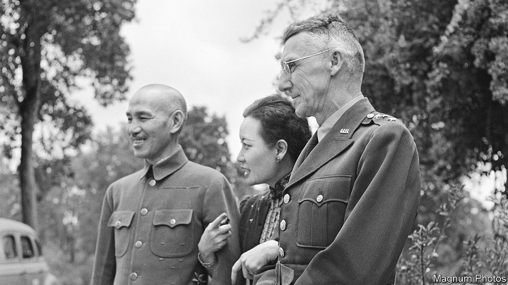

###### The favoured GI

# An unusual museum in China is dedicated to Vinegar Joe 

##### Xi Jinping has a soft spot for the second-world-war general 

 

> Oct 5th 2023 

A curious tourist attraction sits on a hillside overlooking the Jialing river in the south-western city of Chongqing. It features American weapons and military paraphernalia. Some rooms are decorated with American flags. A speech by President Franklin Roosevelt is engraved in stone in the courtyard. This is the Stilwell Museum, a site dedicated to the memory of Joseph Stilwell. The feather-ruffling American general served in China during the second world war.

Though he has been dead for nearly 80 years, Stilwell’s name has been in the news lately. In August the Chinese embassy in Washington announced that China’s leader, Xi Jinping, had replied to a letter from Stilwell’s grandson, John Easterbrook. Weeks later it was reported that Mr Xi had also corresponded with two veterans of the “Flying Tigers”, a group of mercenary American pilots who fought on China’s side in the war. In both letters Mr Xi called for better relations with America.

Why is Mr Xi reaching out to these people? The Stilwell Museum provides some clues. It describes the general as “a great friend” to China. From 1942 to 1944 he served as commander of American forces in China, Burma and India, and as chief of staff to Chiang Kai-shek, leader of the Kuomintang (KMT) government in China. The museum is built on the grounds of Stilwell’s residence in Chongqing, which was China’s wartime capital (at that time the city’s name was romanised as Chungking). The general’s main task was to help the Chinese fight the Japanese invaders and to oversee the delivery of American military aid to Chiang’s forces.

Nicknamed “Vinegar Joe”, Stilwell had strong opinions about his allies—and was not afraid to air them. He clashed often with Chiang, whom he called “the peanut”. In his diary he documented the KMT’s corruption, dithering and incompetence. Acting on an appeal from Stilwell in 1944, Roosevelt wrote a letter to Chiang threatening to cut off aid if he didn’t give the general unrestricted command of all Chinese forces. Stilwell hand-delivered it, writing in his diary: “The harpoon hit the little bugger right in the solar plexus and went right through him.”

Stilwell’s disdain for Chiang may help explain why such a museum is allowed to exist. The KMT, after all, had also been fighting Mao Zedong’s Communists. Stilwell was instructed to get the parties to co-operate against Japan. The museum says he “made positive contributions” to Mao’s forces and promoted a “better and correct understanding” of their cause. That may be overstating it, but Stilwell did support the American army observer mission sent to establish relations with the Communists. He also complained to Roosevelt that Chiang was hoarding supplies in order to use them against Mao’s army after the Japanese were defeated.

Another reason for China’s decision to open the museum in 1991—and why Mr Xi is writing letters—may be the Communist Party’s evolving view of the second world war. After seizing control of the mainland in 1949, the party refused to acknowledge America’s help during the conflict owing to its support for the KMT. But its attitude has slowly changed. Today it recognises America’s role in helping China to fight Japan. Moreover, the party under Mr Xi has shifted from portraying China as a victim of the second world war to a victor. This reassessment has helped shape China’s assertiveness abroad and rising nationalism at home, writes Rana Mitter, a British academic who specialises in Chinese history, in his book “China’s Good War”. 

Some people are evoking Sino-American co-operation during the second world war to call for better relations today. In his letter to the pilots, Mr Xi said America and China “should and must achieve mutual respect”. But there was little respect between leaders back then. In his diary, Stilwell described an urge to bite a radiator after noting that Chiang “sits on his hands and watches with great glee the fool Americans who actually get out and fight.” Not long after he delivered Roosevelt’s note to the KMT leader, the general was recalled. The relationship between Stilwell and Chiang had reached breaking point. ■

