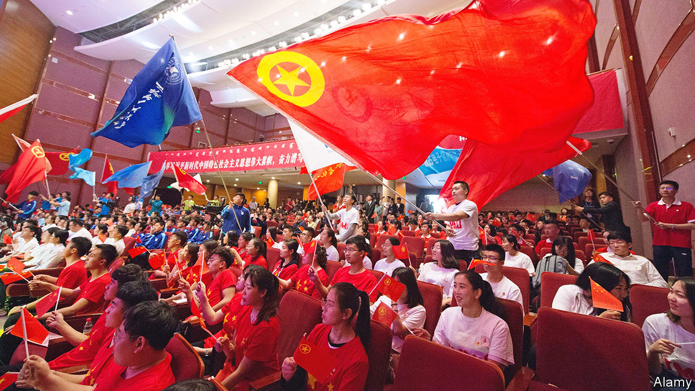

###### The young and the nationalist

# Communist rappers are luring young disgruntled Chinese 

##### The party’s youth wing is growing inside companies 

 

> Oct 2nd 2023 

To mark china’s National Day on October 1st the Communist Youth League sent a message to its nearly 18m followers on Weibo, a microblog platform. “Today, as protagonists of this era, we will write new legends on this sacred land!” it proclaimed. Attached was a music video, its lyrics suffused with patriotic rhetoric and interspersed with clips of speeches by Mao Zedong and the country’s current leader, Xi Jinping. So far, so predictable. The surprise was the singer and his style: a rapper whose early songs about drugs and violence were deemed unfit for public airing. gai, as he is known, has turned a new leaf. He is now the league’s mc.

The Communist Party’s youth wing is a vast organisation. With 74m members it is nearly as large as the party (98m), from which it is separate although some of its members have both affiliations. It plays a big role in China’s political life. The league indoctrinates people aged between 14 and 28 in the party’s ideology, trains potential party members and helps the party to identify talent that can be groomed for high office. It also has an outward-facing task: spreading the party’s message among young people with no political ties. After he assumed power in 2012, Mr Xi worried that the league was not up to the job. Officials admitted that it had become out of touch with young Chinese.

For the party, China’s youth are a growing problem. The economy is stagnating, unemployment is rife among the young and housing costs are sky-high. Late last year small youth-led protests broke out in several cities. They were aimed at Mr Xi’s draconian “zero-covid” regime (subsequently abandoned). With extraordinary bravery, a few demonstrators in Shanghai even called on Mr Xi to step down. He will be mindful of the pro-democracy turmoil of 1989, when some of the league’s officials joined the protesters. That period of upheaval across the communist world haunts Mr Xi. He often harks back to the Soviet Union’s collapse, which he blames on a breakdown in ideological orthodoxy and discipline. “It doesn’t matter if the Communist Youth League makes a thousand mistakes,” he said in 2015, quoting Deng Xiaoping. “But one mistake it cannot make is to deviate from the party’s track.”

In June Mr Xi declared that since 2012 the organisation had acquired a “brand new image”. But also that month the league’s chief, A Dong, said that amid “profound and complex changes” at home and abroad, “the overall fighting spirit and capabilities of the entire organisation urgently need to be improved.” This will involve pushing ahead with sweeping reforms that began in 2016. They range from cutting bloated management to expanding the league’s grassroots presence and tightening controls over membership.

Honing the league’s propaganda skills is also part of this effort. People like gai, whose real name is Zhou Yan, are helping. In 2018 Chinese netizens speculated that, after gai’s rise to stardom on reality TV shows, his performing days on officially approved platforms might be numbered: that year the government reportedly ordered broadcasters not to use artists representing “hip-hop culture”, or even sporting tattoos (gai has plenty: “Badkidz” says one in English). “Hip-hop’s prospects in China seem dim after Chinese rappers removed from TV shows”, said a headline in , a staunchly party-loving tabloid. The story noted gai’s disappearance from the airwaves. But the newspaper’s prediction soon proved wrong. The league began to turn to rappers, including gai, to make itself appear more in tune with the country’s youth.

Slick videos featuring these and other singers have been pushed out by the league through a plethora of social-media accounts. By August last year, the organisation’s central administration was running 26 of these with a total of more than 200m followers, according to , the league’s newspaper. The league’s main account on WeChat had a following of 110m, making it one of the biggest accounts on social platforms, the report said. Online, the organisation began referring to itself as  (“league-league”). In Chinese, doubling a syllable makes a name sound cuter—pandas’ names are routinely formed this way.


To Western ears, the rhetoric used by these accounts is often far from endearing. Mr Xi has pushed the new-look league to the front line of China’s online nationalism, using it to flood the internet with criticism of the West and of anyone in China with negative views of the party. “Why can’t we voice our opinions?” he asked the league’s leaders in 2013. “Good prevails over evil. When positive voices online become powerful, the impact of negative public opinion can be reduced.”

League accounts have been used to heap vitriol on Western journalists, sow disinformation and to attack dissidents suspected of trying to foment a “colour revolution”. In 2021 the league promoted a conspiracy theory that sars-CoV-2, the virus that causes covid-19, was developed in an American military lab. The hashtag the league created on Weibo to spread this story has been viewed about 1.5bn times—an average of more than once per person in China. In recent weeks the league’s accounts have whipped up public anger against Japan for releasing treated wastewater from the Fukushima nuclear plant, which was destroyed by a tsunami 12 years ago—ignoring support for the plan among many scientists elsewhere.

There is no doubt that nationalist rhetoric excites many young Chinese. It is less clear, however, how much the league’s online presence is helping it recruit the kind of people it says it needs to create “healthy and vigorous new blood” for the party itself. Of Chinese aged between 14 and 28, about one-third are members (the league’s officials can be older). But official statistics show that membership has fallen by nearly 20% since Mr Xi became China’s leader. 

This may not reflect any change in young people’s desire to join. Mr Xi’s reforms have aimed to make the league more elite. Teachers have been told not to sign up entire classes, as once was common (and is still the accepted practice for the Young Pioneers, a league-controlled organisation for children aged six to 14). Schools have been given quotas for how many students they can recruit.

The league is not trying to raise the ratio of members to non-members in its target age-group. Indeed, it has set a cap of 30% for 2025, which suggests that it plans little change. But it is trying to expand membership in private firms and NGOs. Among China’s 50m registered private firms, the league’s presence is still tiny. Between 2018 and January 2022, however, the number of league branches in such businesses more than tripled to above 300,000. In Yinchuan this year, league officials announced a plan to establish branches in all of the firms in the western city’s industrial parks by September. With the help of a recently developed database, known as Smart League Building, the organisation can keep much better tabs on such activity. All league members have to register their personal details on this system.

Mr Xi’s eagerness to boost the league’s influence may seem at odds with a common belief that at least part of his decade in power involved a struggle with senior leaders who had once served in senior roles in the league. Such officials are often referred to as members of the , or “league faction”. Under Mr Xi they have become far more marginal at the top of the party hierarchy. But there is little evidence that the league has operated as a factional bastion. More likely, Mr Xi prefers to surround himself with former colleagues, and he has never held office in the league. Jérôme Doyon of Sciences Po, a university in Paris, notes that the league’s administration is still a big source of recruitment for leadership positions in the provinces.

As Mr Xi sees it, the league has a crucial role to play. Even a decade ago he was warning its officials of a global “clash of ideologies” involving ceaseless efforts by “domestic and foreign hostile forces” to Westernise and divide China. This was making it even more imperative, he said, to provide China’s youngsters with “strong guidance” on their ideals and beliefs. Which is why, between occasional outings to revolutionary sites and performing good deeds in their neighbourhoods, recruits can expect plenty of time in the classroom, studying the thoughts of Mr Xi. ■


