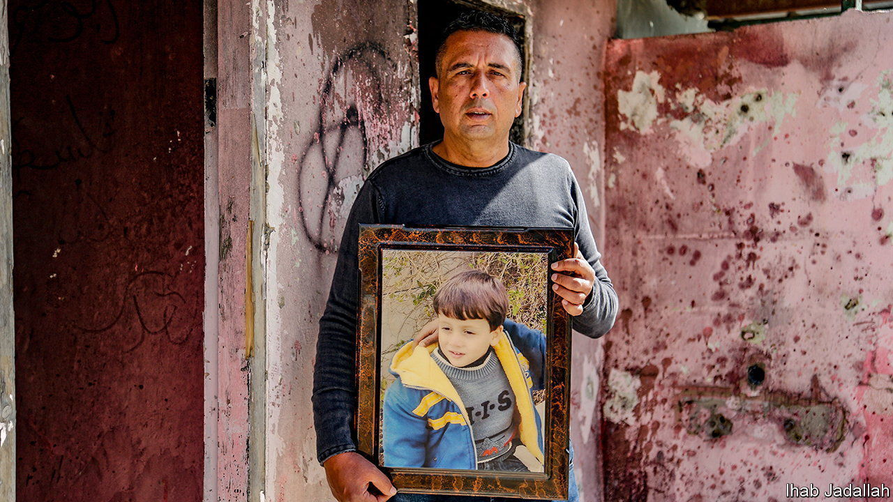

###### Life in the West Bank

# A new book revisits a bus crash that killed Palestinian children 

##### “A Day in the Life of Abed Salama” tries to make sense of a senseless accident 

 

> Oct 5th 2023 

 By Nathan Thrall. 

It began, as many accidents do, mundanely. A bus was ferrying a group of five- and six-year-old Palestinian children on a school trip. But there was heavy rain, and the bus collided with a truck on a road in the West Bank near Jerusalem. The bus went up in flames, killing eight Palestinian children and one of their teachers. In “A Day in the Life of Abed Salama” Nathan Thrall, an American author who lives in Jerusalem, examines the events leading up to the accident in 2012 and the heart-rending aftermath. 

Abed Salama is the father of one of the children involved. The book, which began as an article in the  published two years ago, is about the individuals affected by the accident. But, like a lot of writing about Israelis and Palestinians, the story is also about the history of two peoples living next to each other. It tries to answer what contributed to the horrors of that rainy day. 

In his book Mr Thrall captures both the universality and the specificity of the experiences of Palestinians living under . He recounts details any parent will recognise: the anxious chasing of the school’s secretary to pay for a trip; the last-minute dash to buy chocolate milk and crisps; the children staggering under backpacks “too large for their small bodies” as they clamber excitedly onto the coach. 

He also evokes details that will make parents’ stomachs churn: the urgency of the hunt for your child in a hospital, racing from one room to another; the flare of hope when you are told that your son was probably not on the bus that crashed (only to later learn the truth); the mother turning over in her mind the fact that she had almost refused to allow her son to go on the trip because the weather was so bad.

Accidents happen everywhere, every day. But Mr Thrall’s contention is that the horror was made worse because of the ways in which Palestinians’ lives are so strongly shaped and controlled by Israel and that the accident’s causes can be traced to the occupation. 

He makes this case convincingly. As he weaves in history, Mr Thrall’s decade as director of the Arab-Israeli Project at the International Crisis Group, a think-tank, is evident. He describes the colours of the different ID cards held by Palestinians and how they define people and constrain their movement. He introduces the architect of the wall that separates the occupied West Bank from  proper and traces its design and impact. The depth of Mr Thrall’s knowledge adds weight to his judgments, though there are parts that read a bit too much like a think-tank report. 

Understanding the status of the West Bank and reckoning with what that actually means for Palestinians living there feels pertinent, given the desire of some members of Binyamin Netanyahu’s far-right coalition to . Mr Thrall harnesses a now mostly forgotten accident and connects it to this recent history. 

For Palestinians living in the West Bank the wall limited their access to services, such as ambulances and police. Those areas deteriorated as infrastructure collapsed and drugs spread. Schools were awful. Parents who could afford it sent their children to private schools, which were largely unregulated. It was one of these schools that hired an illegally registered bus, which travelled along a congested, neglected route known as “the death road” before it crashed. 

“A Day in the Life of Abed Salama” is hard to characterise: it is part history, journalism, diatribe and lament. But the book builds a relentless case that this crash and the ensuing trauma must be remembered. It was all so predictable—and could easily happen again. ■


