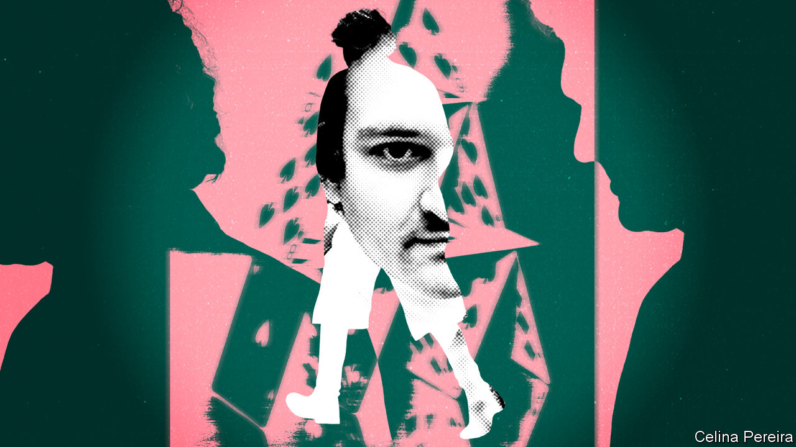

###### Crypto cryptography

# Decoding Sam Bankman-Fried, alleged titan of crypto conmen 

##### Michael Lewis challenges assumptions about his mesmerising, maddening subject 

 

> Oct 3rd 2023 

 By Michael Lewis. 

By Zeke Faux. 

In Zeke Faux’s new book on crypto, “Number Go Up”, there is an unflattering portrait of Michael Lewis. The author of  took the stage in the Bahamas in April 2022 to interview Sam Bankman-Fried, a  billionaire about whom he was rumoured to be writing a book. “Three years ago, nobody knew who you were,” Mr Lewis gushed. “And now you’re sitting on the cover of magazines. And you’re a gazillionaire. And your business is, like, one of the fastest-growing businesses in the history of the planet.” It made Mr Faux, a writer for Bloomberg who was in the audience, uncomfortable, as “the author’s questions were so fawning.” He began to question whether Mr Lewis was writing the book or whether he was a shill for Mr Bankman-Fried.

That biography, “Going Infinite”, is now out, published on the day that Mr Bankman-Fried’s trial began in New York. He is charged with multiple counts of fraud and misappropriating clients’ money; he has pleaded not guilty. Mr Lewis had unparalleled access to Sam, as he calls him—or SBF, as the rest of the world knows him—in 2022 and early 2023. In that time Mr Bankman-Fried went from the world’s richest man under 30 to alleged mastermind of the biggest fraud of the crypto era. 

In the past Mr Lewis has focused on little-known people doing extraordinary things. This time his subject is . Some readers may share Mr Faux’s worry: that Mr Lewis has got so close to Mr Bankman-Fried that he ceases to be objective.

From the start, Mr Bankman-Fried is portrayed as a puzzling yet oddly magnetic personality. He struggles to make sense of his childhood. His appearance is alienating. (He has to teach himself how to smile.) He hates fashion, sporting cargo shorts and unkempt hair. A hilarious passage describes him playing a fiendish video game while speaking to Anna Wintour, the editor-in-chief of on Zoom. 

His hyper-rationality sets him apart from almost everyone. He views people not as good or bad, but as “probability distributions” around a mean. He uses population statistics to dismiss the work of Shakespeare. He argues that there is too little money in politics, rather than too much, given the enormous economic impact of America’s $15trn of government spending. He mulls paying  $5bn not to run for president. 

Mr Bankman-Fried’s rationality leads him down two paths. First, he finds a calling in spotting statistical anomalies in financial markets, especially cryptocurrencies, and exploiting them to make a fortune. Second, he discovers in the  like-minded nerds who, more than having feelings for their fellow human beings, have feelings about saving humanity in general. That enables them to use dispassionate calculations to decide how to make the biggest difference with their money. Both paths intersect early in his career with dazzling, disastrous consequences.

Mr Lewis’s storytelling is as good as ever. A key moment in the book tells of an incident called “The Schism” that took place in 2018, at the start of Mr Bankman-Fried’s efforts to create Alameda Research, his crypto hedge fund. The firm’s finances were already in chaos, a large pot of money had gone missing and some of his EA recruits were in open revolt, believing Mr Bankman-Fried to be either dishonest and manipulative or well-intentioned but a terrible manager. They leave in a huff, though not before brawling over money. With the benefit of hindsight, you might wish everything had come crashing down around Mr Bankman-Fried’s head at that point, saving the world a lot of trouble.

Unlike his previous books, which explain the minutiae of financial innovations in breezy language that anyone can grasp, this one reveals little about the inner workings of crypto, which Mr Lewis says even Mr Bankman-Fried barely bothered to understand. Those wanting a rollicking—albeit jaundiced—examination of crypto’s underbelly should read Mr Faux’s book.

“Going Infinite” focuses on the human dimensions of the story, including Mr Bankman-Fried’s excruciating relationship with Caroline Ellison, the co-CEO of Alameda Research. Forget free love: it is one-sided and desperate. Forget romance: the messages they send each other are coldly businesslike. Forget human decency: Mr Lewis suggests Mr Bankman-Fried treated some of the women in his senior management team unfairly. There is also the jealous rivalry between him and Changpeng Zhao, known as CZ, who runs a crypto marketplace (and rival to FTX) called Binance. Mr Bankman-Fried appears to revel in publicly provoking him. This helps explain why CZ pulled the rug from under FTX in the . 

A third revealing relationship is that which plays out between Mr Lewis and  drafted in to rescue what is left of FTX for its creditors. Mr Lewis’s writing style works best when he stands in the background and, for most of the book, he does. But he subtly skewers Mr Ray, and it is hard to escape the feeling that he is channelling arguments that Mr Bankman-Fried would make—if only the bailiff would listen to him. 

It is clear that Mr Lewis is awestruck by his subject and his oddities, even more than Walter Isaacson was by , a capricious tech titan whose life he recently chronicled. Mr Bankman-Fried, as Mr Lewis portrays him, is both mesmerising and maddening. As a result, for most of the book, Mr Bankman-Fried’s voice drowns out the rest. There are other shortcomings. Mr Lewis is so gripped by the question of what happened to FTX customers’ money, which vanished leaving an almost $7bn hole in the firm’s balance-sheet, that he lets it overshadow the question of intent, around which the trial will revolve. 

As in his other work, Mr Lewis’s brilliant illumination of his central character is helped by his flattening of others. But in this case, those around Mr Bankman-Fried—especially Ms Ellison and other colleagues who have admitted guilt—are likely to have crucial roles in determining whether he is convicted or not. More complex portrayals of them, as well as more examination of the part his father, mother and brother played in the FTX saga, would have made this a richer book. 

Despite its flaws, the closer you get to the end, the bolder “Going Infinite” appears. By tolerating the idea that hyper-rationalists cannot make sense of the rules of the game the way most people do, Mr Lewis implicitly asks readers to reconsider whatever they thought they knew about Mr Bankman-Fried. In the court of public opinion, he is already convicted. That’s reason enough to give this book a read. ■


