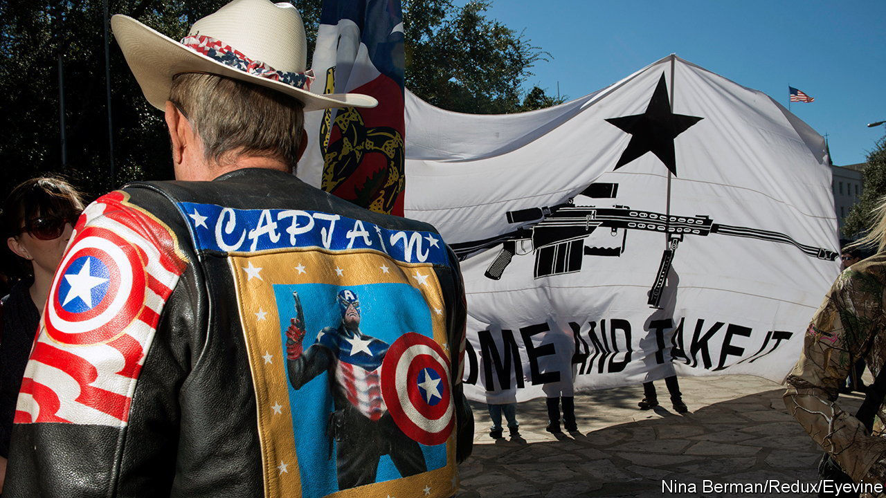

###### Going great guns

# The AR-15 is a symbol of liberty or loss, depending on whom you ask 

##### A new book, “American Gun”, explores the fraught history of a firearm 

 

> Oct 5th 2023 

 By Cameron McWhirter and Zusha Elinson. 

ONE OF THE first people to shoot an AR-15 was  in 1957. Wayne, then the face of American masculinity and the gunslinging West, was at a nearby shipyard repairing his boat when he heard that ArmaLite, a small gunmaker, was testing a new kind of firearm; he dropped by to try it. The AR-15 would go on to become one of America’s most famous and controversial weapons: the gun with which not just real war, but culture war, was fought.

As Cameron McWhirter and Zusha Elinson, two reporters for the , recount in their new history of the AR-15, Eugene Stoner, who worked for ArmaLite, was the underdog inventor who wanted to craft a tool for defending American lives. Stoner was a self-taught engineer with a penchant for clip-on bow ties. He improved on what came before by making his gun’s central mechanism, or receiver, out of aluminium rather than heavy steel and its stock out of fibreglass. Gas, rather than a delicate metal rod, would eject spent casings and load in new rounds, enabling it to fire rapidly—around 45 rounds per minute. 

The timing was ideal for Stoner’s invention, which he first fabricated in his garage. After the second world war, the American armed forces wanted to replace the M1 rifle that soldiers had carried in battle with a lighter, faster-shooting rifle. The Nazis produced what Hitler himself called a (assault rifle), and in 1949 the Soviets introduced the AK-47. But Americans lagged behind, so distracted by the nuclear-arms race that they neglected small arms. The issue took on fresh urgency with the outbreak of the Korean war in 1950. (ArmaLite sold the design for the AR-15 to Colt, another gunmaker, in 1959.)

In 1965, at the urging of Robert McNamara, then America’s defence secretary, the armed forces began using the AR-15 in . However, officials decided to supply cheaper, dirtier powder than Stoner initially intended, resulting in extensive malfunctions. During one firefight, an estimated 50 out of 125 soldiers found their guns jammed. The problem was eventually worked out, but Stoner’s rifle was indirectly responsible for many American deaths in the first years of the Vietnam war. 

The authors are meticulous in the details they recount, although the tone can feel uneven, at first boosterish when discussing the gun’s origins before becoming more circumspect. Still, “American Gun” is a fascinating social history. Buyers did not initially take to a civilian version of the rifle, since its .223 calibre bullet was too small for hunting deer. Though it gained popularity over subsequent decades, it really took off in 2001 after the terrorist attacks on . A new kind of buyer came forward—sometimes mocked by old-school gun enthusiasts as “couch commandos”. They were more interested in self-defence than they were in hunting.

As AR-15 ownership rose, so did mass shootings, many conducted with variants of Stoner’s gun. Mr McWhirter and Mr Elinson catalogue these in excruciating detail, from the first shooting using an AR-15 in 1977 in Oregon (six killed); to one in , Connecticut, in 2012 (26 killed, including 20 children); to a shooting in Buffalo, New York, in 2022 (ten killed). 

The shooter in Buffalo chose the AR-15 not just because it was “very deadly when used properly”, he wrote, but also because “the media loves to hate on” it. In 2017 a man checked into a hotel room in Las Vegas with 14 AR-15s and eight similar guns: he would go on to commit the deadliest mass shooting in American history, murdering 58 people and wounding another 413 in just over ten minutes. 

Controversy has repeatedly boosted the AR-15’s popularity. Whenever regulation looms, Americans buy more. But despite being in lawmakers’ cross-hairs after shootings, . This is largely due to lobbying by the National Rifle Association (NRA), a powerful gun group. Even the federal assault-weapon ban, passed in 1994, was easily sidestepped, since manufacturers tweaked the design and names of guns to evade controls. (The ban expired in 2004, and lawmakers failed to renew it.) Today more than 20m AR-15s are in American civilians’ hands. The government will never take them away, as the NRA claims; it will even struggle to regulate them.

The AR-15 has been used in numerous conflicts in Colombia, Mexico, Northern Ireland and elsewhere, too. But “American Gun” focuses on the nation where the AR-15 was invented, where its unmistakable silhouette has become a symbol painted on young protesters’ signs after school shootings and emblazoned on flags that taunt, “Come and Take It”. For some, it signifies freedom; for others, heedless violence. In this contradiction and division, the AR-15 symbolises America. ■


