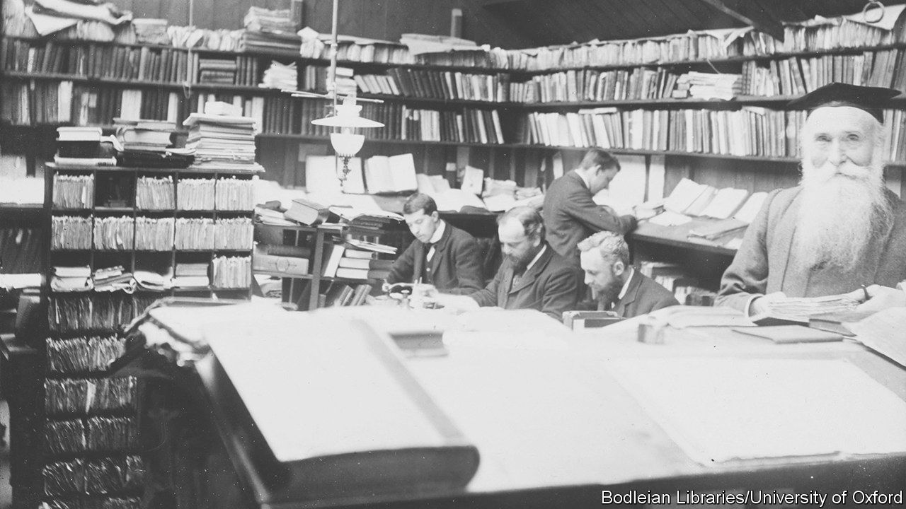

###### Spelling glee

# The stories behind the Oxford English Dictionary 

##### Anyone who finds dictionaries boring has not read Sarah Ogilvie’s new book 

 

> Oct 5th 2023 

By Sarah Ogilvie.

In July 1915 an ailing James Murray (pictured), one of the early editors of the Oxford English Dictionary (OED), defined one final word. He had dedicated 36 years to the dictionary; his toil had taken a toll. Knowing he would not see the project complete, he wrote his last entry: for “twilight”

The poetic pathos of Murray’s final days is one of many memorable tales in “The Dictionary People”. Conceived in 1857, the OED was a huge crowdsourcing project—“the  of the 19th century”—comprising 3,000 people. The idea was to create a “descriptive” dictionary that tracked words’ use and meaning over time (unlike its “” 18th-century predecessor by Samuel Johnson, which told readers how to say and use words). Volunteers read widely, mailing in examples of how “rare, obsolete, old-fashioned, new, peculiar” words were used. What is surprising about this fairly random method is that it worked, achieving order through the large number of contributors.

The origin story of Sarah Ogilvie’s book is almost as improbable as that of the dictionary itself. Ms Ogilvie, a former lexicographer who served as an editor for the OED, went into the archives of Oxford University Press and stumbled across an old notebook. It had belonged to Murray and contained the names and details of the dictionary volunteers, most of whom had previously been unknown. “The Dictionary People” is her work of detective scholarship, evoking the lives behind the names.

The dictionary’s contributors are an engaging cast, including three murderers, a vegetarian vicar, one of ’s daughters and J.R.R. Tolkien. Katharine Bradley and Edith Cooper, aunt and niece, were lifelong lovers and successful writers, who co-wrote plays under a male pseudonym. For some, the dictionary was an obsession: one contributor supplied 165,061 quotations. 

Murray, too, was assiduous. He once wrote to  of “Middlemarch” fame to ask about a word choice in “Romola”published 17 years earlier. (She responded courteously.) Yet he also found time beyond his Herculean project to be humane, paying several visits to one contributor imprisoned in Broadmoor, a high-security psychiatric hospital.

Through the multitude of stories, snapshots of a society in flux emerge: an age of scientific discovery, growing transport and communication links and increased professionalisation of scholarship. Yet many of the dictionary’s contributors were autodidacts. The project’s popularity reflected a growing community of people eager for intellectual pursuits but excluded from conventional academia. 

Ms Ogilvie’s book is full of quirky titbits. Many dictionary obsessives engaged in another crowdsourcing vogue: collecting and measuring rainwater. The presentation of the book is unconventional, too, taking its structure from the work it describes. There are 26 alphabetical chapters, each celebrating a group of contributors (memorably, “K” is for “kleptomaniac”). This is a cunning conceit, though it sometimes means that broader issues emerge only piecemeal.

“The Dictionary People” will appeal to logophiles. Pages abound with wonderful words: absquatulate (to abscond), couthutlaughe (a person knowingly concealing an outlaw) and zwodder (a drowsy feeling). But Ms Ogilvie’s book is also a story of omissions. The OED aimed to record English as it was used across the world; it was a product of empire. “The published sources of those words drew originally on the language of members of black and indigenous communities, whose names never made it into the pages of Murray’s address book,” Ms Ogilvie writes. In addition, many words were kept out of the OED “homosexuality” was included in 1933, “lesbian” not until 1976. When it, Murray was cautious about obscenity laws; first editions of the “C” and “F” volumes remain clear of the obvious culprits.

Above all, though, this is a story about ordinary people. It is a powerful testament to those who, to cite dictionary-helper George Eliot, “lived faithfully a hidden life, and rest in unvisited tombs”. ■


