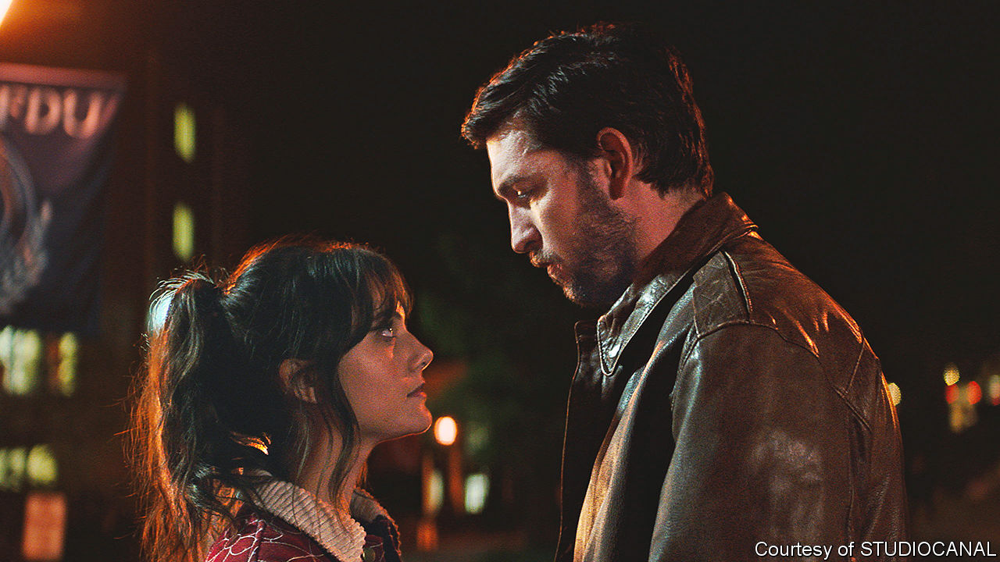

###### Back Story

# “Cat Person”, an internet-breaking short story, is back as a film 

##### A tale of dating and consent has many lives and lessons 

 

> Oct 5th 2023 

A long, excruciating sex scene is at the heart of “Cat Person”, both  and a flawed new film adaptation. In his klutzy rush to take off his trousers, Robert (played on screen by Nicholas Braun) finds he has forgotten to remove his shoes. He whispers dismal, porn-inspired pillow talk to Margot (Emilia Jones), eventually waddling off to the bathroom. In a fittingly grim detail added in the movie, he is still wearing his socks.

For a —a neglected form, despite its aptness for the TikTok age—“Cat Person” has had a long tail. When it ran in the  in 2017, it ignited debates over dating and consent, body-shaming (Robert is said to be flabby) and the male bias of literary culture. It has since cast light on two big distinctions: between real life and fiction, and, now, between literature and film. That unsparing sex scene has been pivotal.

A quick synopsis: 20-year-old Margot meets Robert, a man in his 30s who, in the original, may or may not have cats. They exchange reams of texts before going on a date and back to his place. He has a good time; she doesn’t. The story captures the rhythms and thrills of digital flirtation (plus the spelling corrections older people go in for); the dissonance between online and physical liaisons; and the way that, within couples, age and youthful beauty can each confer a kind of power.

In that central scene, an awareness of Robert’s fragile ego, a sense of obligation to him and an undertow of dread—the old one-two of pity and fear—keep Margot in bed when she yearns to leave. Many readers felt all this was so recognisable that it had to be drawn from life.

According to an article by Alexis Nowicki, a book publicist, in 2021, it was: her life. She alleged in  that Ms Roupenian, whom she had never met, used details of a relationship she had with a mutual acquaintance. On discovering the human link between them, Ms Nowicki wrote, “I could finally say for sure that ‘Cat Person’ was about me.” 

Except, she acknowledged, the crucial passage in the bedroom was “unfamiliar”; ditto a spiral of misogynistic texts in which Robert bears out Margot’s fears. The complaint pulled back the curtain on how quotidian events are transmuted into art. Ms Roupenian apologised for causing distress, but, like most authors, she had mixed snatches of reality with invention, refining and arranging them to achieve her effects. The artful result feels more lifelike than a transcript of any individual’s messy experience is likely to seem.

Directed by Susanna Fogel, the film is out in America on October 6th and in Britain three weeks later. In enlisting Mr Braun, best known as Greg, the doofus cousin in , it obeys an unwritten Hollywood rule—whereby even supposedly schlubby characters are played by nice-looking actors. But its main and most instructive fault lies not in casting but in its distortion of the plot.

The film rises cleverly to a perennial challenge of putting literature on screen, namely the tricky business of interiority. A lot of the drama happens in Margot’s head: her terrors, her desires, her invention of alternative Roberts to which the man himself fails to correspond. One of Ms Fogel’s solutions is to implant an alter-ego Margot in the sex scene, with whom the pinioned Margot keeps up a funny dialogue. The alter ego wants to go. “It’s just easier to get it over with,” groans the young woman in bed.

The shape of “Cat Person” is a bigger obstacle. A good short story is like an epiphany on an elevator ride. It evokes the characters in a few deft strokes, imbuing their brief lives on the page with a spectral before and after. It hints at a wider world while being complete unto itself. , a master of the form, thought the key was to finish writing, then cross out the beginning and end.

Movies are different. They typically demand more action and prefer amplitude to efficiency. In “Cat Person” this means giving Margot horror-inflected reveries, and an old-school mother who recommends “a little compromise” when it comes to men. The film clears up the mystery of whether Robert has cats, throwing in a dog and a colony of ants.

Most important, and most mistaken, is a new, thrillerish last act that bulks up the running time after the sex scene. The poise and subtlety of the original are lost. Alongside its lessons on men and women, fiction and reality and the traps of digital messaging, “Cat Person” offers a final warning on literary adaptations: there are many ways to skin a cat, but don’t try to turn it into a bear.■


