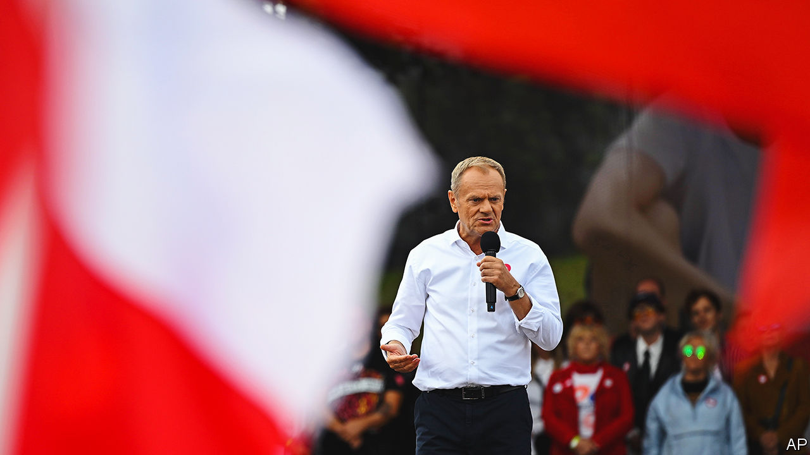
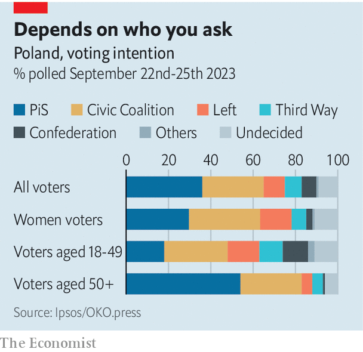

###### Prelude to a brawl

# After a brutal campaign, Poland gets ready to vote 

##### The government has a good chance of losing power, but the outcome is uncertain 

 

> Oct 5th 2023 

ELBLAG, A GRITTY port where the air stings from factory soot, is not exactly full of latte-sipping cosmopolitans. In Poland’s bitterly divided politics, urban voters mostly back liberals; in Elblag in 2019 the ruling hard-right Law and Justice (PiS) party came first. Yet when Donald Tusk, the centrist running to unseat PiS, arrived for a rally on September 28th, the hall was jammed. For years, he cried, PiS had packed Poland’s courts and bickered with the EU. Mr Tusk (pictured), who served as prime minister from 2007-14 and then as president of the European Council, promised to end all that: “Europe is freedom, the rule of law, the fight against corruption.” PiS was trying to brainwash Poles, he said, just as the communists and Nazis had.

If Mr Tusk’s language was harsh, the rhetoric at a PiS gathering outside Warsaw a day earlier was acid. Jaroslaw Kaczynski, the party’s leader, claimed that in a war with Russia Mr Tusk would surrender half of Poland’s territory. The group Mr Tusk heads, Civic Coalition (KO), would help the EU ship in illegal migrants. Mr Tusk wants to instil “German order” in Poland, Mr Kaczynski said, just like the Nazis. The speech was only slightly less rabid than one in August when he called Mr Tusk “pure evil” and said the opposition should be “morally exterminated”.

Polish politics has always been rough, but the campaign for this year’s general election, scheduled for October 15th, is setting records for vitriol. The government is scared: after years of scandals, it has a good chance of losing power. The opposition, for its part, fears that with one more term PiS could so cement its hold over the state that democracy would become a sham, as it has in Hungary under Viktor Orban. Both sides are piling on the stakes.

The question is whether undecided voters are listening. Polls show a tight race. PiS’s hold on its mostly older voters is solid, but may be near its peak. Younger Poles tend to back the opposition, but they also tend not to vote. Many find none of the parties appealing. Mr Tusk is 66, Mr Kaczynski 74; they have been in the political arena for decades. This contest will probably be the final one between these duelling icons of Polish populism and liberalism. But it may be decided by a new generation that cares for neither of them.

PiS will almost certainly come first. But polls give it perhaps 37%, well below the 44% it won in 2019 and far short of a majority. When PiS came to power in 2015 it introduced a hugely popular child-benefit scheme and lowered the retirement age, but its second term has been plagued by misfires. In 2020 an animal-welfare bill (Mr Kaczynski’s pet project) was binned after farmers revolted. A court ruling later that year banned abortion except in cases of rape, incest or to protect the health of the mother, leading to months of protests (the “Women’s Strike”) and alienating some of PiS’s own female voters. Earlier this year PiS had to water down a bill to investigate Russian influence on public figures that was clearly aimed at producing dirt on the opposition. To pacify angry farmers the government blocked imports of Ukrainian grain, sparking a diplomatic crisis.

Finally, in September, a bribery scandal erupted in the foreign ministry. Hundreds of thousands of visas may have been improperly issued to Asians and Africans. (In one case a group of Indians pretended to shoot a Bollywood movie in Poland, then flew on to Mexico, where they tried to cross into America.) The scandal hurts PiS in one of its core issues: immigration.

 


Many voters give PiS credit for Poland’s prosperity. GDP grew 3.2% per year in the decade to 2021, and the government has invested in poor regions, especially in the east, where PiS is strongest. Slow roads and trains have been replaced with fast ones. The government has reopened hundreds of police stations closed when Mr Tusk was in power. Outside the eastern city of Lublin, Robert, an IT worker, says he wishes PiS “stole less”, but prefers it to the opposition because it spreads the money around. Andrzej Zybertowicz, a sociologist who advises Poland’s president, Andrzej Duda, thinks even voters who dislike PiS may fear that a new team would disrupt their benefits. Rural voters viscerally distrust Mr Tusk, recalling his raising of the retirement age in 2012. He is seen to have abandoned Poland for glitzy Brussels. But KO has done little to change their minds, tailoring its message to urban voters. 

PiS’s control of the state apparatus is the root of its power. Orlen, a state company that owns most of the country’s petrol stations, has kept prices low before the election—so low that many pumps have run out of fuel. The government will reward counties for high election turnout with money for fire stations, but only in rural areas (which tend to vote for PiS). Parliament has refused to update electoral districts to reflect population changes, so liberal cities have too few MPs. The Election Observatory, a watchdog, estimates that Warsaw should have 34 seats rather than its current 20. Meanwhile, the government will stage referendums alongside the election on questions such as whether to tear down Poland’s border fence, falsely implying that the opposition supports this.

Yet trying to capture the state has hurt PiS, too. Its efforts to give the government control of the judiciary have been ruled illegal by the European Court of Justice. The EU is withholding €35bn ($37bn) in covid-recovery funds until more of the changes are rolled back. (Mr Tusk notes that this means Polish taxpayers are in effect funding German infrastructure.) The government has made moves to comply, but these are “just for show”, says Ewa Wrzosek, a prosecutor and rule-of-law activist. Meanwhile PiS’s power-grabs have touched off a rule-of-law movement that has mobilised support for liberal goals. The women’s movement catalysed by PiS’s abortion ban plays a similar role. “There’s been a huge political backlash on women’s rights,” says Monika Chabior, deputy mayor of the city of Gdansk, who got her start as an organiser during the Women’s Strike.

Young people are often concerned with issues that do not line up with nationalism or liberalism. Many are frustrated by sky-high housing prices. Others worry about depression and mental health. On the left they gravitate to the Lewica (The Left) party. On the right they may embrace Confederation, a boozy far-right libertarian group that bashes PiS’s spending on welfare (and on Ukrainian refugees). Both were recently polling at about 10%, but the gender split is huge: Confederation draws three times more men than women. In the past few weeks it has been hurt by racism scandals and poor debate performances. Some of its voters may shift to Third Way, an alliance of two centrist parties, one headed by a former journalist and reality-TV host.

No coalition option looks secure. Confederation intermittently vows not to govern with PiS, and would be a fickle partner anyway. KO, Lewica and Third Way may together scrape a majority. But President Duda, who comes from PiS, could frustrate their efforts to govern—as could courts controlled by PiS appointees. That might mean new elections soon. But the opposition’s spirits are high. On October 1st it drew an estimated 600,000-800,000 people to a march in Warsaw. State television, controlled by PiS, did not cover it live. ■

