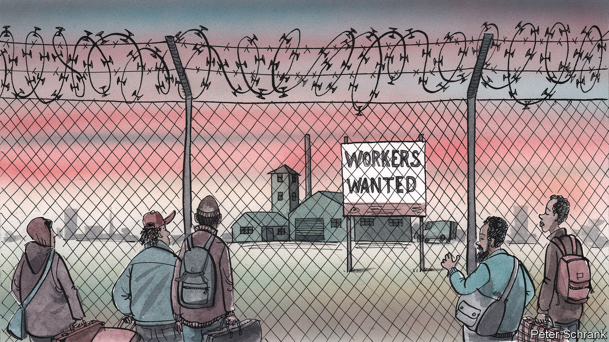

###### Charlemagne

# Europe is stuck in a need-hate relationship with migrants 

##### Alas, the EU is facing a fresh migration crisis 

 

> Oct 4th 2023 

A surge of small boats is arriving on Europe’s southern shores, brimming with migrants willing to work, for example doing low-skilled jobs in construction or caring for the elderly. In entirely separate news, Europe has a mounting shortage of workers, especially in low-skilled sectors such as construction or taking care of the elderly. To some, that may suggest a solution about as complex as slotting the last piece into a jigsaw puzzle. Alas, migration is not amenable to such reasoning. Countries have borders for good reasons; economic needs are often subservient to political imperatives. Still, the end result is that Europe is nuttily deploying barbed-wire fences and “workers wanted” banners at the same time. Meanwhile, thousands are drowning as they try to reach a place that may soon realise it needs them.

So migration is, alas, back at the forefront of EU politics. The bloc is on track to receive over 1m asylum applications this year, the most since a rush of arrivals in 2015-16. Back then, in the midst of turmoil in Afghanistan and Syria, the mood was fairly welcoming: Angela Merkel, Germany’s chancellor, had pronounced that in the wake of a large inflow of migrants “”—we can manage this. Now Europe no longer feels it can  quite as much. Whether liberal or conservative, northern or southern, the feeling is of a continent at its limits. Millions of Ukrainians fleeing war into the EU have strained resources—and sympathy—that might have gone to those from farther afield. Countries that took lots of migrants in 2015 have not fared well: Sweden is calling in the army to help deal with a surge in , much of it related to its previously porous border. Migrant-hating populists have surged there, as they also have in Germany.

If one thing unites politicians in the EU, it is the certainty that a botched policy on migration will cost them their jobs. The continent anyway suffers from old divisions. Southern European countries such as Italy and Greece complain that they bear the brunt of EU rules which force countries where migrants arrive to bear the expense of processing them, even though most migrants want to end up in places such as Germany and Sweden. Those rich countries think southerners are flouting the rules by failing to intercept migrants as they set foot in the EU. One solution mooted for years is a pan-European grand bargain, whereby countries beyond the front lines of migration agree to take in some of the huddled masses. Such a deal was struck in June, and continues to be haggled over. But under the weight of new arrivals it seems to be wobbling. Another element was an agreement with Tunisia, which many migrants from across the world are using as  before crossing the Mediterranean into Europe. The autocratic regime there was in essence to be bribed with EU cash to deter smugglers using its shores. A  helped stem the flow in 2016. But that too is not working well. 

A meeting of EU leaders on October 6th is meant to cool mounting tempers. For there have been spats aplenty of late. Italy is fuming at Germany about its government funding for NGOs that succour small boats in the Mediterranean. What in Berlin is deemed a “moral duty” to save imperilled migrants is decried in Rome as a “pull factor” for asylum-seekers; a politician in Giorgia Meloni’s hard-right ruling coalition has compared the arrival of migrants to the German invasions of the second world war. Schengen, the passport-free travel area, is shrinking by the day as country after country brings back border controls. On September 27th Germany reimposed some passport checks on Poland, in part as a result of authorities there having been busted selling visas in Asia and Africa. 

Nobody quite knows why the migrant numbers are surging. Some are fleeing persecution, though most arriving in Europe are ultimately deemed to want to move for economic reasons and will thus be denied refugee status. Yet economic migrants are just what many countries in the EU are looking for, amid tight labour markets and dire demographic projections.  has announced it will issue 425,000 work permits to non-EU nationals by 2025. Germany needs 400,000 foreign workers a year as baby-boomers retire; as it happens, that is roughly the probable number of this year’s asylum requests. Both Greece and France are mulling ways to regularise undocumented migrants willing to work in industries struggling to recruit. Even central Europe, long reluctant to accept migrants, is bringing in lots. Hail an Uber in Warsaw these days and it is likely to be driven by an Uzbek or a Turk. 

Workers of the world, migrate

It does not naturally follow that a shortage of job applicants in Europe would best be filled by whoever is willing to pay smugglers to get them there. But surely better ways exist to reconcile the hole in European labour markets with the bulge of migrants willing to fill it. “Europe is already in the midst of a global battle for labour that will only get fiercer as time passes,” says Michael Spindelegger, head of the International Centre for Migration Policy Development in Vienna. America, one of Europe’s rivals for willing hands, has a “green-card lottery” system to allow in over 50,000 people a year to work legally. Millions apply—and may thus be dissuaded from trying their chance illegally, though plenty of others do. Opening such legal channels in Europe would at least provide competition for the smugglers preying on human misery. 

A dose of such self-interested generosity would allow the EU to emerge from its migrant-repelling with its moral credentials (nearly) intact. Meanwhile the situation is the worst of all worlds, with little prospect for improvement. So far this year at least 2,500 people have died or are missing having tried to cross the Mediterranean. That is a stain on a continent that likes to consider itself a force for good in the world. In its battle against illegal migration, Europe should not forget that tomorrow it may be politely inviting in much the same people it is today letting drown. ■


 


