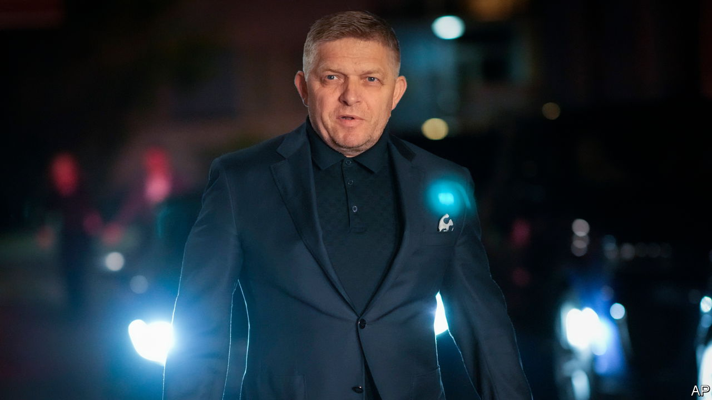

###### Guess who’s back!

# Slovakia gives pro-Russian populist nationalism another win 

##### The country could join the EU’s awkward squad if Robert Fico forms a government 

 

> Oct 1st 2023 

“GUESS WHO’S back!” wrote Viktor Orban, Hungary’s prime minister, in a happy tweet. Robert Fico, twice prime minister of Slovakia,  in 2018 after the murder of a journalist investigating high-level corruption, which led to mass protests. Now he looks set to lead his country once again. Mr Fico’s Smer party took 23% of the votes, coming first in an election on September 30th. So he may lead a coalition government including a party that once split from his own, plus an  whose leader has long been one of Russia’s staunchest fans. 

Slovakia’s EU partners will fret. Allies of Mr Fico, including senior intelligence officers and a former police chief and Smer politician, have been convicted of corruption or indicted for it. Last year Mr Fico himself was charged with leading a “criminal organisation” that controlled the police. The case was later dropped amid controversy; Mr Fico strongly denies corruption. But a former close associate says his main aim in returning to power is “that he will not be prosecuted”. 

Fellow EU members particularly worry about Mr Fico’s attitude to Ukraine. In three decades in Slovak politics Mr Fico tacked left on domestic policy, while foreign affairs were a lesser priority. He was a pragmatist who played with nationalism, says his former associate.

A new Fico-led government can be expected to ally itself in the EU and NATO with Mr Orban—a prickly, conservative, pro-Russian nationalist. Slovakia’s defeated government has staunchly backed Ukraine, handing over a Soviet-made S-300 air-defence system and 13 MiG fighters. Mr Fico has pledged to stop sending arms.

But all this is not yet guaranteed. Back in power, Mr Fico may shrink from alienating the EU and NATO. If he were to reappoint Miroslav Lajcak, his former foreign minister, now an EU official, to his old job, that might signal that he does not want to stray too far from Europe’s mainstream.

Much depends on his partners in government. Peter Pellegrini, who split from Mr Fico to found Hlas (“Voice”) in 2020, has not taken pro-Russian positions, but in 2021 he shared Mr Fico’s hostility to a defence deal with America. A former prime minister, Mr Pellegrini might be offered the foreign ministry as a lure to join the government. Some even see him leading a coalition government. Another potential partner is the extreme pro-Russian Slovak National Party, led by Andrej Danko. In 2019, after meeting Sergey Lavrov, Russia’s foreign minister, he said “I bow to everything Mr Lavrov does” in global relations.

Polling shows that Mr Fico’s voters and those with pro-Russian views tend to be older and less well-educated. Younger, better-educated ones favour the newish Progressive Slovakia party, which came second with 18%. Its views on everything from Ukraine to gay rights echo west European liberals—but are not to most Slovaks’ taste.

Surveys by Globsec, a Slovak think-tank, reveal a distrust in institutions, a yen for conspiracy theories and a deep anti-Americanism. Though 40% agree that Russia is primarily responsible for the war in Ukraine, 51% believe either that the West provoked Russia, or that Ukraine did so by “oppressing” Russian-speakers. 

Dominka Hajdu of Globsec explains that modern Slovak identity still stems from 19th-century pan-Slavic ideas that envisioned Russia as a protector. Many Slovaks still believe that “Russia is this big actor and we are poor, small Slovaks, and we have to do what they say because they’re so big—and we cannot do anything.” ■

