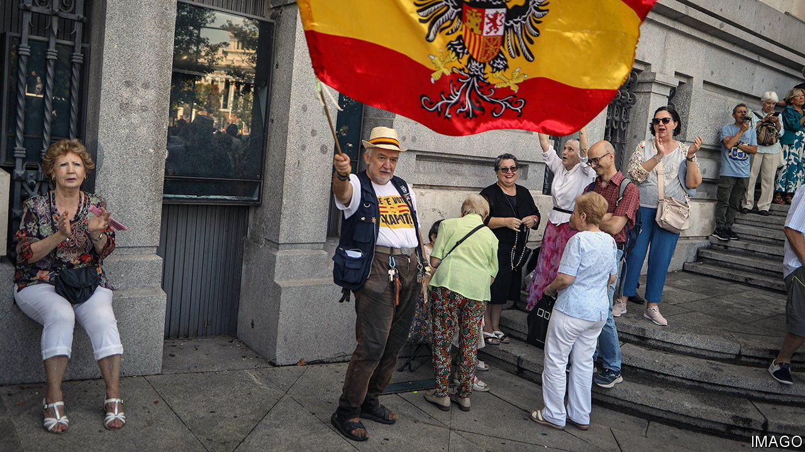
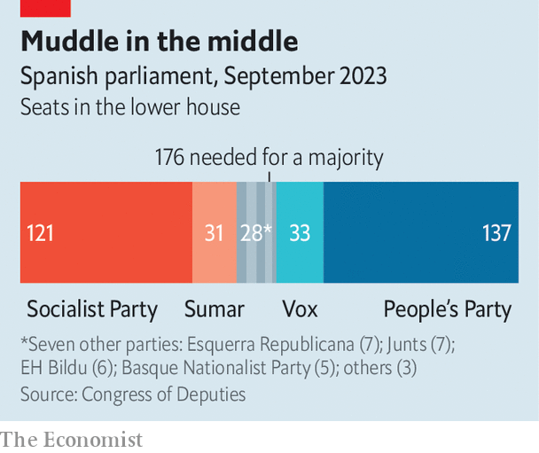

###### Deadlock or blackmail?

# Spain’s Socialists are struggling to recover power 

##### They may be ready to bow to its separatists in order to get it 

 

> Oct 5th 2023 

THE PRESIDENT of the Basque Country, Iñigo Urkullu, said it best. As Pedro Sánchez tries to return as Spain’s prime minister, Mr Urkullu said he would need “all the votes of all the parties all the time”. 

July’s elections left no party alliance with a majority. Alberto Núñez Feijóo, leader of the centre-right People’s Party, failed in a parliamentary vote to be installed as prime minister on September 29th. That leaves Mr Sánchez with a request from the king to try to forge a majority of his own. But Mr Sánchez’s Socialists and a left-wing ally, Sumar, are even farther from a majority than Mr Feijóo was. They need the support of five regional parties that want independence from Spain.

 


That includes two Catalan parties that in 2017 supported an illegal referendum on independence. Some of the organisers of that drive were jailed, and have already been pardoned by Mr Sánchez. But now he is negotiating an amnesty that would wipe out criminal charges for around a thousand people—most notably Carles Puigdemont, the region’s former president, now a fugitive in Belgium. He has made an amnesty a precondition for offering the support of his party, Junts per Catalunya (“Together for Catalonia”).

Opponents of an amnesty say it would grievously harm the rule of law, locking people up for ordinary crimes while letting them off for political ones. Public opinion is 53% against, 37% in favour. Mr Sánchez, though he stayed silent about amnesty negotiations before the king asked him to seek a governing majority, has talked of a chance to “turn the page” on Catalonia.

That would be quite something. But both of Catalonia’s main separatist parties say they are as committed as ever to independence. And Junts and the other party, Esquerra Republicana (“Republican Left”, or ERC), are fierce rivals to lead the nationalist cause. Between them they are bidding up the price to be asked of Mr Sánchez. Pere Aragonès, the regional president, who comes from the ERC, has directly contradicted the “turn the page” narrative, saying that an amnesty in itself would solve nothing. ERC and Junts pushed a declaration through the regional legislature calling on Mr Sánchez to “commit to working to make effective the conditions for the holding of [another] referendum”.

Through all the weasel words, it is clear that Mr Sánchez wants to get on with running Spain while parties whose support he needs are keen to get back to breaking it up. The Socialist Party fired back at the separatists, saying that their statement was unhelpful and that any agreement must respect the constitution (which guarantees the territorial integrity of Spain). 

The constitutional court could anyway strike down a deal. An amnesty would enrage many Spaniards. And Mr Sánchez would still have to send round a begging bowl—to Basque and Galician nationalists as well—in order to pass laws. But he may prefer that to holding yet another election to break the deadlock. ■

