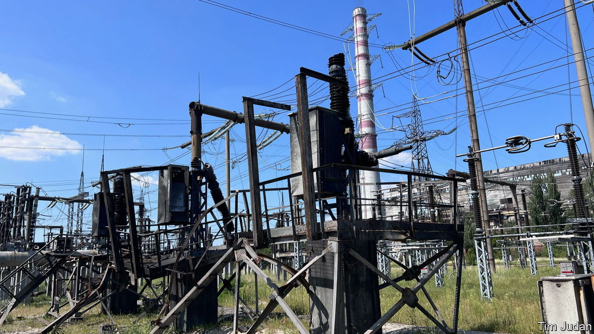

###### Winter is coming, once more

# Ukraine prepares for winter again as Russia targets its power grid 

##### Things may be tougher this time 

 

> Oct 2nd 2023 


IT WAS A close-run thing, says the director of the power station, as he thinks back to last November. The Russian missile was heading directly for the turbine hall; but it hit some of the plant’s many power lines a split second before impact, throwing it off course and thus sparing the heart of the operation. It was one of eight missiles to have struck here since the invasion began last year. Now Ukrainian officials are jumpy. The director’s name and the location of the station cannot be revealed, they say, nor the locations of factories that have been rushing to fulfil orders for new equipment to replace what has been damaged and destroyed. The officials make no secret of their fear that, in terms of energy, the coming winter could be worse than last.

In the switching yard, from where the plant’s electricity is distributed, workers are busy installing new insulators, replacing Soviet ones from the 1960s that were shattered during another strike. The cables above buzz softly. A 30-year-old high-voltage transformer, larger than a locomotive, previously used as a back-up elsewhere, is being connected to the system to replace one which was destroyed in another attack. Two exhausted engineers nap in the shade nearby.

Throughout the power station sand-filled bastions surround key pieces of machinery to protect them from shrapnel but, says the director, in the event of a direct hit there is nothing that can be done. Encasing high-voltage transformers in concrete shells is not an option because they overheat.

Ukraine’s engineers have been widely praised for preventing the collapse of the country’s energy system last winter when it came under sustained Russian attack. Ingenious schemes were found for moving both electricity and equipment around the country. Before the invasion Ukraine had the capacity to produce considerably more energy than it consumed, which gave it a buffer as parts of the system were knocked out. A recent modernisation programme also meant that it had many old but only recently retired transformers, which could be reconnected. Even so, between October 10th and the end of last December the average Ukrainian household had no electricity for a cumulative period of five weeks. 

The damage inflicted by the Russian campaign to freeze Ukrainians into submission last winter was immense. According to a report by the UN Development Programme power-generating capacity in April 2023 was down 51% from just before Russia’s invasion in February 2022. Nuclear power accounts for the largest part of Ukraine’s energy output, and while the three working nuclear stations still under Ukrainian control have not been directly attacked, the capture of its Zaporizhia plant, the largest in Europe, by Russia has meant that nuclear generating capacity is down 44%. 

With financial and physical help from its allies Ukraine’s engineers have been working around the clock to repair what they can in time for the coming winter. This comes on top of regular maintenance for a system with much aged equipment. But it is a slow process. 

One hundred new high-voltage transformers have been ordered, half to be produced domestically and half procured abroad; but attacks on Ukrainian factories have meant that few domestic ones have actually been made. As they arrive the foreign ones will be kept safe in Poland and Romania until they are needed.

German Galushchenko, Ukraine’s energy minister, says that the country is bracing for a renewed attack on its energy system but, with no more excess capacity and little in the way of spare equipment, it is much more vulnerable than it was last year. Ukraine’s allies have stumped up money but much is routed via international financial organisations. Their procurement processes for equipment are very slow, he says, so he is asking them for “a martial law approach” to speed things up. One important improvement compared to before the invasion is that Ukraine is now connected to the European grid, and so it can import power if needed. 

Ukrainians now have plenty of experience of how to cope with large-scale attacks, says Mr Galushchenko; but he adds that he expects the Russians, too, to have learned from their experience of “failing to destroy the system”. When asked what is the best way to ensure that the lights stay on this winter, he says wearily that the country needs more air-defence systems. On September 21st, for the first time since the spring, Russia sent a wave of drones against the Ukrainian power grid; four-fifths of them were shot down.

DTEK, a private company, produced around a quarter of Ukraine’s energy before the war. Since then it has lost more than 20% of its capacity, says Dmytro Sakharuk, its executive director. Of its pre-war workforce of 60,000, some 5,000 are now in the army. So many have gone to fight that 250 women are now working underground in its coal mines (before the war women did not work underground). The most frustrating thing, he says, is that when DTEK crews repair or replace damaged equipment the Russians simply attack it again. “It is like being a hamster in a wheel.” 

Mr Sakharuk also says that cyber-attacks could be an even bigger threat this winter than missiles and drones. A successful assault “can paralyse the whole system” and that can be “much more dangerous than physical damage”. Ever since the invasion began DTEK and Ukraine’s cyber warriors have been battling Russia’s hackers; and this, he says, is “a game of cat and mouse”. Once you develop a new way to protect yourself the hackers find a new way around your defences. “You are always in motion,” he says. ■

