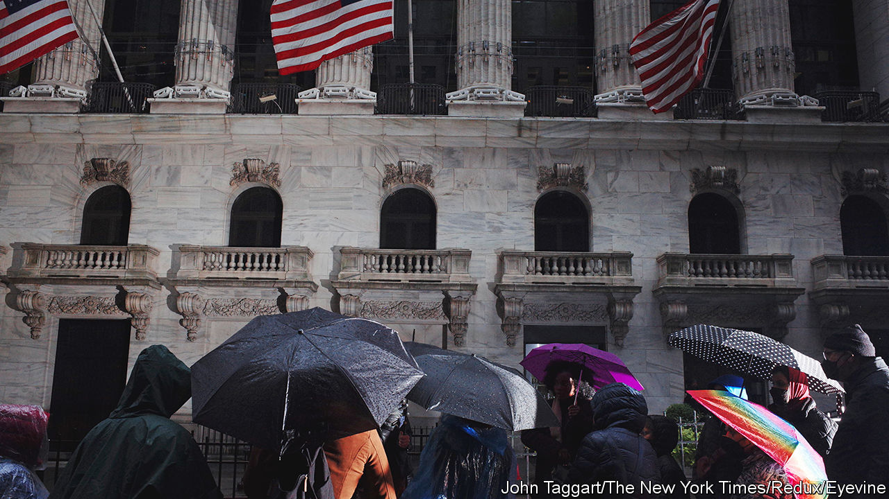
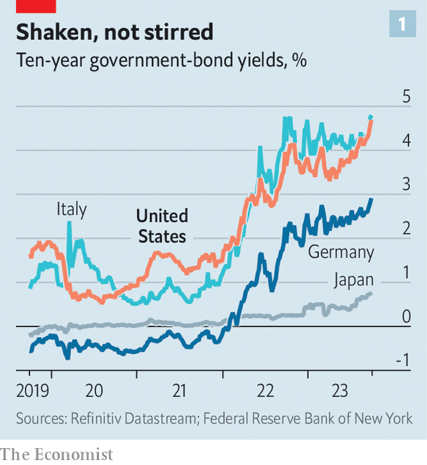
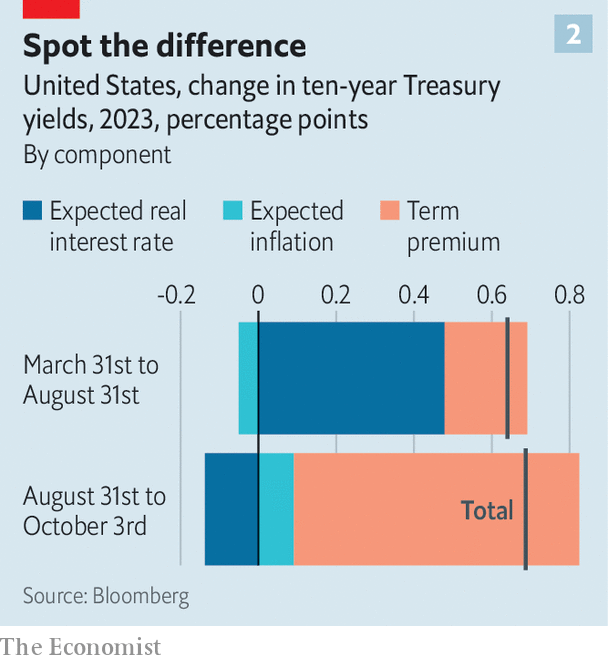

###### All at once

# A surge in global bond yields threatens trouble 

##### Investors fear markets are in for a turbulent time 

 

> Oct 4th 2023 

It is A brave investor who calls the end of a four-decade trend. But bond yields have risen so far and—in recent weeks—so fast that many market participants now believe the era of low interest rates to be over. Since early August America’s ten-year Treasury yield has traded , a level unseen from 2008 to 2021. On October 3rd it hit a 16-year high of 4.8%, having risen by half a percentage point in a fortnight. The moves have spilled over globally: to Europe, where they threaten to bring about a fiscal crisis in indebted Italy; and , which is clinging on to rock-bottom interest rates by its fingertips (see chart 1).

 


What is going on? Start in America, with some financial mechanics. Investors who hold Treasuries typically have the option of lending in money markets, in which overnight interest rates are set by the Federal Reserve. The yield on the shortest-maturity Treasuries therefore tracks Fed policy. At longer maturities yields reflect two additional factors. One is expectations of how the Fed will change rates in future. The other is the “term premium”, which compensates investors for the chance of nasty surprises: that forecasts for interest rates or inflation turn out to be wrong—or even, in theory, that the government defaults.

Both policy expectations and the term premium have driven up yields. After America’s banking turmoil in the spring, investors feared recession and expected the Fed to cut interest rates this year. Then the turmoil ended, the fears faded and forecasts for economic growth rose. Markets came around to the view espoused by the Fed itself: that it will hold rates higher for longer. At the same time, many policymakers and investors nudged up estimates for where rates will settle in the long term. Investors were not pencilling in more inflation, expectations for which have been fairly stable. Instead, expected real interest rates soared (see chart 2).

 


In recent weeks things have changed. The New York Fed publishes a daily estimate of the term premium on the ten-year Treasury yield, derived from a financial model. Since August it has risen by 0.7 percentage points, enough to fully explain the rise in bond yields over that time. 

Some attribute the surge in the term premium to simple supply and demand. The Treasury has been on a borrowing binge. From January to September alone it raised a whopping $1.7trn (7.5% of GDP) from markets, up by almost 80% over the same period in 2022, in part because tax revenues have fallen. At the same time, the Fed has been shrinking its portfolio of long-dated Treasuries, and some analysts think China’s central bank is doing the same. Traders talk of price-insensitive buyers leaving the market, and of those who remain being more attuned to risk.

Others point to fundamentals. Outside America, the global economy looks wobbly. In downturns, investors’ appetite for risk falls. The  is volatile, America’s government could yet shut down and the House of Representatives is in turmoil. The uncertain effects of all this push up the term premium. As well as affecting the supply of new Treasuries, America’s gaping fiscal deficit is a long-term phenomenon. A rule of thumb from one literature review suggests it is large enough to be forcing up the interest rate the Fed must set to stabilise inflation by nearly three percentage points. 

In fact, the trajectory of America’s public finances is so dire that the most bearish investors talk of the long-term risk of “fiscal dominance”; that interest rates might eventually be set with the goal of controlling the government’s debt-service costs, rather than inflation. Although markets have not priced in much more long-run inflation yet, measures of inflation risk—which affects the term premium—have rebounded since falling earlier this year.

Regardless of their cause, movements in America’s bond markets set the pace in the rest of the world. Higher rates in America tend to push up the dollar, encouraging other central banks to tighten in order to avoid suffering inflation from pricier imports. And term premia are correlated globally, owing to the mobility of capital.

Reflecting these spillovers, rates in the euro zone have risen in recent weeks, too, even though the economic picture is different. Surveys indicate the bloc is already in recession. Across the zone, fiscal deficits are smaller and the European Commission is debating how to cut state spending. 

But dealing in aggregates does not make sense when each country runs its own budget. Rising rates have brought back worries about the sustainability of public finances in the euro zone’s most indebted big economy. Italy’s ten-year bond yield is now 4.9%, its highest since 2012, when the euro-zone’s debt crisis was raging. It is more than its  for long without fast economic growth or austerity. The spread over German ten-year debt is now just below two percentage points. Investors in Italian debt fear that they might not get their money back—or that one day they may be repaid in lira. 

Look to Japan, though, for the most dramatic immediate consequences of rising yields. The Bank of Japan has been an outlier, keeping interest rates at -0.1%, even as inflation has risen. It also continues to cap ten-year bond yields at 1%, a ceiling it lifted from 0.5% in July. On September 29th it announced an unscheduled purchase of ¥301bn ($2bn) of bonds in defence of the cap, as yields neared 0.8%. On October 4th it returned to the market with a buy of ¥1.9trn. Rumours swirled that the authorities may have intervened to support the yen on October 3rd after it reached 150 to the dollar only to snap back suddenly to 147. That would be in line with past practice. Last October the authorities tried to defend the currency for the first time in 24 years after it crossed the 150 mark. If the long era of low rates really is over, many other financial rubicons could be crossed in the months to come. ■


