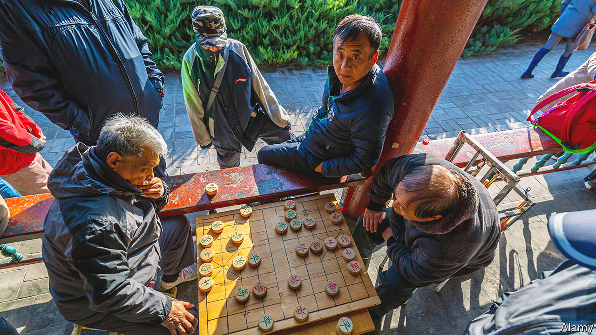

###### Red letter pay

# China’s greying population is refusing to save for retirement 

##### Much to the frustration of the country’s policymakers 

 

> Oct 5th 2023 

Hongbaos are usually reserved for special occasions, such as birthdays, weddings and the Chinese mid-autumn festival, which got under way on September 29th. But now these red envelopes, stuffed with cash, are part of a push by China’s banks to get citizens thinking about retirement. They are being offered to customers who register for private-pension accounts.

Under a law introduced last November, workers may set aside savings in tax-deferred accounts accessible upon retirement, much like America’s Individual Retirement Accounts (iras). Those who want to enrol must open an account with a bank, before allocating their deposits to a licensed wealth manager. Savers can deduct contributions from taxable income; they pay no tax on capital gains and only a 3% tax rate at the time of distribution.

If these terms sound attractive, it is because officials cannot afford for the scheme to fail. Chinese workers retire young—as early as 50 for women and 60 for men. Last year the population shrank for the first time since Mao Zedong’s “Great Leap Forward” in 1962, even as the number of old folk grew. China’s compulsory basic pension, which has more than a billion enrollees and is paid for through employer contributions, will be in deficit by 2028 and run out entirely by 2035, according to modelling by an official think-tank. 

When the reforms were introduced, analysts estimated that they would raise the value of China’s private pensions from $300bn (which had accumulated during the pilot version of the scheme), to at least $1.7trn by 2025. Such a pot would rival the world’s largest pension funds and give officials capital to channel to favoured industries. The scheme would also give Chinese people a new avenue for saving, drawing them away from the country’s troubled property market. Unfortunately, though, things are not going entirely to plan.

Banks, which are mostly state-owned, have offered customers incentives to open accounts, including discounts on phone bills, rewards for referrals and even free ibuprofen (there was a shortage at the time). Although these have lured customers, with more than 40m having signed up by June, getting them to actually save is a struggle. In March fewer than one-third of accounts contained funds. The government has since stopped releasing figures, but there is little reason to believe that savings have risen in the intervening period. Moreover, the president of one bank estimates that 70% of funds deposited go uninvested, remaining in bank accounts, perhaps because depositors want to enjoy the tax advantages without entering financial markets they perceive to be risky.

What is going wrong? Some of the problems facing the pension system reflect its design. Banks, with which customers are required to open accounts, are unfazed by the low contributions. They simply want to beat their rivals on sign-ups, and some are too busy defusing bad debts to focus on pensions, notes an analyst.

But there are deeper issues at play, too. Officials say that workers are unaware of the importance of pension planning. Bankers propose bigger tax breaks and a higher maximum contribution, which is currently 12,000 yuan ($1,700) a year, or 15% of the average disposable income in Shanghai. Neither group wants to confront the possibility that the problem is even more profound. Chinese stockmarkets have long struggled to attract investors, with households preferring property. Financial assets are seen as too volatile—and too vulnerable to political interference.

The situation is unlikely to improve any time soon. Pension pots cannot be invested offshore, meaning that they do not offer a way to escape a weak domestic economy. Local stockmarkets are not exactly becoming any more alluring: Shanghai’s main equity index is down this year. The government is also expected to raise the retirement age, which delays when savers can gain access to their investments. Last month the pensions ministry was forced to refuse requests from working-age depositors to withdraw their funds. All this means that another worry—a failing private pension system—can be added to the long list facing Chinese policymakers. ■


