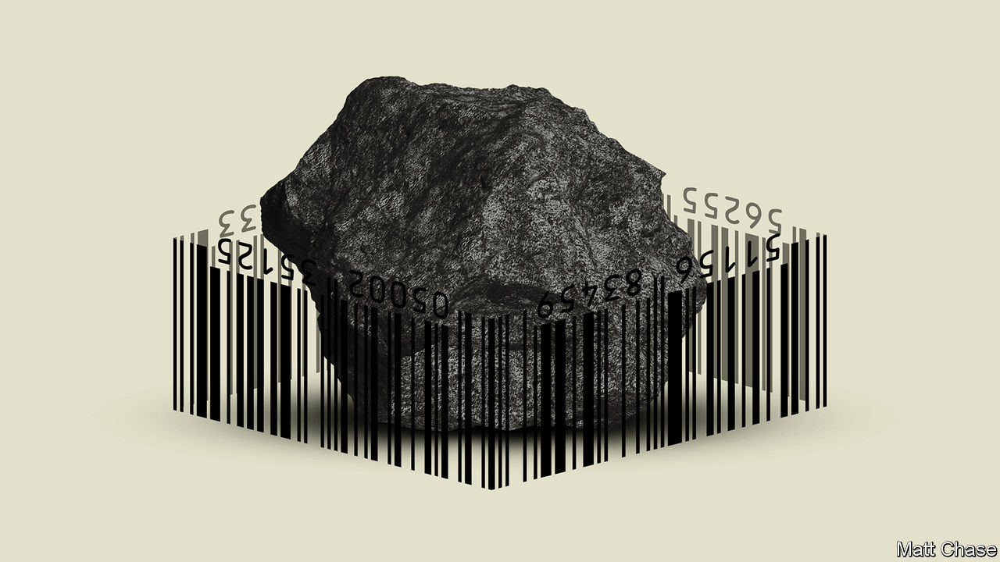
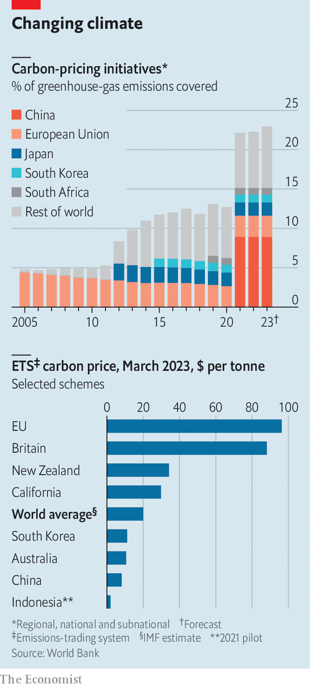

###### Green light

# How carbon prices are taking over the world 

##### A quarter of global emissions are now covered, and the share is rising fast 

 

> Oct 1st 2023 

If global warming is to be limited, the world must forget  as fast as possible—that much almost everyone agrees upon. How to do so is the complicated part. Economists have long favoured putting a , a mechanism Europe introduced in 2005. Doing so allows the market to identify the cheapest unit of greenhouse gas to cut, and thus society to fight climate change at the lowest cost. Others, including many , worry that such schemes will provoke a backlash by raising consumer costs. Under President Joe Biden, America is instead doling out hundreds of billions of dollars to turn supply chains green. 

Yet, remarkably, the rest of the world is beginning to look more European—with carbon prices spreading in countries both rich and poor. Take Indonesia, the world’s ninth-biggest polluter. Although it releases 620m tonnes of carbon-dioxide equivalent a year, with almost half its soaring energy consumption coming from coal, the country has green ambitions. On September 26th, at the launch of its first carbon market, Joko Widodo, the president, talked up its prospects as a hub for the carbon trade, and local banks duly snapped up credits from a geothermal-energy firm. The country also introduced an emissions-trading scheme in February, which requires large coal-fired plants to buy permits for emissions above a threshold. 

 


In short, even in countries better known as polluters than green leaders, things are shifting. By the beginning of 2023, 23% of global emissions were covered by a carbon price, up from just 5% in 2010. The spread will only accelerate over the coming years as more countries come round to the advantages of carbon pricing, and schemes expand their reach. According to the imf, 49 countries have carbon-pricing schemes, and another 23 are considering them. On October 1st the EU launched a groundbreaking policy under a dreary name. The “carbon border adjustment mechanism” (CBAM) will, by 2026, start to levy a carbon price on all the bloc’s imports, meaning that European companies will have a strong incentive to push suppliers around the world to go green. 

The spread of carbon prices is happening in three ways. First, governments are creating new markets and levies. Indonesia is one example. If all goes to plan, its market will eventually be combined with a carbon tax. In April Japan launched a voluntary national market for carbon offsets, which will work alongside an existing regional cap-and-trade policy in Tokyo. Participants, accounting for 40% or so of the country’s pollution, will have to disclose and set emissions targets. Over time the scheme will become stricter, with auctions of carbon allowances for the energy industry due to begin in 2033. Meanwhile, Vietnam is working on an emissions-trading scheme to be established in 2028, in which firms with emissions above a threshold will need to offset them by buying credits.


Second, countries that already have established markets are beefing up their policies. In September China’s National Climate Strategy Centre announced that its emissions-trading scheme, the largest in the world, will move from focusing only on the carbon intensity of coal power plants, to focusing on both their intensity and total emissions. The scheme will also be linked with a dormant carbon-credit market, allowing power plants to meet obligations by purchasing credits for renewable power, planting forests or restoring mangroves. Australia, which scrapped its original carbon price in 2014, has reformed a previously toothless scheme known as the “safeguard mechanism”. Since July industrial facilities that account for 28% of the country’s emissions have had to reduce them by 4.9% a year against a baseline. Those that fail must buy offsets, which trade at a price of around $20 a tonne. 

Breaking boundaries

The final way that carbon markets are spreading is via cross-border schemes. The EU’s programme is by far the most advanced. In CBAM’s pilot phase importers of aluminium, cement, electricity, fertiliser, hydrogen, iron and steel will need to report “embodied emissions” (those generated through production and transport). Then, from 2026, importers will have to pay a levy equivalent to the difference between the carbon cost of these emissions in the EU’s scheme and any carbon price paid by the exporter in their domestic market. Free permits for sectors will also be phased out, and the housing and transport industries will be brought into the market. 

Many of these schemes will take time to have an impact. Lots in Asia are flimsy, with prices set too low to lead to substantive change—well below the EU’s current price of around €90 ($95), which is itself only approaching climate economists’ estimate of the social cost of carbon. For instance, half the coal plants covered by China’s emissions-trading scheme face a negative carbon price, meaning that they are in effect paid to burn the dirty fuel, since their emission intensity is below the national average, says Lauri Myllyvirta of the Centre for Research on Energy and Clean Air, a think-tank. The scheme, he notes, also fails to create an incentive to shift from coal to other sources of power. 

Across the world, activists criticise the ability of companies to use offsets to indulge in what they term “greenwashing”, where firms falsely present themselves as environmentally friendly. Some schemes also struggle to prove that they have led to emissions reductions. Last year a team of academics, led by Andrew Macintosh of Australian National University, argued that reforestation used as carbon credits in Australia’s scheme either did not happen or would have happened irrespective of payments for offsets. An independent review has since recommended changes to how the scheme works.

Yet even carbon-pricing programmes that are limited will still help change behaviour, for the simple reason that they encourage the monitoring of emissions. After its launch two years ago, China’s emissions-trading scheme was dogged by fraud, with consultants alleged to have helped firms fake coal samples. A crackdown was announced by officials earlier this year, who are now satisfied with the quality of the data. Despite the absence of a carbon price, American firms also face incentives to monitor emissions. President Biden has proposed a rule that all businesses selling to the federal government must disclose emissions and have plans to reduce them. Many large firms have set voluntary net-zero targets as part of their marketing efforts. Apple, the world’s largest, has pledged to make its supply chain entirely carbon neutral by 2030.

Industrial firms around the world now face a still greater incentive to accurately track their carbon footprints: CBAM. The EU’s ultimate goal is to tackle “carbon leakage”. Before CBAM’s introduction, Europe’s carbon price meant that domestic industries faced an extra cost compared with those in countries with less ambitious decarbonisation plans. This gave importers an incentive to source material from abroad, even if such inputs were dirtier. To compensate for this, the EU handed out permits to industrial producers. These will now be phased out as CBAM is phased in. 

During the pilot phase, CBAM simply presents an extra hurdle (or a “non-tariff barrier”) for exporters to the bloc. To comply, European firms must report the embodied emissions of their imports. If such data do not exist, importers must use reference values provided by the EU. In order to nudge foreign companies to change their behaviour and prove that their emissions are lower, these are based on the emissions of the dirtiest firms in the bloc. 

Carbon border tariffs may themselves start to multiply. In Australia the government recently announced a review into “carbon leakage”, which will examine such an option. In 2021 America and the EU paused a trade dispute, begun by President Donald Trump, by starting negotiations on a “Global Arrangement on Sustainable Steel and Aluminium”. America wants the two trading partners to create a common external tariff on polluting steel producers. Since it does not have a domestic carbon price, such a policy would break the World Trade Organisation’s rules. But if the EU and America do not come to an agreement, the Trump-era tariffs and the EU’s retaliatory measures will be reinstated. 

There is a domino effect to carbon pricing. Once an industry is subject to a carbon price, affected businesses will naturally want their competitors to face the same rules. Therefore owners of coal power plants will lobby to ensure that gas power plants operate on a level playing field. Governments in exporting countries also have an incentive to ensure that their domestic firms pay a carbon price at home rather than a tariff abroad. If Asia’s factories are pressed to reduce their emissions anyway by schemes such as CBAM, then its governments are leaving money on the table by not levying a carbon price of their own. 

Getaway cars

The question is whether the dominoes will fall sufficiently quickly. Almost no emissions-trading schemes are aimed at emissions from residential property or cars, for instance, where consumers would really feel the pain. In choosing to introduce carbon-pricing schemes, and then to make them broader and more muscular, policymakers have most economists firmly on their side—and are proceeding much faster than is commonly realised. Yet future policymakers will have little choice but to make such measures even more intrusive if they want to minimise the effects of climate change. For that to happen, they will have to win over voters, too. ■


