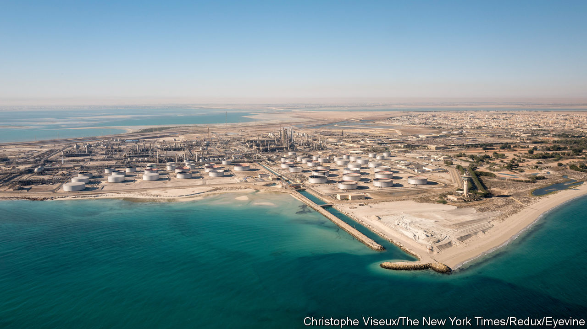

###### Drill thrill

# Oil prices fall, defying suggestions of a $100 barrel 

##### But bulls argue the landmark remains possible 

 

> Oct 3rd 2023 

This year Saudi Arabia and its allies in the Organisation of the Petroleum Exporting Countries (opec) have been trying to climb what seems like a . Despite production cuts, crude-oil prices, which exceeded $115 a barrel for much of June 2022, languished below $80 a year later. Then the cartel appeared to regain control after Saudi Arabia decided on an extra output cut of 1m barrels a day (b/d)—equivalent to 1% of global demand—which it has since extended until the end of the year. Signs that the global economy might avoid a recession after all also helped. On September 27th oil prices neared $97 a barrel. 

But this week OPEC and its allies, including Russia, succumbed to the slope once again. On October 4th, the very day the group confirmed its cuts until the end of the year at a meeting in Vienna, oil prices dropped by more than 5%, to $86 a barrel. Amid such volatility, pundits are debating where prices will go next. The bears reckon that crude will stay at this level until Christmas, or maybe even fall further. Meanwhile, bulls predict a rebound before too long; some still foresee triple digits before the festive season. The stakes are high, and not just for opec. Dearer oil would push up inflation, which could force central banks to keep policy tighter than they would otherwise like, and would also deal a heavy blow to the global economy.

 


Unexpectedly resilient demand for oil is at the heart of the bulls’ case. Economic and literal headwinds, in the form of a mighty typhoon, failed to deter Chinese tourists and businessfolk from travelling a record amount this summer, boosting demand for petrol and kerosene. Growth in global demand for “mobility fuels”, at nearly 1.6m b/d, has remained unchanged in the year to date. Around the world, daily flights in the week ending September 29th averaged 96% of levels in 2019, their highest share since mid-July. Diesel demand growth has also remained robust, in part because of frantic trucking in Asia.

Bulls also see that supply cuts are filling producers’ pockets, raising the possibility that they may be extended into 2024. Despite lower export volumes, Saudi Arabia’s revenues could be $30m a day higher this quarter than last, a jump of 6%, reckons Energy Aspects, a consultancy. Russia’s revenues are also up. Both can take comfort from the fact that, unlike in the late 2010s, when opec and Russia first teamed up to cut supply, American shale drillers are not filling the gap. Production is rising for the moment, but they are shutting wells, squeezed by higher costs. Rig numbers are down 20% from last November.

This week’s decline also reflects “profit-taking” by traders, bulls argue. They point to a forecast 1.5m-2m b/d supply deficit for the year as whole, most of which is due to materialise in the last quarter, as record production by non-opec countries, such as Brazil and Guyana, is finally outpaced by the cartel’s cuts. This will force users to dig deeper into their reserves. America’s crude stocks fell by 2.2m barrels to 414m barrels in the week to September 29th; a decline that may accelerate as refineries seek more crude after their maintenance season, which runs through October.

The bears reckon all these inflationary signals will be blown away by the economic gale heading the world’s way. The Fed has said it is ready to keep interest rates higher for longer which, together with a slowdown in hiring and jumpy bond yields inflating the cost of debt, will dampen growth. This “very unsettled picture” is being made murkier still by political chaos, says Adi Imsirovic, a former oil-trading chief at Gazprom, an energy giant, with America’s House of Representatives, on which all federal spending decisions depend, ousting its speaker on October 3rd. 

Signs of demand destruction caused by the recent price spikes are becoming visible, with American gasoline use falling to its lowest seasonal level since 2001. Pressure from raised oil prices is also feeding through to “core” inflation, which excludes food and energy costs, as firms in other sectors, starting with transport, raise their prices to compensate. The Cleveland branch of the Federal Reserve’s “Nowcast”, which uses oil and petrol prices as inputs, projects it will edge up to 4.19% year on year this month, from 4.17% in September. On top of all this, higher interest rates in America push up the dollar’s value, making oil more expensive for everyone else.

The bears have the upper hand, then, but the question is how long the situation will hold. Saudi Arabia’s enduring cuts mean the market remains extremely tight. Jorge León, a former OPEC analyst, now at Rystad Energy, a consultancy, reckons that prices will soon return to somewhere in the low $90s. Surprising economic data could cause swings of as much as $5-10 a barrel; several surprises could even push prices briefly into the triple digits. 

Yet any victory for the bulls will be a short-lived one. Beyond Christmas, bears look likely to gain a durable advantage. Non-opec production growth should cover most of the rise in demand, which will anyway be subdued by the lagging impact of high rates. Kpler, a data firm, projects a solid surplus for the first few months of 2024.

There is still an unknown. Although Saudi Arabia has given hints that it is worried about the economic prospects of its Asian and European customers, lower benchmark prices may nonetheless push it to bigger production cuts. If there is a glut of supply, such cuts may not be enough to push up prices. But they will prevent the rebuilding of stocks, which normally happens during downturns. That would set the stage for the next oil-price thriller. ■


