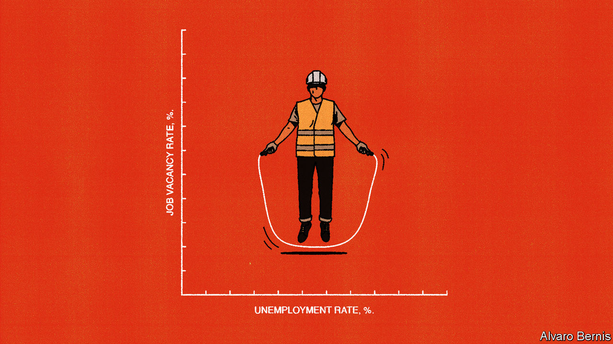
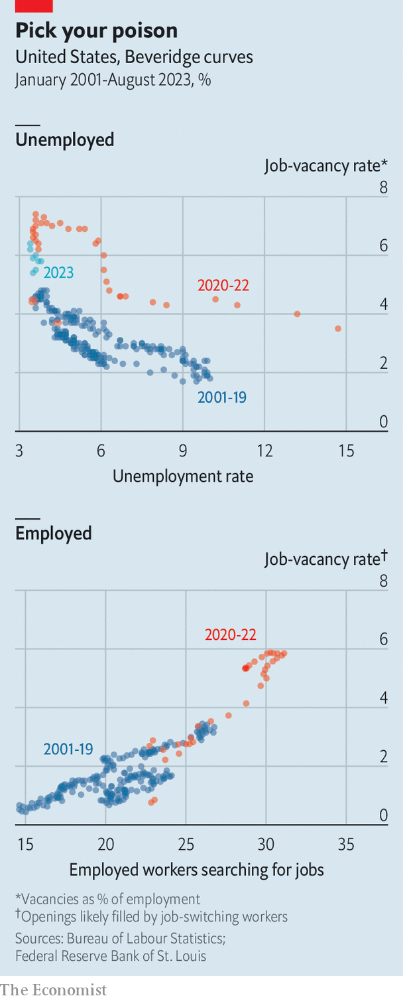

###### Free exchange

# To understand America’s job market, look beyond unemployed workers 

##### Why talk of a skills shortage is overblown 

 

> Oct 5th 2023 

Sitting in a medical clinic recently, as a young-looking nurse extracted blood from his veins, your columnist’s mind turned to the flexibility of the American labour market. How long, exactly, had she been on the job? The somewhat shocking answer: it was her first month. Six weeks of training was all it took, she explained, to make the transition from eyelash technician to phlebotomist, which offered higher pay and better hours.

Workers ditching old jobs for better ones has been a feature of the post-covid American economy. Early last year about 3% of Americans quit their jobs in any given month, the highest in two decades. Since July that has fallen to 2.3%, back to its pre-pandemic level. The decline is a sign that the labour market is gradually normalising. It has gone from being ultra-tight—beset by a seemingly endless worker shortage—to merely moderately tight.

 


During the period of ultra-tightness, analysts and investors paid close attention to a chart. The Beveridge curve, named after William Beveridge, a mid-20th-century British economist, depicts the link between unemployment and job vacancies. It is an inverse relationship: vacancies rise as unemployment falls. The logic is simple. When nearly all would-be workers have jobs, companies struggle to find new staff and have more vacancies.

What makes the Beveridge curve fascinating but also frustrating is that it moves around. There is no fixed relationship between vacancies and unemployment. Take, for instance, an unemployment rate of 6%. This was consistent with about 2.5% of jobs in America being unfilled in the early 2000s, but 3.5% in the 2010s and 6% in 2021. As a rule, the higher the vacancy level for any given unemployment rate, the less efficient the labour market, since firms must fight to find workers. In graphical terms, an inefficient Beveridge curve shifts outwards, away from the origin point.

The fascinating bit is the explanation for this. Normally, the location of the Beveridge curve is viewed as a measure of skills-matching. If workers lack the skills wanted by employers, the vacancy rate will be higher. During covid-19 and its aftermath, though, the problem was less a skills mismatch than a willingness mismatch. Many people were scared of illness and thus less willing to work. At the same time, having profited from a rapid recovery, many companies were willing to hire additional workers.

An exceedingly inefficient labour market was the result. There were two job openings per unemployed person at the start of 2022, the most on record. Given such a Beveridge curve, the dismal conclusion was that unemployment would soar as the Federal Reserve wrestled down inflation. The causal chain went like this: to tame inflation, the Fed had to generate slower wage growth; for wages to slow, vacancies had to fall; finally, in an inefficient labour market, a big fall in vacancies implied a big rise in unemployment.

Skip ahead to the present, though, and these fears have receded. Job vacancies have declined without much unemployment. There are now 1.5 job openings per unemployed worker. The labour market, in other words, looks more efficient. The Beveridge curve has shifted inwards, reverting to somewhere close to its pre-pandemic location. The typical explanation is that the willingness mismatch has abated: Americans have re-entered the labour force, while companies have cut their help-wanted advertisements.

Question everything

That, at least, is the conventional story. But think about it for a second and it is does not sit quite right. After all, the Beveridge curve is supposed to depict the state of the labour market. If, however, the curve itself is liable to move around, as this story suggests, it surely cannot be of much use. Do adjustments take place along the curve or does the curve itself change locations? After the fact it seems clear enough. In the moment, it is guesswork.

There is a different, and better, way of constructing the Beveridge curve. The standard curve implies that it is the unemployed who fill job vacancies. The problem, as testified by your columnist’s phlebotomist, is that in reality, holes are often filled by job-switchers, not the unemployed. In research published by the Fed’s branch in St Louis, Paulina Restrepo-Echavarría and Praew Grittayaphong have reflected this, proposing a revised Beveridge curve that links prospective job-switchers to vacancies.

Instead of the inverse traditional curve, their one has a positive slope: as vacancies rise, more workers consider jumping ship for new jobs. Indeed, they find that about four-fifths of vacancies since 2015 have been geared towards job-switchers, not the jobless. Along with its faithfulness to reality, their curve has another advantage in that it appears to be mostly stable. The pandemic was unusual because of the large rise in both job vacancies and job seekers, but that was an extrapolation of their revised curve, not a shift to a new location. One conclusion is that a relatively soft landing looks more plausible today. Although a decline in vacancies is still needed to calm wage growth, that largely translates into less job-switching rather than higher unemployment.

There may be a more profound lesson to draw. In 2020 Katharine Abraham and colleagues at the University of Maryland also looked at whether they could improve the Beveridge curve, this time by incorporating job searchers who are already employed or out of the labour force. Their revised curve, like that of the St Louis Fed’s economists, is more stable than the traditional curve. The implication of that stability is that the economy actually does a decent job of matching workers with jobs.

Many people, including politicians from both sides of the aisle, declare that America is plagued by a skills mismatch. Yet the evidence suggests that workers respond to wages, and that firms which are willing to invest can train them up. The skills shortage may be more of a talking-point than a fundamental constraint to growth. Remember: America is a country in which eyelash technicians can become phlebotomists in a matter of weeks. ■


