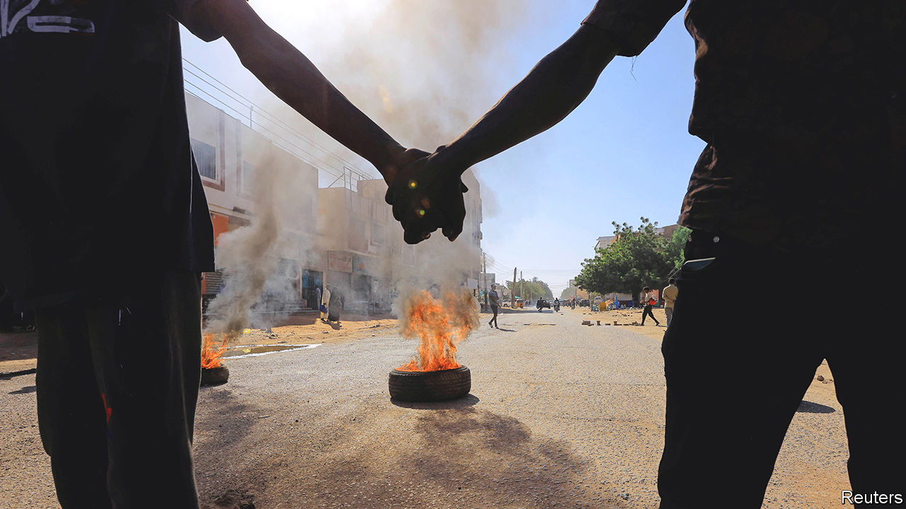
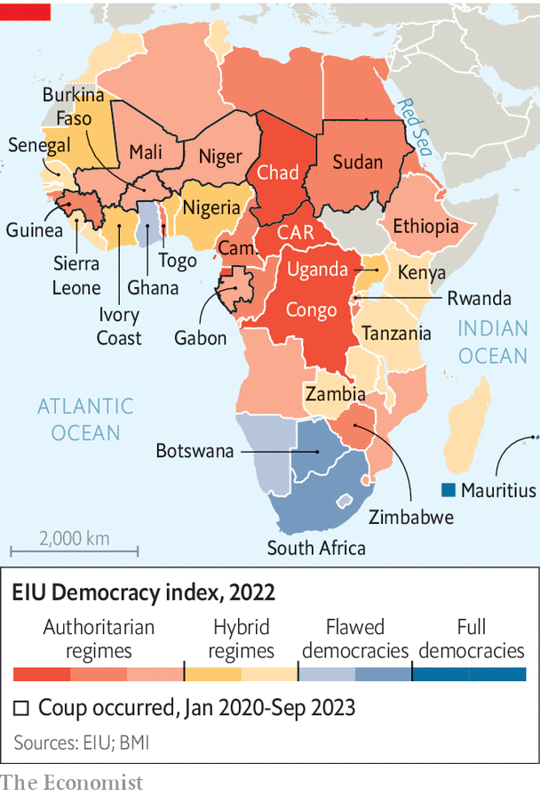
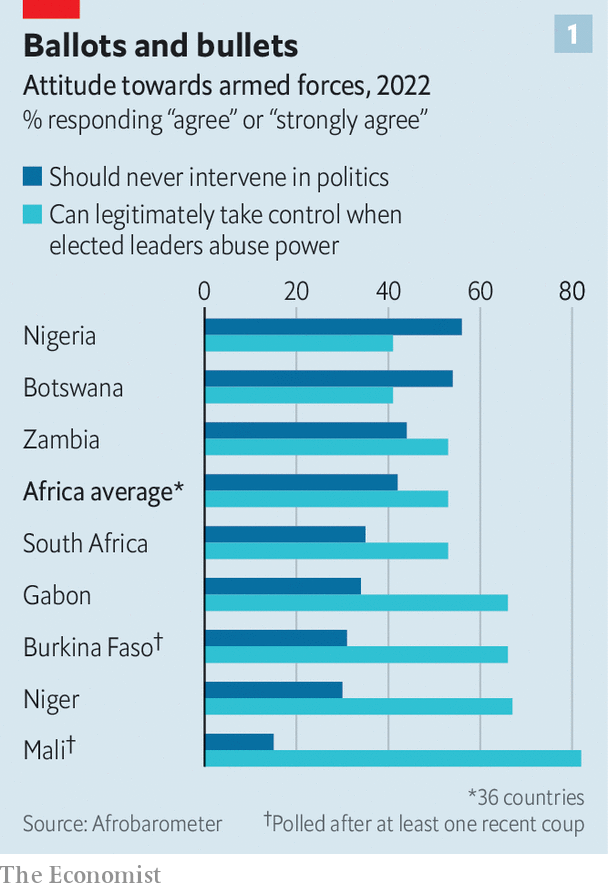

###### Afropopulism approaches

# Africa’s coups are part of a far bigger crisis 

##### Democracy is under threat from graft, stagnation and violence 

 

> Oct 3rd 2023 

FOR MANY years, coups in Africa seemed a thing of the past. But in the 2020s they are back with a vengeance: the nine this decade account for more than a third of successful African putsches this century. At this rate there will be more of them in the 2020s than in any decade since the 1960s. 

 


Aside from the latest one, in Gabon on August 30th, the seizures of power have been in the “coup belt”. It is possible, if inadvisable, to walk some 6,000km from the Atlantic coast of west Africa to the shore of the Red Sea and stride only through countries where there have been coups in the past three years (see map). The trek from Guinea to Sudan would cross the Sahel, the region south of the Sahara where there have been two coups each in Mali and Burkina Faso since August 2020, and one in Niger in July. 

Africa—which covers an area larger than America, China, India, Japan and western Europe combined—is more than its coup belt. Yet the takeovers are part of a broader political crisis. The most recent surveys by Afrobarometer, a pollster, find that in 24 of 30 countries approval of the idea of military rule has risen since 2014. 

 


Contingent support is higher. On average across 36 countries more Africans (53%) would be willing to consider a military government than would rule it out (42%) “if elected officials abused their power”—which they often do (see chart 1). Just 38% expressed satisfaction with “democracy”, the lowest share since at least 2014. The backing for potential strongmen or deep dissatisfaction with democracy was common across the coup belt, but also in relatively stable places, including Botswana and South Africa (see chart 2). Afropopulism, for want of a better phrase, is an increasingly potent force. 

Why is there such widespread discontent? Africans are frustrated with the sham that passes for “democracy” in most countries. They are also fed up with flimsy states that provide neither security nor prosperity. Around two-thirds of them, as well as majorities in 28 of 36 polled countries, feel their countries are heading in the wrong direction. Should this continue, many Africans, especially younger ones, may be tempted to reconsider shabby social contracts—and look for radical change.

 


The most important failure is the provision of security. African states are often strong in areas where they ought to be weak and weak where they ought to be strong. Many regimes are adept at beating or locking up opponents, but inept at stopping their citizens from being robbed or killed. As a consequence, those promising to restore security, however ruthlessly, can gain support from ordinary citizens. 

Although some African wars in the late 20th century were much deadlier, the overall number of African conflicts is rising, according to a paper published last year by the Peace Research Institute Oslo. It noted that small conflicts caused more deaths in 2021 than at any point since its data began in 1989. The number of conflicts in which at least one side is a state was higher in 2021 than a decade earlier. 

Mounting chaos

Since 2021 things have become only bloodier. In Burkina Faso, Mali and Niger, a trio of countries where jihadists linked to al-Qaeda and Islamic State run riot, deaths in conflict have risen from under 800 in 2016 to over 10,000 in 2022. It is no coincidence that all three have gone from being largely democratic to suffering coups in the 2020s. Putschists have sought to justify their takeovers and gained support by pointing to insecurity under democracy. 

As the jihadist chaos spills into coastal states, political chaos could follow. Togo, for example, has a dynastic dictatorship like the one recently toppled in Gabon: the Gnassingbé family has run the country for 56 years. And it faces growing jihadist insecurity—at least 140 people have been killed since July 2022. 

In Nigeria, Africa’s most populous country, jihadists terrorise the north-east, gangs kidnap hundreds at a time in the north-west and armed separatists pillage the south-east. Clashes between farmers and herders in the centre add to the bloodshed. More than 10,000 people died in conflict in the country in both of 2021 and 2022. This year will be almost as bad. ACLED, a conflict-tracking group, rates Nigeria as having the fifth-most extreme violence globally, behind Ukraine. 

Nigeria’s political class, lounging in well-guarded mansions, is out of touch. Turnout in this year’s election was 29%, the lowest ever. More than 40% of Nigerians think it would be legitimate for the armed forces to take over in the event of abuses of power by elected leaders. Before the election senior Nigerian political figures told  they had heard of coup-plotting. That is a troubling development, given that the country was run (abysmally) by military dictators for much of the second half of the 20th century. 

Harsh ingredients

Other large countries are riven with conflict. Though the civil war centred on Ethiopia’s Tigray region may be over, clashes in Amhara and Oromia spiral on. Resurgent violence in the east of Congo has caused almost 3m people to flee from their homes since March 2022. In April 2023 Sudan plunged into civil war. All three countries are among Africa’s ten most populous. In every place people will seek protection where they think they can find it.

Insecurity is felt beyond war zones. In a poll of 30 countries around the world released last month by Open Society Foundations, an NGO network, four of the five countries with the highest share of respondents fearing political violence were African: Kenya, Nigeria, Senegal and South Africa. The latter’s murder rate, among the highest in the world, is rising again. Lawlessness increases support for populists and vigilantes. And 72% of South Africans would swap elected governments for a crime-bashing strongman. One former cabinet minister, who campaigned against apartheid, praises Paul Kagame for Rwanda’s apparent lack of crime (but says less about its abuses of human rights). “Kagame has the right idea: sometimes you need to crack the whip.” 

Economic stagnation compounds the political crisis. From 1990 to 2018 the number of people living in extreme poverty in sub-Saharan Africa rose from 284m to 433m, as population growth often outstripped the economic sort. The region has lost another decade: real GDP per person was lower in 2022 than ten years earlier. 

Households and governments are also facing a tightening financial squeeze. The median inflation rate in sub-Saharan Africa has more than doubled since the start of the pandemic. In a region where food makes up 40% of consumption, there is double-digit food-price inflation in 80% of countries. Some 17% of government revenues will be spent on servicing external debt this year, the highest share since 1999. 

“Job creation” is by far the most-cited priority by 18- to 35-year-olds in Afrobarometer polls. The Mo Ibrahim Foundation, a British NGO, reckons that 18m formal jobs must be created annually to absorb the numbers entering the labour force; the current figure is 3m. Almost half of 18- to 24-year-olds in 15 countries surveyed last year by the Africa Youth Survey, a poll by a South African charity, said they were thinking of emigrating. Young Nigerians talk of “adulthood na scam” and hunt ways to , Yoruba slang for to emigrate.

Earlier this year Hakainde Hichilema, whom the West sees as a rare liberal on the continent, warned his outside champions that African democrats need to secure material results or they will face political consequences. “[Y]ou can’t eat democracy,” argued Zambia’s president in an opinion piece urging foreign creditors to speed up debt restructuring. “Human rights may sustain the spirit, but not the body.” 

The desperation to meet basic needs partly explains why Africans may be relatively willing to consider strongmen. The Open Society poll asked whether authoritarians would produce better results in ten policy areas, such as creating jobs and fighting crime. In eight cases the sub-Saharan African average was higher than the global one. “Invariably, juntas that promise better material conditions will show up and win enough people’s hearts and minds,” notes Ken Opalo of Georgetown University in America. 

Nevertheless, Africans’ faith in what passes for democracy is plummeting not just because of the insecurity and poverty their governments deliver, but also because of the nature of politics itself. In the 1990s and 2000s most African countries ditched one-party systems and embraced multi-party elections. The pageantry of elections, however, obscures the fact that much of Africa has only the patina of democracy. EIU, our sister outfit, classifies just one African country (Mauritius) as a “full democracy” and six as “flawed”. Between 1990 and 2019 sitting presidents won 88% of the 112 elections they ran in. 

Nine leaders have kept power for more than 20 years. These include Uganda’s Yoweri Museveni; Cameroon’s Paul Biya, who spends much of the year in a Swiss hotel; Equatorial Guinea’s Teodoro Obiang, the longest-serving president of any country; and Mr Kagame. All fear fair elections; all may be grooming a son for office. 

Even relative newbies abuse the law, entrenching frustration. In August Zimbabwe’s main opposition party did not contest yet another dubious election because it sees the courts as biased. A month earlier the Central African Republic’s president won a referendum he rammed through the courts that will end term limits. In 2020 Alassane Ouattara, president of Ivory Coast, won a third term after controversially tweaking the constitution so he could get around the two-term limit. Senegal’s Macky Sall this year opted against a similar move after violent protests. But any goodwill earned was undermined by the arrest of hundreds of opposition-party members, including a presidential candidate.

On average in Afrobarometer polls only 13% believe that no one in their country’s presidency is corrupt. Transparency International (TI), a watchdog, finds that sub-Saharan African countries are on average seen as less clean than El Salvador, where graft is so endemic that a millennial authoritarian has promised to build a huge jail specially for white-collar criminals. On average, perceptions of corruption in sub-Saharan Africa were slightly worse in 2022 than they were a decade earlier, reckons TI.

The Open Society poll found that corruption was the gravest national issue for voters in Ghana and Nigeria. Voters also fret about it in South Africa, where “state capture” became ubiquitous under Jacob Zuma, president from 2009 to 2018. The looting of state institutions remains a problem in South Africa today—and in many other countries. “The capture of democratic political systems by private power networks is arguably the greatest threat to civil liberties and inclusive development in Africa,” argues Nic Cheeseman of the University of Birmingham in Britain. 

Youth and experience

Putschists exploit anger at graft—and it works, at least initially. In a poll before the first coup in Mali, 58% of people thought most or all the people in the presidency were corrupt. Two years and a second coup later, just 25% did. In Guinea the share before the coup was almost 50%. After it the share fell to 28%. 

Why doesn’t dissatisfaction with sham democracy spur Africans to try to obtain a better version of it? There are several reasons. For a start it is fiendishly difficult to oppose dictatorships. The bad guys usually have the guns. Ruling parties also often co-opt NGOs and youth groups. Many activists have tried to improve democracy and to vote out authoritarians. Yet after decades of failing, some may be concluding that only more radical methods, even coups, can end stagnation and state capture. Guinea’s main opposition leader, for example, told of his “relief” immediately after the coup that ousted Alpha Condé, then president, in 2021.

Second, there is reason to believe that support for liberal democracy is softer than its champions would wish. In Mali, for example, support for the idea of military rule had been flat for years at just under 30% before the first coup. Now almost 80% of Malians say they approve or strongly approve of rule by military men. 

Although outsiders may point out that liberal democracy has never really been tried in Africa, that is not always the view of Africans. Last month Olusegun Obasanjo, a former Nigerian president, said: “We have seen that the liberal type of democracy as practised in the West will not work for us.” Mr Kagame has argued similarly. (“The West does not define democracy in Africa.”) In the Africa Youth Survey just 39% of respondents said that Africans should emulate “Western democracy”; 53% said Africa needed to find its own version.

Indeed, too much is often expected of young Africans. Many of them are apathetic when confronted with the façade of democracy. They are more than twice as likely to say they did not vote in the last election as the over-56s. In Nigeria’s election this year young voters helped Peter Obi to the best-ever result for a third-party candidate but he still came only third. In South Africa’s last general election only 30% of eligible 20-somethings voted—from apartheid to apathy in a single generation. 

Support for military rule if elected leaders abuse power is highest among the young. On average 56% of 18- to 35-year-olds would contemplate it, versus 46% of those aged 56 and older. It is young men who rally in support after coups, complicating potential efforts by African countries or the West to reverse takeovers. 

Not that outsiders’ commitment to African democracy is especially strong—the third reason for its feebleness. The continental organisation, the African Union, is weak and ultimately the creature of its mostly authoritarian members. Regional hegemons such as South Africa carry less weight: economic stagnation means it has less hard power, while endorsing rigged elections in Zimbabwe and elsewhere means it has less soft power. Meanwhile, China skews aid towards corrupt autocratic regimes, as the Chinese Communist Party preaches its model to Africa’s ruling parties. Russia, whether through the notorious Wagner Group or via arms sales, props up juntas and authoritarians. Newer players such as Turkey and Gulf countries will not promote democratic norms. 

The West offers half-hearted help and hypocrisy. It sometimes speaks out when elections look sketchy, as was the case this year in Zimbabwe and Sierra Leone. But America decided to whitewash dodgy results in mineral-rich Congo in 2018. Britain is unlikely to criticise Mr Kagame given that it wants to fly asylum-seekers to Rwanda. France rails against coups in countries where it stands to lose influence, such as Niger, but says little when the putschists are in tune with Paris, as was the case with Chad’s coup in 2021.

Françafrique—the term given to how France has maintained influence in former colonies by propping up autocratic elites—is coming back to bite Paris. In Mali a survey in 2021 found that more than a fifth of Malians believed that France’s armed forces in the country were in league with jihadists or separatists. In Burkina Faso the new president, 35-year-old Captain Ibrahim Traoré, says that he is restoring sovereignty. It is the free choice of his junta, like Mali’s, to ask Russia for help. After Niger’s coup, the junta quickly scapegoated France, which had troops fighting jihadists in the country. Crowds waved Russian flags and decapitated a rooster painted in French colours. In Senegal, protesters against Mr Sall’s flirtation with a third term burned down French-owned supermarkets and petrol stations. Half of Ivorians say that France is the country they trust least, according to Premise Data, a pollster. 

Winter of discontent

So long as Africans see—and experience—“democracy” as a charade played by corrupt elites with the help of foreigners, then many will consider other options. What those look like will vary depending on the context. In South Africa frustration at meagre progress since apartheid is opening up space for Julius Malema, a hard-left black nationalist, and for ethnic-based parties. In Nigeria the efforts of Nnamdi Kanu, a separatist, to resuscitate the dream of an independent Biafra rely on charisma, populism, disregard for the truth and violence. 

Elsewhere populist military men may prove appealing, at least temporarily. In Burkina Faso Captain Traoré chooses deliberately to mimic Thomas Sankara, a revered former socialist leader often referred to as Africa’s Che Guevara. He came to power in a coup in 1983 aged 33 before being gunned down four years later. France has been a butt of both men. 

There is a well-intentioned desire to see Africans, especially younger ones, as a latent progressive force. But it is also patronising to deny, given the present circumstances amid what passes for democracy on the continent, that many Africans will be tempted by authoritarians. They are no more immune to populism than Americans are to Donald Trump, or Turks are to Recep Tayyip Erdogan. They will gravitate to those who seem to meet their needs—or at least offer a change from those who manifestly do not. ■

