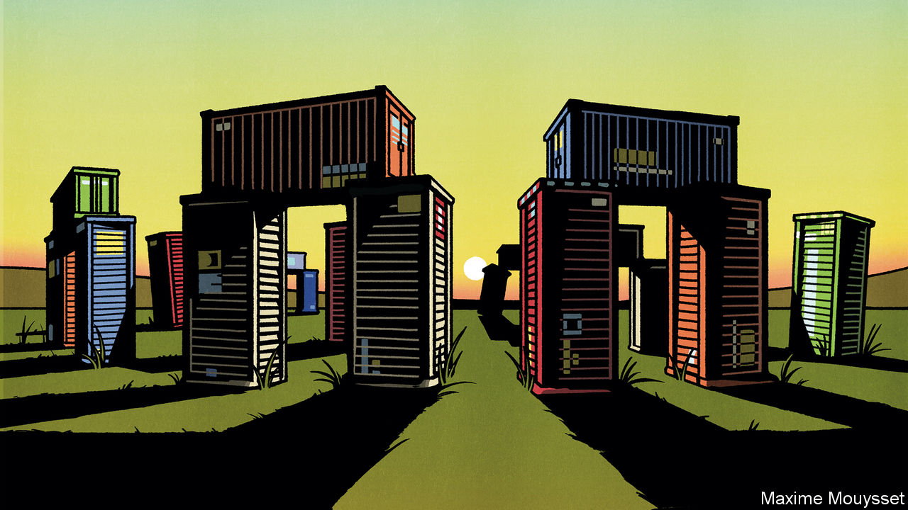

###### The size of the state

# Are free markets history? 

##### Governments are jettisoning the principles that made the world rich 

 

> Oct 5th 2023 

Sometimes, in wars and revolutions, fundamental change arrives with a bang. More often, it creeps up on you. That is the way with what we are calling , a protectionist, high-subsidy, intervention-heavy ideology administered by an ambitious state. , growing threats to national security, the energy transition and the cost-of-living crisis have each demanded action by governments—and for good reason. But when you lump them all together, it becomes clear just how systematically the presumption of open markets and limited government has been left in the dust.

For this newspaper, this is an alarming trend. We were founded in 1843 to campaign for, among other things, free trade and a modest role for government. Today these classical liberal values are not only unpopular, they are increasingly absent from political debate. Less than eight years ago President Barack Obama was trying to sign America up to a giant Pacific trade pact. Today if you argue for free trade in Washington, you will be scoffed at as hopelessly naive. In the emerging world, you will be painted as a neocolonial relic from the era when the West knew best.

Our  this week argues that homeland economics will ultimately prove to be a disappointment. It misdiagnoses what has gone wrong, it overburdens the state with unmeetable responsibilities and it will botch a period of rapid social and technological change. The good news is that eventually it will bring about its own demise.

Central to the new regime is the idea that protectionism is the way to cope with the buffeting of open markets. China’s success convinced working-class Westerners that they had a lot to lose from the free movement of goods across borders. The covid-19 pandemic left elites thinking that global supply chains had to be “derisked”, often by moving production closer to home. China’s rise under “state capitalism”, with its disregard for rules-based trade and challenge to American power, was seized on in rich and emerging economies as a justification for intervention.

This protectionism goes along with extra government spending. Industry is gobbling up subsidies to boost the energy transition and guarantee the supply of strategic goods. Vast handouts to households during the pandemic have raised expectations of the state as a bulwark against life’s misfortunes. The Spanish and Italian governments are even bailing out borrowers who cannot afford the rising cost of mortgages.

And, inevitably, state handouts go along with extra regulation. Antitrust has become activist. Regulators are eyeing nascent markets, from cloud gaming to artificial intelligence. Because  are still too low, governments end up micro-managing the energy transition by decree.

This mix of protection, spending and regulation comes at a heavy cost. For a start, it is a misdiagnosis. The pooling of risks is indeed an essential function of governments. But not all risks: for markets to work, actions must have consequences. 

In contrast to the accepted view, covid and the Ukraine war have shown that markets deal with shocks better than planners do. Globalised trade coped with huge swings in consumer demand: throughput at America’s ports in 2021 was 11% higher than in 2019. In 2022 Germany’s  repeated the trick, suffering no calamity as it switched rapidly from Russian gas to other sources of energy. By contrast, state-dominated markets like the supply of shells for Ukraine are still struggling. Just like the old complaints about trade with China—which has boosted Americans’ real incomes—gripes about globalisation’s supposed fragility have built a cathedral of fear over a grain of truth.

Another flaw in homeland economics is to overburden the state. Governments are losing all restraint just when they need to curtail welfare spending. Ageing populations weigh down budgets with extra bills for pensions and health care. Rising interest rates make everything worse. After a bond-market crisis in 2022, Britain’s right-wing government is raising taxes, as a share of GDP, by more than in any parliamentary term in the country’s history. As yields rise on long-dated bonds,  looks wobbly again. America’s rising debt-service bill will probably match its all-time high before the end of the decade—testimony to the fiscal fragility of the new era.

The least visible, but potentially most costly flaw is that homeland economics is a blunt instrument in a time of rapid change. The energy and AI transitions are too big for any government to plan. Nobody knows the cheapest ways to decarbonise or the best uses of new technology. Ideas need to be tested and channelled by markets, not governed by checklists from the centre. Excessive regulation will inhibit innovation and, by raising costs, make change slower and more painful.

Despite its flaws, homeland economics will be tough to restrain. People enjoy spending other people’s money. As government budgets get bigger, the special interests that feed on them will grow in size and influence. It is harder to withdraw protection and handouts than to grant them—particularly with more elderly voters, who have less of a stake in economic growth. Anyone doe-eyed about the arc of history bending towards progress should remember that a century ago Argentina was about as rich as Switzerland.

Plan for the road ahead

Yet disillusionment will eventually set in. That may be because fiscal extravagance catches up with indebted governments. Perhaps the rent-seekers’ greed will become too hard to conceal. Or a stagnating, repressive China may no longer hold out the promise of state-directed prosperity.

When change comes, it can be surprisingly swift—in democracies, at least. In the 1970s the tide turned in favour of free markets almost as fast as it has turned against them today, leading to the election of Margaret Thatcher and Ronald Reagan. The task for classical liberals is to prepare for that moment by defining a new consensus that adapts their ideas to a more dangerous, interconnected and fractious world. That will not be easy, especially in the face of the rivalry between America and China. But it has been done in the past. And think of the prize. ■


