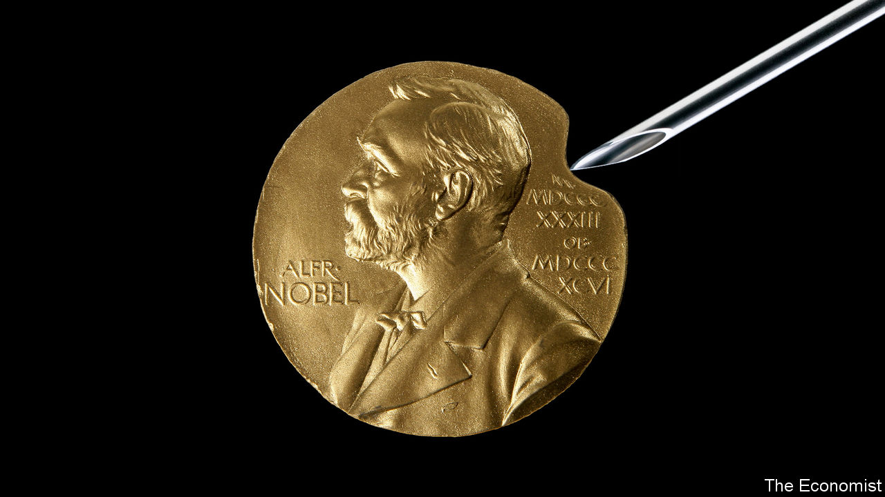

###### A Nobel cause

# In an ugly world, vaccines are a beautiful gift worth honouring 

##### According to the WHO, they have saved more lives than any other medical invention 

 

> Oct 5th 2023 

The Nobel prize , awarded on October 2nd to Katalin Karikó, a biochemist, and Drew Weissman, an immunologist, is a fitting capstone to a great underdog story. Dr Karikó’s unfashionable insistence on trying to get RNA into cells set back her career. She persisted, and the two developed a technique which allowed the  to be primed against threats in an entirely new way. When the  hit, the mRNA vaccines they had made possible saved millions of lives—and freed billions more to live normally again.

Their prize is unusual. The only previous scientist to have won a Nobel prize in the context of vaccination was Max Theiler, who discovered the attenuated strain of the yellow-fever virus which has been used as a vaccine since the 1930s. Neither Jonas Salk nor Albert Sabin was rewarded for developing polio vaccines. The eradication of smallpox went uncelebrated, too. 

Given that Alfred Nobel’s will calls for the prizes to go to those who have conferred the greatest benefit on humankind, this poor record is undeserved. But although they may have gone without trips to Stockholm, nice fat cheques and 175g gold medals portraying an entrepreneur in explosives, vaccine scientists can contemplate something even better. As the inscription to Christopher Wren in St Paul’s Cathedral puts it:  (If you seek his monument, look around you). The vaccine-makers’ work is commemorated in hundreds of millions of lives. 

The World Health Organisation (WHO) says that vaccines have saved more from death than any other medical invention. It is a hard claim to gainsay. Vaccines protect people from disease cheaply, reliably and in remarkable numbers. And their capacity to do so continues to grow. In 2021 the WHO approved a first vaccine against malaria; this week it approved a second. 

Vaccines are not only immensely useful; they also embody something beautifully human in their combination of care and communication. Vaccines do not trick the immune system, as is sometimes said; they educate and train it. As a resource of good public health, they allow doctors to whisper words of warning into the cells of their patients. In an age short of trust, this intimacy between government policy and an individual’s immune system is easily misconstrued as a threat. But vaccines are not conspiracies or tools of control: they are molecular loving-kindness.

The best way to further honour this extraordinary set of technologies is to use it more and better. Gavi, a public-private global-health partnership, has made over 1bn doses of various vaccines available to children in poor and middle-income countries this century; it believes this has averted over 17m deaths. Even so, millions of children receive no vaccinations at all. 

It is often said that Nobel’s bequest was an atonement for the destruction his explosives made possible. His writings offer no evidence for that, but the sheer scale of the damage they did—the military use of explosives in 20th-century wars is reckoned to have claimed 100m-150m lives—is so great that the idea feels as if it should be true. Vaccination is one of the few benefits conferred on humankind that measures up to that task. It is as though the world were able to run one of the terrible wars of the 20th century in reverse, saving millions of lives a year, every year. ■

