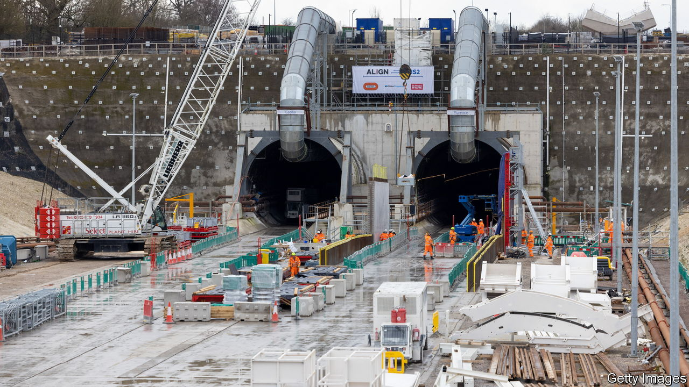

###### HSscrewed

# Rishi Sunak is wrong to amputate Britain’s high-speed rail line 

##### The HS2 decision will make it harder to build infrastructure 

 

> Oct 4th 2023 

On October 4th Rishi Sunak declared that HS2, a high-speed rail line designed to connect London and the north of England, would not extend beyond Birmingham to . Britain’s prime minister made this announcement at the Tory party conference—in Manchester. In what was once a railway station. During a . Full marks for chutzpah, but what about the decision?

To be fair to Mr Sunak, this was not an easy call. Costs have spiralled horribly. The total bill for HS2 was first put at £37.5bn ($62bn at the time) and may end up close to £100bn. Value for money matters. Making pledges to do whatever it takes might work for wartime administrations and central bankers, but it is no way to run the public finances. Even so, . It doesn’t make sense in its own terms. And the problems that bedevil HS2 are deep-seated ones that only the government can solve. Cancelling the project does not just leave them unsolved. It exacerbates them.

First, consider the decision itself. The case for HS2 remains valid. It is designed to relieve congestion on existing rail networks. Although the pandemic muted demand, the number of passenger-rail journeys is at 83% of pre-pandemic levels and rising fast; the need to increase long-term capacity has not gone away. Under the cut-down scheme, trains will zip from London to Birmingham before trundling along a congested line to Manchester. 

The most useful bit of the project was still to come. The southern leg of the line is the bit of HS2 that is trickiest to build; it is also the one that improves connectivity the least. Starting construction in the north would have been sensible, as some pointed out at the time; amputating it at Birmingham compounds that error. 

Mr Sunak pledged to divert money to other transport projects in the north. These are needed, too, but why should anyone take his promises of a new “network north” at face value? It is true that HS2 has specific problems, most obviously the insistence on eye-catching speeds that jacked up the bill. But in many ways it is not an outlier, but emblematic of an  in which delays are rife, modifications proliferate and costs spiral. 

An upgrade to a trans-Pennine route connecting Manchester and York has been announced many times since 2011 and is still not complete. Britain Remade, a pressure group, has found that tram projects in Britain are two and a half times more expensive to build, per mile, than in France. Simple projects to widen roads fester for years. Last month a decision to turn the A1 in north-east England into a dual carriageway was delayed for another nine months. That sounds fine, except that the scheme was first mooted 15 years ago. Simply planning a road under the Thames has taken ten years and cost more than it did to actually build the longest road tunnel in the world.

If cancelling HS2 were to galvanise the government to speed up infrastructure projects, that would be something. But believing in this would be as optimistic as the project’s initial budget projections. The government is not some innocent bystander in this mess. It has been slow to issue national policy statements, crucial documents that underpin planning-assessment processes. From wind farms to housing, it runs scared of NIMBYs. Mr Sunak had nothing to say about the obstacles to building in his speech.

Indeed, this week’s amputation is likely to raise infrastructure costs yet further. The presumption that really big infrastructure projects will survive changes of government, or even party leaders, is no longer safe. After this decision, contractors will therefore charge a higher risk premium. The amount of time and money consumed in planning applications is likely to increase, too. One lesson NIMBYs will take from this fiasco is that delaying projects can eventually lead to their demise. 

Mr Sunak says he is making hard choices, but with an election looming and the Tories trailing, the reversal looks more like political expediency. Last month he pushed back deadlines to phase out new petrol cars; now he claims that people care more about potholes than about high-speed rail. That may be true in a narrow sense, but a fundamental job of central government is to build strategic infrastructure. Mr Sunak’s HS2 decision flies in the face of his vaunted long-termism. ■ 

