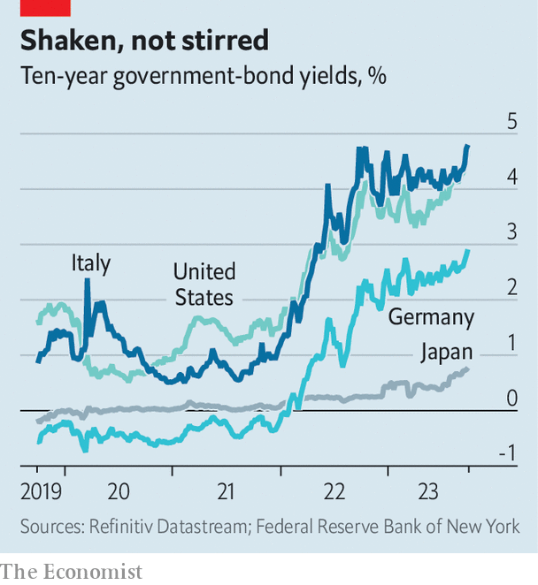

###### Reality beckons

# Rising bond yields are exposing fiscal fantasy in Europe 

##### Italy’s budget plans look irresponsible 

 

> Oct 4th 2023 

As the FEAR that interest rates could stay higher for longer sinks in, government-bond yields  are rising. America’s ten-year Treasury yields, at , are at their highest since 2007. The Bank of Japan has ramped up its bond purchases to maintain its . In Europe on October 4th the yield on ten-year German Bunds crossed 3% for the first time in more than a decade. Those on Italian debt are nearly 5%—the highest since the tail-end of the euro zone’s sovereign-debt crisis in 2012. And that is a worry, because Italy is one of the bloc’s most indebted member states and its government has not woken up to how its spending plans now look unsustainable. 

Over the past 15 months a surge in inflation in the euro zone has been met by dramatic action from the European Central Bank (ecb), which has raised rates by 4.5 percentage points. Look at public spending, though, and you would not know that a battle against inflation is raging. Budgets ballooned in several big European countries as governments sought to help their citizens recover from lockdowns and an energy crunch. But even as those shocks have faded, deficits have remained wide. France projects a budget shortfall of nearly 5% of gdp this year, and 4.4% next. Italy plans to run a deficit of 5.3% this year, and 4.3% in 2024. Its shortfall comes even as the country is on course to receive nearly €70bn ($74bn), equivalent to another 2% of annual Gdp, from the eu’s common pandemic-recovery fund. 

 


Italy’s spending is a particular problem because of its slow growth, which this year is expected to be below 1%, and its vast debt burden—net public debt in 2022 was 144% of gdp. If it runs too wide a deficit, or faces too high an interest rate, the debt will become unmanageable. Now it is in danger of both. 

Investors are well attuned to these risks, which is why they extract a premium for lending to Italy, compared with lending to Germany. When Italy’s government, led by Giorgia Meloni, revealed its budget plans on September 27th, that yield-spread duly went up. Unless she reins in spending, Ms Meloni looks set on a collision course with the European Commission, the central bank and investors. 

In an ideal world, Italy would follow the eu’s fiscal rules, designed to ensure that its public finances stay out of danger. Alas, this will be hard to pull off. For a start, the rules are not realistic. To expect Italy to hit a debt-to-gdp target of 60% over a set number of years, as they do, is ridiculous. Although the European Commission hopes to overhaul those rules, hawkish northern countries are loth to give much ground. The result is standstill. 

Even if better regulations were in place, enforcing them would be another difficulty. Past experience suggests that national governments rarely choose to follow the rules set in Brussels and trim spending at home, because it risks irking voters. 

That leaves Italy subject to discipline from investors and the ecb. The role of the central bank is far clearer than it was during the depths of the euro zone’s debt meltdown. Should spreads on government debt start to spiral out of control, the ecb has committed itself to buying that debt. In July last year the bank also said it would seek to aid the smooth transmission of monetary policy, by buying a country’s debt if spreads rise by more than it deems to be warranted by economic fundamentals. 

Meloni-drama 

Yet none of this means that the ecb will backstop reckless fiscal policy. Its programmes come into force only if the country in question accepts budgetary discipline. The central bank’s focus is unwarranted rises in spreads, rather than the level of the interest rate itself—and it is that which is a problem for Italy. Moreover, having been an enthusiastic buyer of government bonds during the pandemic, the ecb will soon decide how to shrink its holdings, which may further reduce demand for Italian bonds. 

The scene is set for more market jitters. Ms Meloni’s government could begin to curb spending before then. More likely, though, she will wait for nervous investors and rising borrowing costs to force her hand. A reckoning with reality is almost certain. The only question is how much drama is needed first. ■

