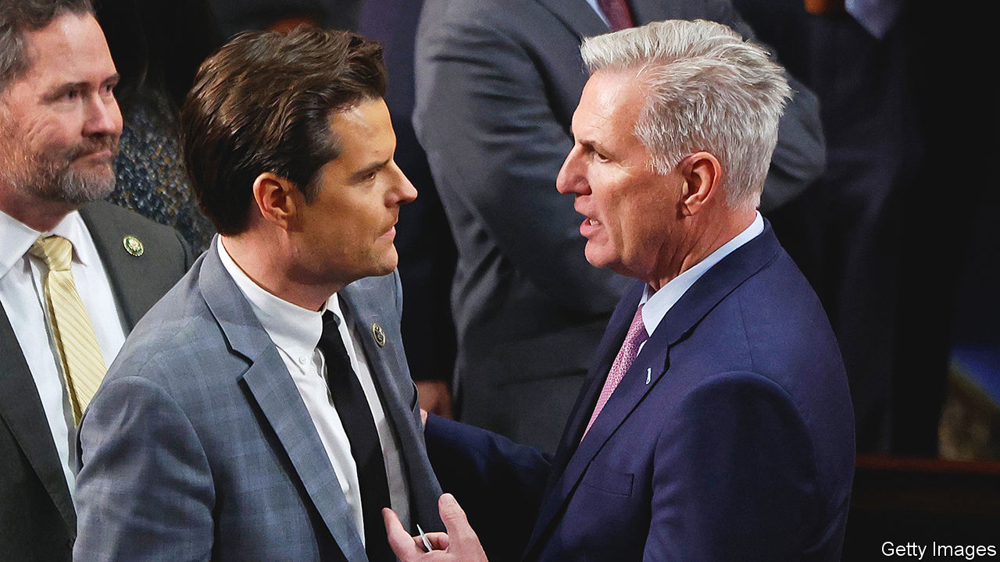

###### The conservative Jacobins

# The ousting of Kevin McCarthy: bad for America, worse for Ukraine 

##### His successor should seek cross-party support to keep funding the war 

 

> Oct 4th 2023 

TWO MONTHS before the French revolution in 1789, Congress met for the first time, in New York City’s Federal Hall. In the intervening 234 years no speaker of the House of Representatives has been removed by a motion to vacate—until this week, when a small cadre of Republicans  Kevin McCarthy. Mr McCarthy had only had the gig since January. But the House Republican Party exists in a state of permanent revolution. All of the past three Republican speakers have been hounded by their own side. The parliamentary point that did for Mr McCarthy in the end was arcane, but its consequences are not.

A healthy two-party system ought to encourage bipartisan dealmaking. In the House the only way Mr McCarthy could ascend to the speakership, after a humiliating 15 rounds of voting, was to make a series of apparently  to members of his own side—and then agree to a rule whereby any one of 222 Republicans could bring forward a motion to replace him. Mr McCarthy has a reputation for , but making promises that are impossible to keep seems to be a condition for obtaining the speaker’s job. The minute he did the right thing, by reaching across the aisle to fund the government with help from Democrats, he was fired.

The next speaker, whoever he or she is, will try to amend the rule that allows just one member to trigger a contest. But the same dynamic will apply. One of the unwritten laws of American politics is that when Republicans control the House and the president is a Democrat, chaos ensues. There was a government shutdown when Republicans took the House during Bill Clinton’s presidency. There was another when they took the House during Barack Obama’s presidency. A shutdown was only narrowly, and temporarily, averted this time because Mr McCarthy decided to do the deal with Democrats which cost him his job.

This way of not governing is bad for American voters. The country’s debt-to-GDP ratio has reached 98%, at a time when the  has also risen sharply. Tackling this will require hard trade-offs, something this Congress does not deal in. Legislative strikes in Washington do the work of Chinese government propagandists, who say that democracy is no way to run a serious country. And they make America’s allies nervous about whether presidents can keep their word.

Ukraine is the most concerned among them.  will probably run out before the end of the year. The only way for the House to pass a 45-day budget extension and avoid a shutdown was to ditch a new package of help for Ukraine. This comes at a time when Poland, one of Ukraine’s staunchest allies, has been threatening to block some arms deliveries in a . In Slovakia, another hitherto firm ally, a recent election may produce a government under  that is sympathetic to Russia. 

To counter the impression that the West is wavering, the next speaker should bring funding to the floor and allow the cross-party majority in the House that supports Ukraine to vote. The convention that only legislation supported by a majority of the majority can come to the House floor is a pointless one that ought to be scrapped. Doing so would make it harder for a small group of nihilists to prevent anyone else from passing laws.

A more likely outcome is that Congress will stick to the usual way of doing things. The House will eventually find more money for Ukraine—but not until the end of the year, when a gigantic spending bill arrives before the Christmas break. That needless delay will undermine American credibility. By encouraging Vladimir Putin to wait for the West’s support to peter out, it may cost Ukrainian lives, too. ■

