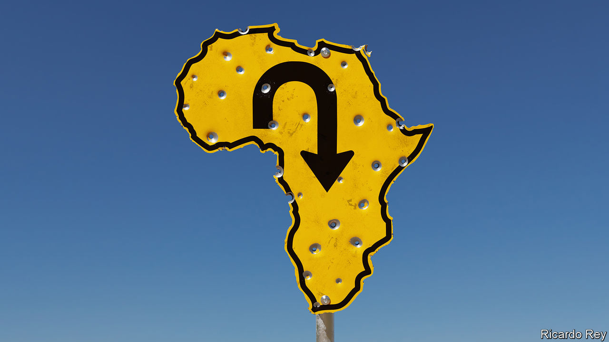

###### Sub-Saharan suffrage

# Why Africans are losing faith in democracy 

##### The alternatives will undoubtedly be worse 

 

> Oct 5th 2023 

Something has gone badly wrong in Africa. Sudan has collapsed into carnage, as two grasping warlords battle for control. : fighters loyal to one of those warlords are murdering every male they can find from one ethnic group, even shooting baby boys strapped to their mothers’ backs, as we report. In Ethiopia one civil war has barely ended and a new one is brewing. Across the Sahel, jihadists are terrorising millions and soldiers are seizing power, promising to restore calm but not actually doing so. You can now walk across nearly the widest part of Africa, from the Atlantic to the Red Sea, passing only through countries that have suffered coups in the past three years. But it would be unwise—you might well be kidnapped.

One reason coups have grown more common is that many . Afrobarometer, a pollster, found that the share who prefer democracy to any other form of government has fallen from 75% in 2012 to 66%. That may sound like a solid majority, but it includes many waverers. An alarming 53% said a coup would be legitimate if civilian leaders abuse their power, which they often do. In South Africa, which has one of the world’s most liberal constitutions, 72% say that if a non-elected leader could cut crime and boost housing and jobs, they would be willing to forgo elections. 

There are as many reasons for this growing disillusion as there are medals on a coup-leader’s chest. One is that incumbent regimes, most of which claim to be democratic, have brought neither prosperity nor security. Real GDP per person in sub-Saharan Africa was lower last year than it had been ten years earlier. More people are dying in small conflicts than at any point since at least 1989. In Nigeria whole schools have been abducted. When people lose hope that their lives will improve, they become impatient for change and the risk of coups and civil wars increases sharply.

Another problem is that many so-called democracies in Africa are phoney. Most African countries adopted the trappings of multiparty democracy after the end of the cold war. And in some countries, such as Kenya and Zambia, power changes hands more or less peacefully at voters’ behest. In many others, though, rulers allow the opposition to participate in elections but take a thousand precautions to ensure they cannot win, from tampering with the voters’ roll to throttling the media. No fewer than nine African leaders have been in power for more than 20 years. It is hard to expect people to support democracy if all they have experienced is a masquerade of it.

Meanwhile, geopolitics has grown friendlier to autocrats. If the West withholds arms or loans from African juntas, China and Russia are happy to step in. So, too, are unsqueamish middling powers such as Turkey and the United Arab Emirates. Western governments have sometimes acted shabbily, turning a blind eye to a coup in Chad and electoral theft in Congo. Their hypocrisy undermines the democratic values they espouse. 

Africa is not the only part of the world where democratic disillusion is spreading. A whopping 62% of Americans and 56% of French told a Pew poll last year that they were not satisfied with democracy in their countries. Among young Americans, nearly a fifth think a dictatorship would be preferable. The big difference is that rich, mature democracies have solid institutions that make a coup virtually impossible. In much of Africa the army and its cronies are all too ready to seize control. 

Once the men with guns are in charge, they are hard to dislodge. They postpone elections indefinitely and remove even the threadbare checks on executive power that once existed. They govern terribly, but if the joyful crowds that greet some coups change their minds about their new rulers, there is little they can do about it. Equatorial Guinea’s president seized power in 1979. He is still in office, and his luxury-loving son may succeed him. Autocracy lacks the built-in correction mechanism of true democracy: the promise that, if governments are no good, voters can sack them. And because many African countries have festering ethnic tensions and territorial disputes, coups and dictatorships often lead to war, as has happened in Sudan. 

Reversing Africa’s turn away from democracy will not be easy. It is a task, first and foremost, for Africans themselves. The African Union, a regional body, should once again take seriously its old “no-coup” policy, and ostracise putschists. More important, African governments that claim to be democratic will have to govern better, by curbing corruption, fostering growth and resisting the temptation to hogtie the opposition. For example, the World Bank reckons that implementing the African Continental Free Trade Area could raise incomes by 9% by 2035 by removing obstacles to trade. Yet its members are dragging their feet. 

Rich countries can help. They ought to press ahead with restructuring unsustainable debts and make good on a long-standing, unkept promise to spend $100bn a year to help poor countries with climate change. The World Bank and IMF could help crowd in investment, especially if their capital were topped up. The West would do well to welcome more African migrants to study and work; some will return home with useful skills and others will send back money to educate nieces or bankroll new businesses. 

To help improve African security, America, which is more popular than former colonial powers such as Britain and France, could keep training and arming legitimate forces battling jihadists and other insurgents. The European Union must not cut funding for African-led peacekeeping missions, such as the one in Somalia that is now being wound down. 

From cradle of humanity to centre of gravity

The main reason to wish for progress in Africa is to benefit Africans. But the rest of the world has a stake, too. Africa is the only continent where population growth is fast. By 2030 nearly one in three people entering working age will live there. Many of humanity’s big challenges, from climate change to pandemics, will be harder to tackle if Africa is dysfunctional. There is no guarantee a more democratic Africa will be prosperous and peaceful, but one ruled by autocrats and generals will surely not be. ■


