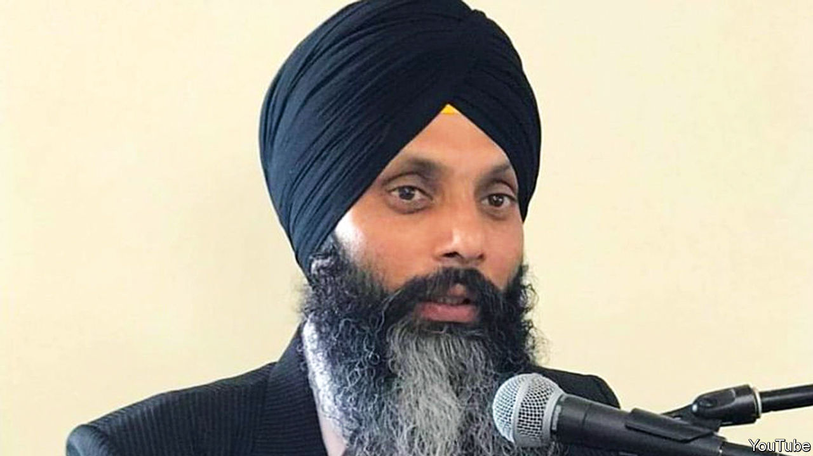

###### On Ukraine, India and separatists, British politics, AI and science, Europe’s hard right, Elon Musk

# Letters to the editor 

##### A selection of correspondence 

 

> Oct 5th 2023 

Ukraine’s army divisions

The claim that a lack of professional junior leaders may have impeded Ukrainian operations seems plausible (“”, September 16th). Since the first world war, effective infantry tactics have relied on expertise at the squad, platoon and company levels. Nevertheless, the real obstruction to Ukraine’s counter-offensive seems to be located higher up the chain of command, especially at the divisional level. 

The job of the division, a command of about three brigades (20,000 troops), is to co-ordinate artillery and air strikes in the “deep” battlespace beyond its brigades, but in immediate support of them. Although the Ukrainians have mounted many successful operational strikes against Russian targets in Crimea and elsewhere, they seem to have struggled to support their brigades with sufficiently concentrated fireplans. Brigades have fought bravely and effectively on their own. 

If it is difficult to train junior commanders, it is even more challenging to develop competent divisional commanders, supported by efficient headquarters. The West would be wise to address this issue over the winter.

Anthony King

Chair of war studies

University of Warwick 


 


A precedent for India

India is alleged to have killed a Sikh separatist in Canada (“”, September 23rd). Perhaps it could take a lesson from Northern Ireland, where funding for the IRA came mainly from donors in America. British governments worked with the American authorities to stop the flow of those funds. At no time did the British government accuse the American government of conspiring to cause mayhem in Northern Ireland. It was a bone of contention but both governments had to work within the law. India must understand this. However beleaguered it may feel about separatist movements outside its shores, it must recognise that foreign governments have to work within the law of their own countries. India may then be able to achieve a lot more in that spirit of co-operation.

Ajay Doshi


 


Britain’s frustrating politics

Bagehot () blamed the clash of Rory Stewart’s idealism with the political reality of Westminster for his going “a bit mad”. But isn’t the endorsement of the “grubby but always needed art of politics” even crazier? The corrupt, factional skulduggery now embedded in many representative governments should not be the best that Britain can hope for, especially now that we so clearly see that it produces an apathetic, alienated population, divisive all-or-nothing referendums and a long decline of national competitiveness. 

Those seeking power must spell out new ideas, even if at first they sound naive, otherwise newcomers like Mr Stewart will have no legitimacy to reform how any country is run. Change in Britain might include proportional representation, randomly selected citizens’ assemblies, doing something new with the House of Lords, a mix of all these and more. True insanity is to keep banging our heads against the wall of the same outdated voting system and to expect that it will produce a better result.

Hugh Pope


Like that Japanese soldier who hid in the jungle until 1974 Britain’s parties are survivors of dead conflicts. The MPs they pick and control for our approval are tied to manifestos with minority support. Our simplified elections are cockfights between the two main parties, one of which expects to win. Unlike Europe’s other voters, ours despise coalitions and proportional representation as formulas for sissies. As a result we have alternating rule by one party that the majority of voters have usually rejected, which is on the hook to its remnant membership. 

Rod Tipple


 


Can AI spot fake science?

You ask whether artificial intelligence could transform science itself, highlighting the potential for AI algorithms to trawl through the global academic literature for patterns and insights (“”, September 16th). It is a troubling reality that the reliability and trustworthiness of this literature is undermined by a significant proportion of content that is fraudulent, dishonest and fake, for reasons which are often related to the career advancement of the miscreants. 

Some of this material is weeded out by suspicious readers, reviewers and editors, but an unknown volume escapes censure to contaminate the academic gene pool. In my own wide-ranging field of medicine, information from fraudulent and misleading papers can have a significant adverse impact upon human health and well-being. 

Hence there is a real danger that trawling AI for insights will naively integrate the good, the bad and the ugly with the erroneous and potentially damaging. The solutions to this problem are not yet clear, but awareness of the potential for harm is an important first step. 

David Rew

Faculty of medicine

University of Southampton

You focus on using AI in the fundamental sciences rather than on applied research. Arguably, the latter is the area where humanity will need most of its breakthroughs to prevent climate and other catastrophes before it’s too late, given the time it takes from fundamental research to broad commercialisation. AI’s prowess in “interpolation”, and ability to rapidly access existing knowledge is listed as a limitation, but should be seen as a strength and an enabler to researchers and engineers who need to combine insights across scientific and technological domains in order to solve intractable challenges.

The implications to industrial R&amp;D is threefold. First, companies must ensure that AI is broadly accessible to, and deployed by, their researchers, rather than residing exclusively with a separate team of data scientists. Second, firms should invest in knowledge and data sharing across the entire company and even with external innovation partners. And finally, they should make the necessary changes to their working practices and incentive structures (more agile, more cross disciplinary; with incentives focused on deployment not invention) so that future AI-inspired R&amp;D breakthroughs can be developed and commercialised more systematically.

AI will not replace experimentation nor the experimenter, although fewer of both will probably be needed. The gravy train it promises for R&amp;D is in making researchers into better problem-solvers. 

Michael Kolk 

Ben Thuriaux-Alemán

Arthur D. Little 


To describe the concerns of some people about AI and the “extinction of humanity” as fretting, whereas others are just focused on its potential, is a classic on the one hand, on the other hand formulation. I can’t see how you can reasonably balance extinction with anything else. In those stakes, we don’t fret enough.

Lori Fontanes


Extremists in power

You argued that the far right in Europe would become less dangerous if it entered government (“”, September 16th). I am not so sure. That was precisely the argument used to obtain President Hindenburg’s approval for bringing the National Socialists into government in 1933. But why turn to ancient history? Just look at Hungary’s Fidesz party, which has become much more extreme since attaining a governing supermajority in 2010. Beyond Hungary, there is a great deal of evidence—Nuevas Ideas in El Salvador, Law and Justice in Poland, the True Finns in Finland—that extremist parties and leaders do not in fact become more moderate after achieving power. Your claim seems to involve the triumph of hope over experience.

Matthew Draper


 


You chose a photo of a shaven-headed man with an earring to illustrate your cover on the far right (September 16th). The reality is that the hard right today has support from men and women of all ages, races, religion, sexual orientation and classes, both with and without hair. Some of them even wear suits. 

Jack Lard

Balding but not extreme


Now you listen here!

I speak for all Monty Python fans when I posit that, although Elon Musk’s Messiah status remains unclear, with all his self-acknowledged faux pas he certainly is a very naughty boy (“”, September 16th).

Tom Appleton


