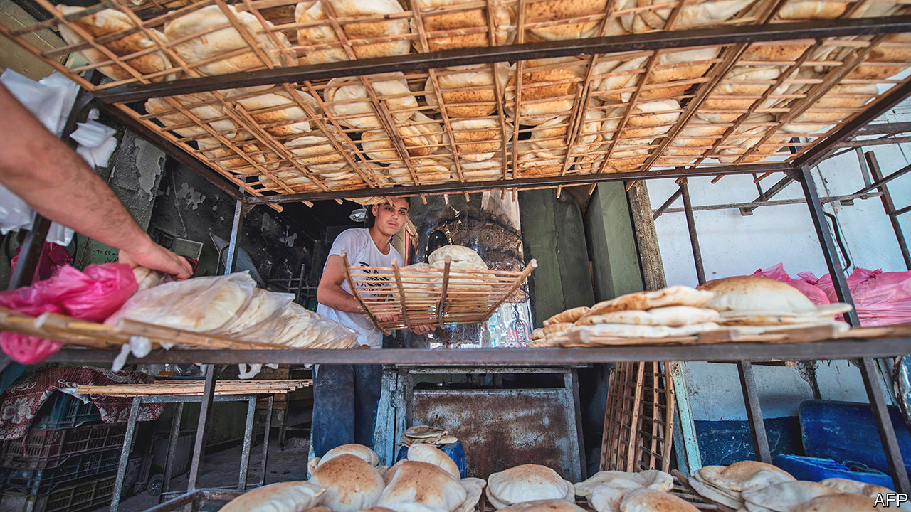

###### Give us this day

# Egypt’s bread subsidies are unsustainable 

##### But with inflation soaring people can afford few alternatives 

 

> Oct 5th 2023 

That in egyptian Arabic the word for bread, , is the same as the word for life stresses the foodstuff’s importance in the country. Nearly two-thirds of Egypt’s 106m-strong population rely on subsidised bread. Partly as a result, they devour about three times the global average per head. But as its population grows and climate change makes wheat harder to grow, the government’s determination to provide its people with cheap bread looks ever less sustainable. 

Bread subsidies are already expensive. They cost $2.9bn in the past fiscal year, 2.6% of the budget. Only half of the grain Egypt uses is grown domestically; it is among the world’s largest importers of wheat. That leaves it hostage to global price fluctuations. Russia’s invasion of Ukraine caused a surge in prices last year, though prices have since fallen. 

Meanwhile urbanisation is eating away at Egypt’s scarce farmland. Arable land—most is in a fertile strip along the Nile—makes up just 4% of the country. Urban sprawl devoured a tenth of the farmland around Alexandria, Egypt’s second city, between 1987 and 2015. 

Local wheat yields are predicted to fall by 10-20% by 2060 as climate change further limits the country’s ability to grow its own food. Rising sea levels will blight crops by making the soil of the Nile delta saltier. Higher temperatures and reduced rainfall could mean smaller harvests. The country’s annual water usage already exceeds its renewable supply by more than a quarter. It makes up the shortfall partly by depleting its aquifers, which in turn reduces soil quality. And last month Ethiopia finished an upstream dam whose reservoir could in theory hold back 88% of the river’s annual flow, allowing it to control how much water goes downstream to Egypt. 

The population of Egypt is forecast to hit 160m by 2050. The World Bank reckons growing another 5m tonnes of wheat on top of the 20m tonnes the country now consumes each year would require an additional 5.5bn cubic metres of water, the equivalent of another 10% of the Nile’s annual flow. Subsidising wheat means farmers have an incentive to grow it with scant regard for water’s scarcity.

The government says it will spend $246bn on climate-mitigation and adaptation measures by 2030. That would represent nearly 10% of current gdp a year, a vast sum for a country in economic crisis. If Egypt, which is on the brink of not being able to pay its bills, wants even to start on its grand plans, it may have to rethink its pricey bread subsidy.

Replacing bread subsidies with cash transfers—which would be cheaper and reduce the incentives to grow wheat—would be economically logical but politically fraught. Attempts to reform the subsidy system led to riots in the 1970s. And given that annual food inflation hit 72% in August, it is not clear what Egyptians would eat in place of their daily government-sponsored bread. ■

