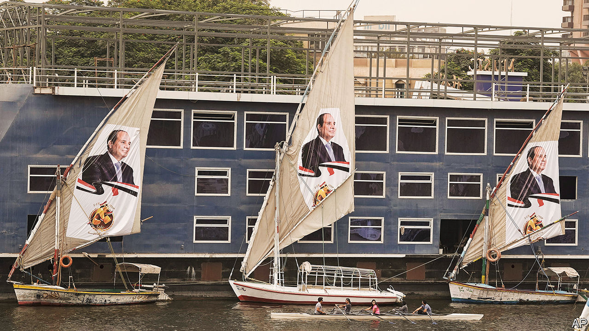
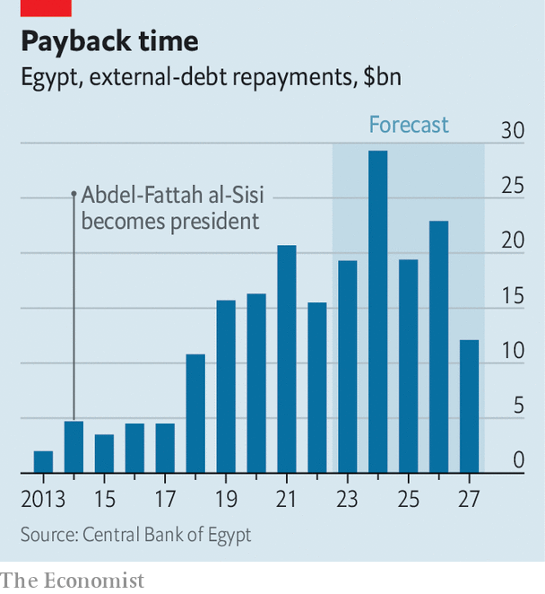

###### Deaf on the Nile

# Egypt’s rushed election shows Abdel-Fattah al-Sisi is nervous 

##### It will be easy for him to win a third term. Seeing it out may be harder 

 

> Oct 3rd 2023 

POLITICIANS campaign in poetry, as the saying goes, even if they govern in prose. Rarely do they write verses about suffering. Last month Abdel-Fattah al-Sisi, Egypt’s military dictator, tried out a bleak slogan for his upcoming election. “If the price of the nation’s progress and prosperity is hunger and thirst, then let us not eat or drink,” he said. With food prices up 72% over the past year, many voters are doing just that: , indeed.

On September 25th Egypt decided to hold presidential elections earlier than planned. Instead of voting in the spring, Egyptians will go to the polls on December 10th. The change was not unexpected. Mr Sisi is keen to get the election out of the way before he makes painful economic decisions such as devaluing the currency. In a democracy, this would be sound politics: beggaring voters is not a ticket to victory.

 


The logic may seem fuzzier in Egypt, where voters are props in a democratic farce. But Mr Sisi, who led a coup in 2013, is on wobbly ground. Victory would allow him to rule until 2030. The question that many Egyptians have begun to whisper is whether he will last that long.

There is no doubt that he will win. The previous election, in 2018, had just one “opposition” candidate—who until the day he entered the race had endorsed Mr Sisi. He finished third in a two-man race (spoiled ballots came second). Anyone who might have posed a real challenge was disqualified, detained or intimidated into dropping out.

Four politicians have talked about running this time. None has much support. One of them, Ahmed al-Tantawy, a former MP, says dozens of his backers were arrested after the government announced the election date. Citizen Lab, a Canadian cyber-watchdog, says Mr Tantawy’s phone was also targeted with Predator, a sophisticated bit of spyware.

The president himself entered the race on October 2nd, after his allies bused thousands of people to post offices to sign petitions endorsing his candidacy (many were bribed or compelled). “As I responded to the call of the Egyptians before, today I respond to their call again,” Mr Sisi said, striking a familiar pose: the reluctant leader pressed to service by an adoring nation.

There are no reliable polls on his popularity, but it is safe to say that few Egyptians still adore him. Ordinary citizens who cheered his coup in 2013 because they craved stability now curse his handling of the economy. The currency has lost half its worth in three devaluations since early 2022. Annual inflation hit a record 39.7% in August. A dollar shortage has left businesses struggling to pay for imports. External debt has more than doubled, from 17% of GDP in 2013, to 39% today.

Egypt signed a $3bn agreement with the IMF in December (it is the fund’s second-largest debtor). So far it has received only the first $347m tranche of the loan. A review meant to be finished in March would have unlocked more money. It was delayed because Egypt had made little headway on two of the fund’s main demands: sell state-owned assets and float the currency.

Mr Sisi’s government has made half-hearted progress on the former. It sold stakes worth $1.9bn in the six months to June, barely missing its $2bn target, and hopes to shift another $5bn by June 2024. But it refuses to divest the army’s economic empire, which is a big obstacle to growth because it crowds out a growing number of private firms. In August Mr Sisi held a meeting about how to grow Egypt’s iron-and-steel industry. His only guests were uniformed generals; no businessmen were at the table.

Floating the currency will be harder. The black-market rate is still around 20% below the official one. A weaker pound will trigger more inflation (the IMF estimates it will hit 32% year-on-year in 2024, up from 24% this year). Even boosterish analysts at Egyptian banks doubt the central bank will get close to its 7% inflation target.

At the same time, Egypt will have to repay $29.2bn in external debt next year (see chart), up from $19.3bn in 2023. That is equal to 85% of its $34.4bn in foreign reserves, a figure mostly made up of deposits from wealthy Gulf states. Although they seem willing to roll over those deposits indefinitely, they are fed up with Mr Sisi and reluctant to offer him more money.

So are private investors. Interest rates have more than doubled since early 2022, to 19.75%, but high inflation means real rates are negative. State-owned banks offer 9% interest on dollar deposits, returns that have a whiff of a Ponzi scheme about them. Moody’s, a rating agency, has Egypt under review for a possible downgrade (it docked the country to a dismal B3 in February). JPMorgan Chase, a bank, may remove the country from its emerging-markets bond index because of concerns that investors cannot repatriate funds.

The current-account deficit has narrowed, but Egypt still registered a $5.3bn shortfall in the nine months to March. Goldman Sachs, another bank, estimates that Egypt needs an extra $11bn in financing over the next five years. Officials hope to plug the gap with state-asset sales, borrowing from Asian countries and the IMF loan. But the maths look daunting.

Mr Sisi offers nothing but empty talk. In June he insisted that he would not approve another devaluation; last month he said the “end is near” for the economic crisis. He also told young people they could earn a “respectable income” by donating blood every week. Mostafa Madbouly, the prime minister, brags that Egypt has spent 9.4trn Egyptian pounds ($300bn) on infrastructure projects over the past decade. Even if that is true, much of it has been wasted on white-elephant projects, from a vast, desolate new capital city in the desert to an expansion of the Suez canal that has fallen far short of revenue projections.

The never-ending story

This election should be Mr Sisi’s last: the constitution forbids a fourth term. Then again, it used to forbid seeking a third. He fixed that in a sham 2019 referendum, creating a loophole that allowed him to run again. Some of his supporters see that as a mistake. Even before the last election, they urged him to stop at two terms. “I told him he could retire as the man who saved Egypt from chaos,” one recalls. “Stand down and bring new ideas.”

Friendly advice has turned to furtive scheming. Businessmen, politicians and some army officers have tried to enlist a real challenger. By rushing the poll, the president hopes to pre-empt such plots.

Again, though, this is democratic logic applied to an undemocratic country. Though remembered as a revolution, the ousting of Hosni Mubarak in 2011 could also be called a coup: the army turned on the ruler to preserve the ruling system. History could be repeated, especially if soaring prices spark unrest. At small protests on the night Mr Sisi announced his candidacy people chanted “ (leave), a popular slogan from 2011. Mr Sisi will win a new six-year term, but there are no guarantees he will be allowed to finish it. ■

