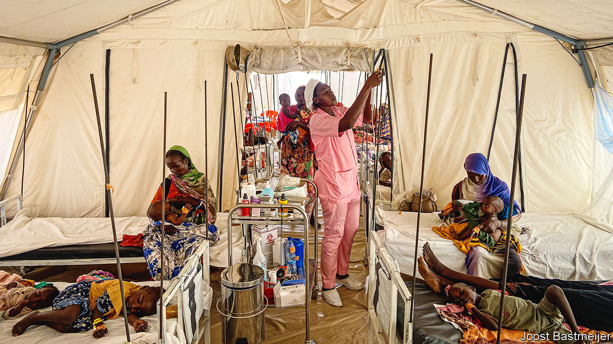
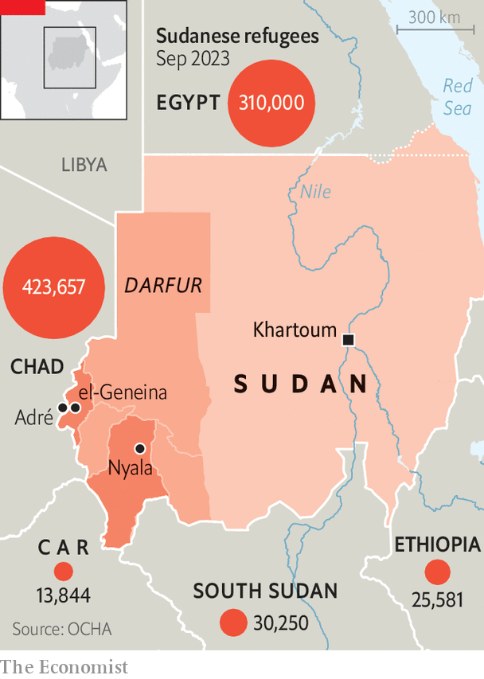

###### Sudan’s civil war

# Genocide returns to Darfur 

##### Survivors tell of mass slaughter, murdered babies and kill lists 

 

> Oct 5th 2023 

Hanan Khamis just wanted to get to safety. In mid-June, after surviving weeks of gunfire and rockets directed at the Masalit, a black African ethnic group, she fled el-Geneina, the capital of the state of West Darfur in Sudan. Hoisting her 23-month-old baby boy, Sabir, onto her back she started walking towards Chad. Yet fighters wearing the uniforms of the Rapid Support Forces (RSF) soon surrounded them. They dragged men to the side of the road and told the women to run. Before she could do so, a gunman wrenched open the shawl on her back that covered Sabir. “No men can escape to Chad,” he shouted. Then he shot her baby in the head.

 In Chad a humanitarian worker identifies four other mothers who tell of similar horrors. One says she was stopped at a roadblock where Arab militiamen murdered the men in her group. When they saw her 15-month-old son strapped to her, they shot him dead as he clung to her. The bullet burst through his tiny body and into hers, where it remains lodged. “If that isn’t a genocidal act, I don’t know what is,” says Mukesh Kapila, a former UN chief in Sudan who blew the whistle on massacres in Darfur 20 years ago.

 


Back in 2003, armed groups from black African tribes in Darfur rebelled against the Arab-dominated government in Khartoum, the capital. The government responded by arming Arab militias known as the Janjaweed (“devils on horseback”). They indiscriminately attacked villages inhabited by black Africans, not just rebels, torching houses and shooting residents. They also seized land, access to which is a continuing source of tension. In roughly the two years that followed, millions fled and perhaps 170,000 died, about 80% of them from hunger and disease. 

America and several NGOs said that this amounted to genocide, though others disagreed. A report to the UN Security Council argued that “the crucial element of genocidal intent appears to be missing.” In 2007 the UN and the African Union deployed a joint peacekeeping mission. Intermittent violence continued, but hopes rose of a durable peace in 2019 after the toppling of Sudan’s longtime dictator, Omar al-Bashir. Few people were held accountable for the earlier war crimes and the peacekeepers were withdrawn in 2021. 

In April this year war broke out between the Sudanese Armed Forces (SAF) and the RSF, a paramilitary formed by the government from the Janjaweed. The fighting has pulverised much of Khartoum. In Darfur it has triggered attacks on the Masalit by Arab militias and RSF fighters. This time the targeting of the Masalit is clear, says Kholood Khair of Confluence Advisory, a Sudanese think-tank. “Genocidal intent this time is much more explicit.”

Ali Yagoub Idris recounts how from a hiding place he saw RSF fighters force eight people to lie down while shouting: “You are Masalit, you are not allowed in this town.” Then they shot all eight of them. Elsewhere people lied about their ethnicity to survive. But speaking with a Masalait accent could mean death. UN data appear to back up allegations that men are being singled out and shot when they try to leave, as only one adult man reaches Chad from el-Geneina for roughly every two adult women who do so. Arab militias also tried to hunt down particular Masalit leaders such as Hatim Abdallah El Fadil, a vocal civil-society activist. “I was on a list,” he says. 

Zahara Adam Khamis, a women’s rights activist, weeps as she recounts how a 27-year-old university student she knows was gang-raped by five militiamen in front of her mother. ”The baby will be Arab,” they said as they finished.

The fighting in West Darfur also appears more one-sided than in 2003, when the conflict began with rebel attacks. This time, after skirmishes between the RSF and the SAF in el-Geneina in April, government forces quickly retreated as the RSF, aided by Arab militias, attacked Masalit neighbourhoods. Some Masalit descended on a police-weapons depot where policemen allowed the crowd to grab Kalashnikov rifles. Yet the Masalit were outgunned. No one knows exactly how many were killed, but the UN has credible reports of at least 13 mass graves. On June 14th the governor of West Darfur, a Masalit, publicly accused the RSF of genocide. Hours later he was gruesomely killed, reportedly by RSF forces, a charge they deny. 

Even after people fled from towns they faced murder and ambush on the way to Chad. Bodies littered the road. One man, call him Khalid as he asked that we not use his real name, fled to Chad in 2003 without facing violence on the way. This time he tried to reach Chad safely by taking a route far to the south at night with a group of about a hundred people. Yet as they neared the border, headlights lit them up. Seconds later the firing started, killing around 20. 

Today the RSF wields not just Kalashnikov rifles but also rocket-launchers and machineguns. The difference is grimly evident at a hospital in the Chadian town of Adré, close to the border with Sudan. Before Abdul Samad was hit by a rocket he hoped to be an electrician. Now the 19-year-old sits looking at the stump of his right leg and the mangled clump of burnt flesh that is all that remains of his left foot. 

The RSF has heavier weapons thanks to foreign backers. The United Arab Emirates (UAE) is understood still to be shipping weapons to the RSF through Chad. A $1.5bn loan from the UAE to Chad seemingly smoothed the way. Evidence for this traffic is “pretty clear”, says a Western diplomat. The  reported that weapons are being shipped under the guise of an aid mission. The UAE has said its operation is purely humanitarian.

In parts of West Darfur there has been a lull in violence since the terrible peaks of June. That is partly because in some places fully 70% of the population has fled. More than 420,000 went to Chad. The mud of the rainy season also makes it difficult for the RSF to mount large attacks on other towns and villages. But the rains are ending and the chances of calm are fading, both in Darfur and between the RSF and SAF. “We will see a very distinct uptick in the level of violence,” predicts Ms Khair. Many also fear there will be more air strikes by the SAF, which last month bombed a market in Nyala, the capital of South Darfur.

Some among the Masalit, meanwhile, are said to be training to fight and are trying to arm themselves in Chad. Ismat Adam Abdallah is a soft-spoken English teacher. But after 18 members of his extended family were killed, he has changed. “We will take it back by force,” he says of their lost land. “We need weapons, we need vehicles.” Would he fight? “Yes,” he avers vigorously, “because I lost everything.” ■

