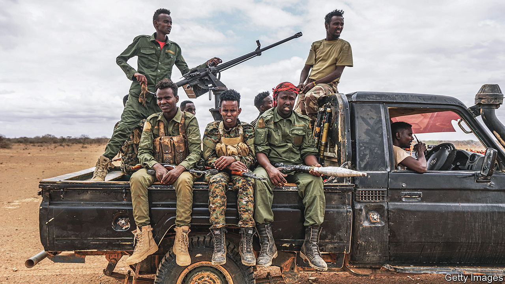

###### Mission unaccomplished

# The drawdown of African peacekeepers from Somalia has stalled 

##### The government still needs them in its fight against al-Shabab 

 

> Oct 2nd 2023 

No peacekeeping mission anywhere has been as deadly, nor has any African-led one lasted as long. After almost 17 years of trying to stabilise Somalia and , at a loss of perhaps 3,500 peacekeepers, the next phase in winding down the almost 18,000-strong African Union (AU) force had been greeted with high hopes. Yet plans to withdraw 3,000 troops at the end of September have just been shelved,  has learned. This is because of concerns that Somalia’s army will be unable to hold territory that had previously been recaptured from , a jihadist group that America’s military command for Africa has termed “the largest and most deadly al-Qaeda network in the world”. 

On September 30th the AU agreed to pause the drawdown for three months after a last-minute plea from Somalia’s government, according to several people in the know. A statement may be released within days, possibly after a meeting between officials from the AU and the UN Security Council: an extension needs the approval of the council, which had previously said that the African Union Transition Mission in Somalia (ATMIS) should number no more than 14,626 from October and be completely withdrawn by the end of 2024. (In the first phase of the drawdown 2,000 went home in June.)

Unanswered, however, is the question of who will stump up the cash to keep the peacekeepers there. The European Union, which since 2007 has provided more than €2.6bn ($2.7bn) to ATMIS and its predecessor, AMISOM, has long been reluctant to keep paying for what some of its members saw as a never-ending commitment. Yet it is tightening its purse-strings at arguably the wrong time. After years of deadlock, the Somali army has made real progress. 

Last year clans rose up against al-Shabab in central Somalia, where locals were angry with the militants for conscripting their sons and taking their livestock. The new president, Hassan Sheikh Mohamud, sent in the national army to support them, backed by American and Turkish air power. Together the soldiers and clan militias pushed al-Shabab out of a third of the territory it controlled. Lloyd Austin, America’s defence secretary, recently said that more progress had been made in the past year than in the previous five. As Somali forces advanced, ATMIS secured bases and towns. When the peacekeepers leave, the national army will have to take their place. 

Yet the national army is disorganised and poorly equipped. After 2,000 troops left in June, some of the bases ATMIS handed over were targeted by al-Shabab. The Armed Conflict Location &amp; Event Data Project, which monitors violence, reports a surge in attacks along the border with Kenya. In August the militants attacked the Somali army in Galguduud region, forcing it to retreat from liberated towns. “We don’t have the forces needed to hold on to those positions that will be vacated by ATMIS,” says Ali Mohamed Omar, the state minister for foreign affairs. He says the government has recruited 10,000 new soldiers in the past year, but needs time to train more and stabilise the areas it holds. 

Little of this is likely to change much before the end of 2024. Yet even if ATMIS leaves on schedule, foreign soldiers may stay on under different hats. Ethiopia and Kenya, which have both contributed troops, share borders with Somalia and worry about regional stability. The Somali government will almost certainly seek new arrangements with them to keep some boots on the ground, says Omar Mahmood of the International Crisis Group, a think-tank, though there are lingering questions about who would pick up the tab.

When it finally goes, the AU mission will leave a mixed legacy. In the early years it drove al-Shabab from the main towns and carved out a space for the Somali government to operate. But it could not do the politicians’ job for them. Rather than uniting against the militants, Somali leaders have spent much of the past decade arguing over the division of power. Outsiders can help fight the war, but they cannot make the peace. ■

